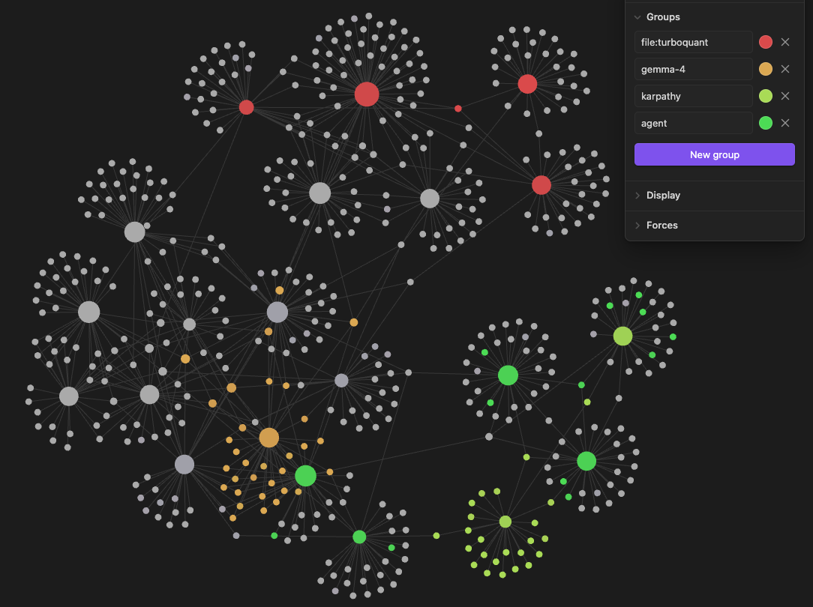
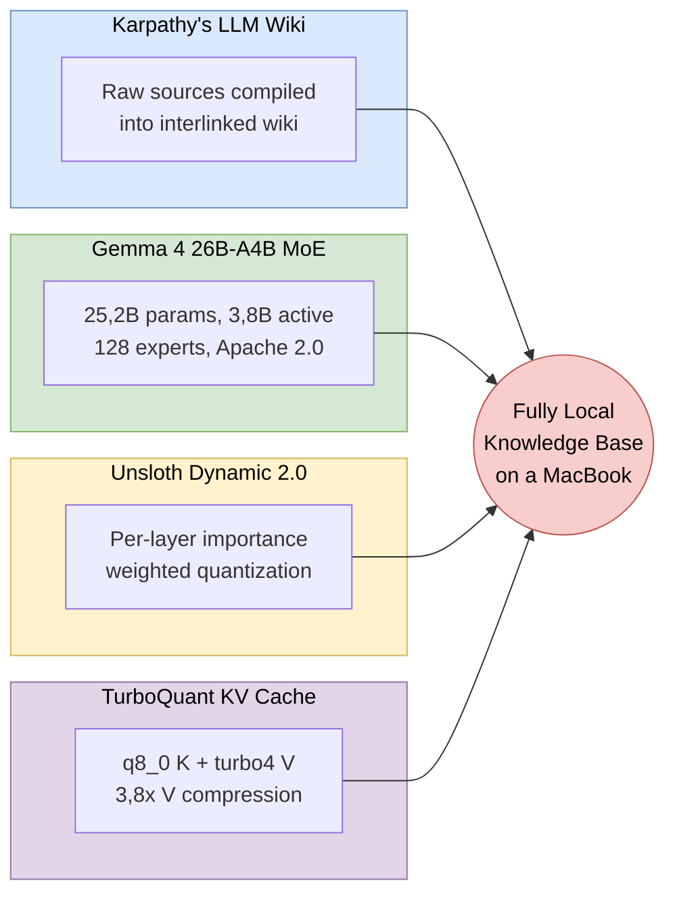
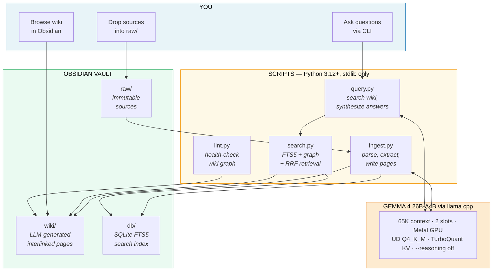
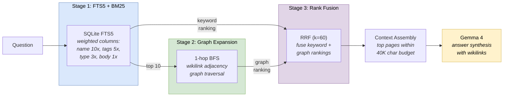
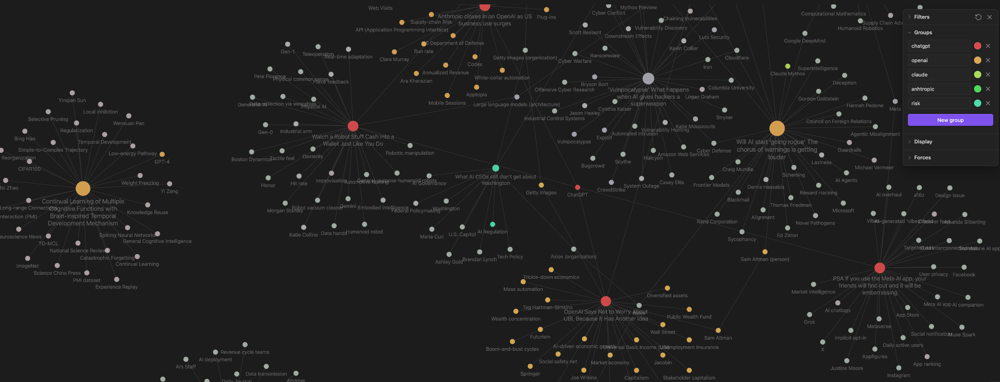
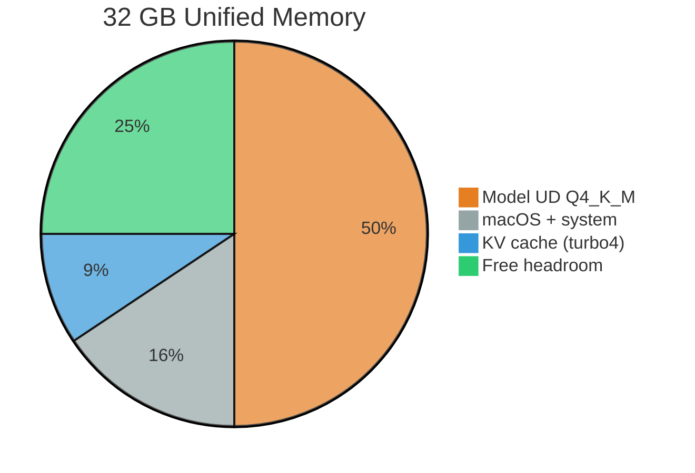

# LLM Wiki

A fully local implementation of [Karpathy's LLM Knowledge Base](https://x.com/karpathy/status/2039805659525644595) pattern. No cloud APIs, no data exfiltration, no external dependencies beyond the Python standard library.

Drop source documents into a folder. A local LLM reads them, extracts entities and concepts, writes interlinked wiki pages and maintains a persistent, compounding knowledge graph, all on-device, all offline.


This project is a proof-of-concept that integrates four recent developments into one working system:

1. **[Karpathy's LLM Wiki pattern](https://x.com/karpathy/status/2039805659525644595)** (April 2026) the idea that an LLM should *build and maintain a wiki* from raw sources, rather than doing one-shot RAG retrieval. Raw data is "compiled" into interlinked Markdown, then operated on by CLI tools for Q&A, linting and incremental enrichment.

2. **[Gemma 4 27B-A4B](https://ai.google.dev/gemma/docs/core/model_card_4)** (April 2026) Google DeepMind's open-weights Mixture-of-Experts model. 25,2B total parameters, but only 3,8B active per token via learned routing across 128 experts. This gives 27B-class output quality at roughly 4B-class inference cost ([model card](https://ai.google.dev/gemma/docs/core/model_card_4): MMLU Pro 82,6%, GPQA Diamond 82,3%, within 2-3% of the 31B Dense variant on all benchmarks). Apache 2.0 licensed.

3. **[Unsloth Dynamic 2.0 (UD)](https://unsloth.ai/blog/dynamic-v2)** per-layer importance-weighted quantization for GGUF files ([docs](https://unsloth.ai/docs/basics/unsloth-dynamic-2.0-ggufs)). Unlike standard Q4_K_M which applies uniform bit-width across all layers, UD selectively adjusts quantization precision per layer based on importance analysis, attention layers that matter more for output quality get higher precision, less impactful MLP layers get lower precision. Same ~16GB file size, measurably better output quality.

4. **[TurboQuant KV Cache Compression](https://arxiv.org/abs/2504.19874)** (Zandieh et al., ICLR 2026) runtime KV cache compression using PolarQuant with Walsh-Hadamard rotation. We use the asymmetric `q8_0` K + `turbo4` V configuration via the [llama-cpp-turboquant](https://github.com/TheTom/llama-cpp-turboquant) fork (not yet in mainline llama.cpp). Full-precision keys preserve attention routing accuracy; compressed values (3,8x) reduce the KV cache from ~5GB to ~3GB, freeing ~3GB of headroom for longer context windows or additional parallel slots.

Everything runs on a single MacBook. The 16GB model loads into Metal GPU unified memory, processes documents through a structured extraction pipeline and produces an [Obsidian](https://obsidian.md)-compatible knowledge base with hundreds of interlinked pages.



*The wiki after ingesting ~25 sources on local LLM inference: 500+ interlinked pages organized by topic clusters. Color groups show how the LLM cross-references entities across sources — red = TurboQuant, orange = Gemma 4, green = Karpathy, lime = agents.*



---

## Table of Contents

- [Relationship to Karpathy's LLM Wiki](#relationship-to-karpathys-llm-wiki)
- [Why Not RAG](#why-not-rag)
- [Architecture](#architecture)
- [Stack](#stack)
- [How Ingestion Works](#how-ingestion-works)
- [How Retrieval Works](#how-retrieval-works)
- [Quick Start](#quick-start)
- [Operations Reference](#operations-reference)
- [Obsidian Integration](#obsidian-integration)
- [Server Configuration](#server-configuration)
- [Design Decisions](#design-decisions)
- [Maintenance](#maintenance)
- [Troubleshooting](#troubleshooting)
- [Project Structure](#project-structure)
- [References](#references)
- [License](#license)

---

## Relationship to Karpathy's LLM Wiki

In April 2026 Andrej Karpathy [described](https://x.com/karpathy/status/2039805659525644595) a pattern he called "LLM Knowledge Bases", using LLMs to build personal knowledge bases for research topics. His [architecture gist](https://gist.github.com/karpathy/442a6bf555914893e9891c11519de94f) outlines the core idea: index raw sources, have the LLM "compile" a wiki of interlinked Markdown files, then query against that compiled wiki.

This project implements that pattern. Here is where we align and where we diverge:

### Where we follow Karpathy's design

| Karpathy's description                                                                                                          | Our implementation                                                                                                         |
|---------------------------------------------------------------------------------------------------------------------------------|----------------------------------------------------------------------------------------------------------------------------|
| *"I index source documents into a raw/ directory"*                                                                              | `obsidian_vault/raw/` immutable source files (PDF, markdown, plain text, XML)                                              |
| *"Use an LLM to incrementally compile a wiki, which is just a collection of .md files"*                                         | `obsidian_vault/wiki/` LLM-generated pages with YAML frontmatter and `[[wikilinks]]`                                       |
| *"The wiki includes summaries of all the data in raw/, backlinks and categorizes data into concepts, writes articles for them"* | Source summaries in `wiki/sources/`, entity pages in `wiki/entities/`, concept pages in `wiki/concepts/`, all cross-linked |
| *"I use Obsidian as the IDE frontend"*                                                                                          | Full Obsidian compatibility graph view, backlinks panel, Dataview queries all work natively                                |
| *"The LLM writes and maintains all of the data of the wiki, I rarely touch it directly"*                                        | The LLM is the librarian; the human is the curator. All wiki content is generated and maintained by scripts                |
| *"You can ask your LLM agent all kinds of complex questions against the wiki"*                                                  | `query.py` synthesizes answers from wiki context with `[[wikilink]]` citations                                             |
| *"I end up filing the outputs back into the wiki to enhance it for further queries"*                                            | `--save` flag files query answers as synthesis pages in `wiki/synthesis/`                                                  |
| *"I've run some LLM health checks over the wiki"*                                                                               | `lint.py` checks for broken wikilinks, orphan pages, index inconsistencies, thin pages                                     |
| *"I vibe coded a small and naive search engine over the wiki"*                                                                  | `search.py` SQLite FTS5 full-text search with BM25 ranking                                                                 |

### Where we deviate (and why)

**1. Retrieval: structured search vs. LLM-reads-the-index**

Karpathy notes that at his scale (~100 articles, ~400K words), *"the LLM has been pretty good about auto-maintaining index files and brief summaries [...] and it reads all the important related data fairly easily."* This works when the index fits within a single context window.

We started with this approach, sending `wiki/index.md` to the LLM and asking it to select relevant pages. It worked at 50 pages but degraded quickly: 10-30 seconds per query just for page selection, an entire context window consumed by the index and the LLM sometimes hallucinated page names or missed obvious matches. By 500+ pages, the index itself exceeded the context window.

We replaced it with a three-stage retrieval pipeline, [SQLite FTS5](https://www.sqlite.org/fts5.html) keyword search with [BM25](https://www.sqlite.org/fts5.html#the_bm25_function) ranking, wikilink graph expansion via 1-hop BFS and [Reciprocal Rank Fusion](https://dl.acm.org/doi/10.1145/1571941.1572114) (Cormack et al., SIGIR 2009) to merge the rankings. Page selection now takes ~5ms with no LLM call, no token cost and no context-window ceiling. See [How Retrieval Works](#how-retrieval-works) for the full design.

**2. Fully offline: local model vs. cloud API**

Karpathy's pattern is API-agnostic, he doesn't prescribe a specific model or hosting approach. This implementation runs entirely on-device using [llama.cpp](https://github.com/TheTom/llama-cpp-turboquant) (TurboQuant fork) with [Gemma 4 26B-A4B](https://ai.google.dev/gemma/docs/core/model_card_4) in Unsloth Dynamic (UD) Q4_K_M format. No data ever leaves the machine. This is a deliberate constraint: a personal knowledge base should not require transmitting your private documents to a third-party API.

**3. Automated structured extraction vs. conversational compilation**

Karpathy describes a conversational workflow where the LLM agent compiles the wiki through interactive sessions. Our pipeline automates this: `ingest.py` parses, chunks, extracts structured JSON (entities, concepts, claims), deduplicates across chunks, generates summaries, writes pages and updates the index, all in a single command. This makes batch ingestion practical (e.g., ingesting 20 papers overnight via `--all`) without requiring human supervision per document.

**4. Zero external dependencies**

The entire project runs on Python 3.12+ standard library. No pip install, no venv, no package manager. HTTP via `urllib.request`, JSON via `json`, XML via `xml.etree.ElementTree`, search via `sqlite3` with FTS5, concurrency via `concurrent.futures`. The only system-level tools are `pdftotext` (poppler, for PDF extraction) and `caffeinate` (built into macOS, for preventing sleep during batch ingests).

---

## Why Not RAG

Standard Retrieval-Augmented Generation embeds document chunks into vectors, retrieves the top-k nearest neighbors at query time and feeds them to the LLM as context. The [BEIR benchmark](https://arxiv.org/abs/2104.08663) (Thakur et al., NeurIPS 2021) evaluated 10 retrieval systems across 18 datasets and showed that this approach works, but it has structural limitations that the LLM Wiki pattern avoids:

- **No knowledge integration.** Each query starts from scratch. The system never builds understanding, it just searches. As Karpathy puts it: the value is in having the LLM *"compile"* the raw data, not just retrieve it.

- **Chunk boundary problems.** Splitting documents into fixed-size chunks breaks logical structure. Key context often spans multiple chunks. The wiki pattern synthesizes each source into coherent, self-contained pages at ingest time.

- **No entity resolution.** The same person, concept, or dataset mentioned across 10 sources exists as 10 independent text fragments with no unification. The wiki pattern deduplicates entities and concepts into single pages that accumulate information from every source that mentions them.

- **Embedding quality ceiling.** Dense retrievers optimize for semantic similarity, which is [not the same as factual relevance](https://arxiv.org/abs/2112.09118) (Izacard et al., 2022). The [BEIR benchmark](https://arxiv.org/abs/2104.08663) found that many dense retrievers fail to consistently outperform BM25 in zero-shot settings, particularly on out-of-distribution domains.

The trade-off is upfront compute: ingestion takes 30-90 seconds per source instead of milliseconds for chunking + embedding. But queries against the pre-built wiki are faster and higher quality and the knowledge graph grows richer with every source. As Karpathy describes: *"each new source makes the whole thing richer"*, the wiki compounds.

---

## Architecture



The vault follows a three-layer pattern:

1. **`raw/`** Source documents (articles, papers, notes, exports). Immutable. The LLM reads from here but never modifies it.
2. **`wiki/`** LLM-generated Markdown pages with YAML frontmatter and `[[wikilinks]]`. Organized into `sources/`, `entities/`, `concepts/` and `synthesis/`.
3. **`db/`** [SQLite FTS5](https://www.sqlite.org/fts5.html) full-text search index. Auto-rebuilt after each ingest. Used for instant retrieval at query time.

The wiki schema is defined in [`CLAUDE.md`](CLAUDE.md), it specifies page formats, wikilink conventions, tag taxonomies and the operational rules the LLM follows during ingestion and query synthesis.

---

## Stack

| Component        | Details                                                                                                                                                                                                                                            |
|------------------|----------------------------------------------------------------------------------------------------------------------------------------------------------------------------------------------------------------------------------------------------|
| **Model**        | [Gemma 4 26B-A4B](https://ai.google.dev/gemma/docs/core/model_card_4) MoE, 25,2B total / 3,8B active per token, 128 experts (8 active + 1 shared), 256K context, Apache 2.0                                                                        |
| **Quantization** | [Unsloth Dynamic 2.0 (UD)](https://unsloth.ai/blog/dynamic-v2) Q4_K_M per-layer importance-weighted quantization ([docs](https://unsloth.ai/docs/basics/unsloth-dynamic-2.0-ggufs))                                                                |
| **Runtime**      | [llama.cpp](https://github.com/TheTom/llama-cpp-turboquant) (TurboQuant fork) with Metal GPU, flash attention, turbo4 KV cache                                                                                                                     |
| **Retrieval**    | [SQLite FTS5](https://www.sqlite.org/fts5.html) with [BM25](https://www.sqlite.org/fts5.html#the_bm25_function) + wikilink graph traversal + [Reciprocal Rank Fusion](https://dl.acm.org/doi/10.1145/1571941.1572114) (Cormack et al., SIGIR 2009) |
| **Hardware**     | Apple Silicon Mac (tested on M5 Pro/32GB, should work on M1+/16GB+)                                                                                                                                                                                |
| **Interface**    | [Obsidian](https://obsidian.md) for browsing, Python CLI for operations                                                                                                                                                                            |
| **Dependencies** | Zero. Python stdlib only. No pip install, no venv, no requirements.txt.                                                                                                                                                                            |

---

## How Ingestion Works

When you run `python3 scripts/ingest.py article.pdf`, the pipeline executes:

```mermaid
graph LR
    source["Source<br/><i>PDF, MD, TXT, XML</i>"]
    parse["Parse<br/><i>pdftotext / read<br/>/ struct parse</i>"]
    chunk["Chunk<br/><i>split at para<br/>bounds, max 50K</i>"]
    extract["Extract<br/><i>LLM JSON extraction<br/>parallel, 2 slots</i>"]
    merge["Merge<br/><i>dedup entities<br/>richest desc wins</i>"]
    summarize["Summarize<br/><i>LLM prose synthesis<br/>across all chunks</i>"]
    write["Write<br/><i>source + entity<br/>+ concept pages</i>"]
    idx["Index<br/><i>index.md, log.md<br/>FTS5 rebuild</i>"]

    source --> parse --> chunk --> extract --> merge --> summarize --> write --> idx

    style source fill:#d5e8d4,stroke:#82b366,color:#000
    style extract fill:#fff2cc,stroke:#d6b656,color:#000
    style summarize fill:#fff2cc,stroke:#d6b656,color:#000
    style idx fill:#dae8fc,stroke:#6c8ebf,color:#000
```



1. **Parse** → PDFs via `pdftotext` (poppler). XML structurally parsed. Everything else read as UTF-8.

2. **Chunk** → Split at paragraph boundaries, ≤50,000 characters per chunk (~12-16K tokens). With the extraction prompt (~500 tokens) and output budget (2,048 tokens), this fits within the 32K per-slot context window. Most articles fit in one chunk.

3. **Extract** → Each chunk is sent to Gemma 4 with a structured prompt requesting JSON: title, summary, key claims (with specific metrics), entities (people, orgs, tools, datasets, models, benchmarks) and concepts (methods, theories, frameworks, techniques). Chunks are processed in parallel across the server's 2 slots.

4. **Auto-split** → If a chunk exceeds the context window (HTTP 400), the pipeline catches the error immediately, no retry of the same payload, splits at the nearest paragraph boundary to the midpoint and processes each half. Recurses up to 2 levels (quarter-chunks minimum).

5. **Merge** → Deduplicate entities and concepts across chunks using case-insensitive keys. When the same entity appears in multiple chunks, the version with the richest description wins.

6. **Summarize** → For multi-chunk documents, Gemma 4 synthesizes a unified 3-4 paragraph overview from all chunk summaries.

7. **Write** → 1 source summary page + N entity pages + M concept pages. Existing entity/concept pages get new source information *appended*, not overwritten. Cross-references via `[[wikilinks]]`. A single source typically touches 10-50 wiki pages.

8. **Index** → Update `wiki/index.md` and `wiki/log.md`. Rebuild the SQLite FTS5 search index.

**Timings on M5 Pro/32GB:**

| Source type            | Time    | Pages touched |
|------------------------|---------|---------------|
| Short article/note     | 30-60s  | 10-25         |
| Research paper (PDF)   | 2-4min  | 20-50         |
| Large document (40MB+) | 5-10min | 30-60+        |

---

## How Retrieval Works

When you ask a question, the system does **not** use the LLM for page selection. Instead, retrieval uses a three-stage pipeline that completes in ~5 milliseconds with zero LLM calls:



### Stage 1: Full-Text Search, SQLite FTS5 + BM25

All wiki pages are indexed in a [SQLite FTS5](https://www.sqlite.org/fts5.html) virtual table with four weighted columns:

| Column       | Weight | Rationale                                                          |
|--------------|--------|--------------------------------------------------------------------|
| Page name    | 10x    | A page named "KV Cache" is the most relevant result for "KV cache" |
| Tags         | 5x     | YAML frontmatter tags capture the page's domain                    |
| Type         | 3x     | Source vs. entity vs. concept affects relevance                    |
| Body content | 1x     | Full text matches are useful but noisy                             |

The [BM25 ranking function](https://www.sqlite.org/fts5.html#the_bm25_function) (built into FTS5, using k1=1,2 and b=0,75) scores documents by term frequency, inverse document frequency and document length normalization. The Porter stemmer tokenizer handles morphological variants ("quantizing" matches "quantization"). Query terms are OR-joined for broad recall.

**Why FTS5 specifically?** SQLite FTS5 is compiled into Python's bundled `sqlite3` module, it requires no external dependency, no server process, no network call. For a personal wiki with hundreds to low-thousands of pages, it delivers sub-10ms query latency with BM25 ranking that the [BEIR benchmark](https://arxiv.org/abs/2104.08663) (Thakur et al., NeurIPS 2021) showed is a [strong baseline](https://arxiv.org/abs/2105.05686) (Rosa et al., 2021) that many dense retrievers fail to consistently beat in zero-shot settings. Simon Willison's [exploration of SQLite search relevance](https://simonwillison.net/2019/Jan/7/exploring-search-relevance-algorithms-sqlite/) notes FTS5 as "usually the best option" for applications requiring ranked full-text search.

### Stage 2: Wikilink Graph Expansion

From the top 10 FTS5 results, the system performs a 1-hop BFS expansion through the wikilink adjacency graph. Every wiki page links to related pages via `[[wikilinks]]`, forming a dense document graph. Pages linked by *multiple* seed results score higher, they sit at the intersection of several relevant topics.

This catches pages that don't contain the query terms but are structurally related. A query about "attention mechanisms" surfaces "Flash Attention" even if that page never uses the word "mechanisms."

**Why not a full knowledge graph?** [Microsoft GraphRAG](https://arxiv.org/abs/2404.16130) (Edge et al., 2024) uses LLM calls to extract entity-relation triples and build a knowledge graph with community detection. This produces excellent results for complex, multi-hop questions, but at significant indexing cost (many LLM calls per document) and system complexity. [Han et al. (2025)](https://arxiv.org/abs/2502.11371) found that community-based GraphRAG actually *underperforms* vanilla RAG on single-hop QA (13,4% lower accuracy on Natural Questions), while adding substantial overhead.

Our wikilink graph is a lightweight alternative: it is not a knowledge graph constructed via entity extraction, it is a document link graph that emerges as a free byproduct of wiki generation. Links are written during ingestion anyway; the graph traversal is just reading what already exists. The approach is closer to [SubgraphRAG](https://arxiv.org/abs/2410.20724) (Li et al., ICLR 2025) in philosophy: simpler graph structures can be more effective than complex ones for many retrieval tasks.

### Stage 3: Reciprocal Rank Fusion (RRF)

The FTS5 keyword ranking and graph expansion ranking are merged using [Reciprocal Rank Fusion](https://dl.acm.org/doi/10.1145/1571941.1572114) (Cormack, Clarke and Buettcher, SIGIR 2009):

```
score(doc) = Σ  1 / (k + rank_i)    for each ranking list i where doc appears
```

with k=60 (the constant from the original paper).

RRF requires no training data, no score normalization and no learned weights. It fuses rankings purely by position, which makes it robust across arbitrary document distributions. Both [Elasticsearch](https://www.elastic.co/docs/reference/elasticsearch/rest-apis/reciprocal-rank-fusion) and [OpenSearch](https://opensearch.org/blog/introducing-reciprocal-rank-fusion-hybrid-search/) adopted RRF with k=60 as their default hybrid search fusion method.

**Known limitations:** [Bruch et al. (2022)](https://arxiv.org/abs/2210.11934) showed that RRF is more sensitive to its k parameter than commonly assumed and that convex combination outperforms RRF when tuning data is available. [Benham & Culpepper (2017)](https://rodgerbenham.github.io/bc17-adcs.pdf) demonstrated that fusion methods that improve average performance can degrade results for specific queries. We accept these trade-offs: RRF's strength for this use case is precisely that it works out-of-the-box on arbitrary personal documents without any labeled relevance data.

### Context Assembly

Top-ranked pages are loaded in order until the 40,000-character context budget is reached (~12K tokens, leaving room for the prompt and 2,048 output tokens within the 32K per-slot window). Source pages are prioritized over entity/concept pages. The loaded context is passed to Gemma 4 for answer synthesis with `[[wikilink]]` citations.

**Comparison with the LLM-based approach we replaced:**

| Metric               | LLM page selection (v1)                | FTS5 + graph + RRF (current)          |
|----------------------|----------------------------------------|---------------------------------------|
| Retrieval latency    | 10-30 seconds                          | ~5 milliseconds                       |
| LLM calls per query  | 2 (select + answer)                    | 1 (answer only)                       |
| Token cost per query | ~15K (index + answer)                  | ~12K (answer only)                    |
| Recall               | Limited by index.md fitting in context | Full-text search over all pages       |
| Scale ceiling        | ~200 pages (index fills context)       | Tested at 500+, FTS5 handles millions |

---

## Quick Start

### Prerequisites

- **macOS on Apple Silicon** (tested on M5 Pro/32GB; should work on M1+/16GB+)
- **Python 3.12+** -- `python3 --version`
- **poppler** for PDF text extraction  `brew install poppler`
- **[Obsidian](https://obsidian.md)** for browsing the wiki (optional but recommended)

### 1. Clone and get the model

```bash
git clone https://github.com/DimitrisLianos/LLM_Wiki_SecondBrain.git
cd LLM_Wiki_SecondBrain
```

Download the Gemma 4 26B-A4B MoE GGUF model into `models/`. The [Unsloth Dynamic (UD)](https://huggingface.co/unsloth/gemma-4-26B-A4B-it-GGUF) version is recommended:

```bash
mkdir -p models
huggingface-cli download unsloth/gemma-4-26B-A4B-it-GGUF \
  gemma-4-26B-A4B-it-UD-Q4_K_M.gguf \
  --local-dir models/
```

### 2. Build llama.cpp (TurboQuant fork)

```bash
git clone https://github.com/TheTom/llama-cpp-turboquant.git llama.cpp
cd llama.cpp
git checkout feature/turboquant-kv-cache
cmake -B build -DGGML_METAL=ON -DCMAKE_BUILD_TYPE=Release
cmake --build build --config Release -j
cd ..
```

> **Why a fork?** TurboQuant KV cache compression ([paper](https://arxiv.org/abs/2504.19874)) is not yet merged into mainline llama.cpp. The [TheTom/llama-cpp-turboquant](https://github.com/TheTom/llama-cpp-turboquant) fork adds `turbo4` cache types with validated Metal/Apple Silicon support (M1-M5). See the [TurboQuant+ research repo](https://github.com/TheTom/turboquant_plus) for benchmarks and configuration guidance.

### 3. Start the server

```bash
bash scripts/start_server.sh
```

Wait for `llama server listening` (~30s for the 16GB model to load into Metal GPU memory). Leave this terminal open.

### 4. Ingest sources

In a second terminal:

```bash
# Create the vault directories (first time only):
mkdir -p obsidian_vault/raw obsidian_vault/wiki/{sources,entities,concepts,synthesis}

# Drop files into obsidian_vault/raw/, then:
python3 scripts/ingest.py --list           # see what's available
python3 scripts/ingest.py article.md       # ingest one file
python3 scripts/ingest.py --all            # ingest everything pending
```

### 5. Query the wiki

```bash
python3 scripts/query.py "what themes connect these sources?"
python3 scripts/query.py -i                # interactive mode
python3 scripts/query.py -s "compare X and Y"   # save answer as wiki page
```


## Operations Reference

| Command                                      | What it does                          |
|----------------------------------------------|---------------------------------------|
| `bash scripts/start_server.sh`               | Start the local LLM server            |
| `bash scripts/start_server.sh stop`          | Stop the server                       |
| `bash scripts/start_server.sh status`        | Check server health                   |
| `python3 scripts/ingest.py --all`            | Ingest all pending sources            |
| `python3 scripts/ingest.py --list`           | List sources and their ingest status  |
| `python3 scripts/ingest.py --reprocess file` | Re-ingest, overwriting existing pages |
| `python3 scripts/ingest.py --reprocess-all`  | Re-ingest everything from scratch     |
| `python3 scripts/query.py "question"`        | Ask a question                        |
| `python3 scripts/query.py -i`                | Interactive query mode                |
| `python3 scripts/query.py -s "question"`     | Query and save answer as wiki page    |
| `python3 scripts/search.py "terms"`          | Test search retrieval (no LLM needed) |
| `python3 scripts/search.py --rebuild`        | Rebuild the FTS5 search index         |
| `python3 scripts/lint.py`                    | Health-check the wiki (no LLM needed) |
| `bash scripts/watch.sh`                      | Auto-ingest new files dropped in raw/ |
| `bash scripts/watch.sh --lint`               | Auto-ingest + lint after each         |

### Supported file types

| Type       | Extension | Processing                                            | Requires               |
|------------|-----------|-------------------------------------------------------|------------------------|
| PDF        | `.pdf`    | Text extracted via `pdftotext`, chunked by paragraphs | `brew install poppler` |
| Markdown   | `.md`     | Read as-is, chunked if large                          | -                      |
| Plain text | `.txt`    | Same as markdown                                      | -                      |

Any other file type is read as plain text with UTF-8 decoding.

---

## Obsidian Integration



*Zoomed view: each node is an entity or concept page; edges are `[[wikilinks]]` written by the LLM during ingestion. Larger nodes (e.g. "Gemma 4 Fine-tuning Guide", "Run Gemma content generation and inferences") are sources; smaller nodes are entities and concepts extracted from them.*

### Setup

1. Open Obsidian → "Open folder as vault" → select `obsidian_vault/`.
2. Enable **Graph View** (core plugin) to visualize the knowledge graph.
3. Optionally install **Dataview** plugin for dynamic queries on YAML frontmatter.
4. Set **Settings → Files and links → Attachment folder path** to `raw/assets`.
5. Install **[Obsidian Web Clipper](https://obsidian.md/clipper)** browser extension to clip articles directly into `raw/`, then ingest.

### Filing query answers

Use `--save` (or `/save` in `--i` interactive mode) to write query answers as synthesis pages in `wiki/synthesis/`. This is Karpathy's point about filing outputs back: *"my own explorations and queries always add up in the knowledge base."* Valuable comparisons and analyses compound into the wiki rather than disappearing into terminal history.

---

## Server Configuration

`scripts/start_server.sh` is tuned for Apple Silicon Macs with 32GB unified memory. All parameters are configurable at the top of the script.

### Default settings

| Parameter        | Value                           | Purpose                                                                                   |
|------------------|---------------------------------|-------------------------------------------------------------------------------------------|
| `--model`        | `gemma-4-26B-A4B-it-UD-Q4_K_M.gguf` | Unsloth Dynamic (UD) Q4_K_M, ~16GB                                                        |
| `--host`         | `127.0.0.1`                     | Localhost only, no network exposure                                                       |
| `--port`         | `8080`                          | HTTP API endpoint                                                                         |
| `--ctx-size`     | `65536`                         | Total context, split across parallel slots                                                |
| `--parallel`     | `2`                             | Concurrent slots (65536 / 2 = 32768 tokens per slot)                                      |
| `--n-gpu-layers` | `999`                           | Offload all layers to Metal GPU                                                           |
| `--threads`      | `auto`                          | Detected via `hw.performancecores` (excludes efficiency cores)                            |
| `--batch-size`   | `4096`                          | Prompt processing batch size                                                              |
| `--flash-attn`   | `on`                            | Memory-efficient attention                                                                |
| `--cache-type-k` | `q8_0`                          | Full-precision keys, preserves attention routing accuracy                                 |
| `--cache-type-v` | `turbo4`                        | [TurboQuant](https://arxiv.org/abs/2504.19874) 4-bit compressed values (3,8x compression) |
| `--reasoning`    | `off`                           | **Critical.** See below.                                                                  |

### Why `--reasoning off` is critical

Gemma 4 supports a "thinking" mode where it generates internal reasoning tokens before the visible output. When enabled, these tokens are invisible in the API response but *consume the output token budget*. With `max_tokens=2048`, the model might spend 2000 tokens thinking and produce only 48 tokens of visible content, or truncate to zero.

The [Gemma 4 model card](https://ai.google.dev/gemma/docs/core/model_card_4) documents this behavior: when thinking is disabled on non-E2B/E4B variants, the model skips the thinking phase entirely. For structured extraction tasks where the prompt already specifies the output format, disabling thinking is strictly better.

### Memory budget (32GB)



```
Model (Q4_K_M):       ~16 GB   loaded into Metal GPU unified memory
macOS + system:        ~5 GB
KV cache (65K, turbo): ~3 GB   2 slots × 32K ctx × q8_0 K + turbo4 V
Headroom:             ~8 GB    (~3 GB freed vs Q8 symmetric)
```

### Trading memory for context

TurboQuant's KV cache compression frees ~3GB compared to Q8. This makes doubling the context window feasible on 32GB:

```bash
# In scripts/start_server.sh:
CONTEXT=131072      # was 65536 - double the context
# KV cache already uses q8_0 K + turbo4 V - fits 131K in ~6GB
PARALLEL=2          # still 2 parallel slots (65K each)
```

[TurboQuant](https://arxiv.org/abs/2504.19874) (Zandieh et al., ICLR 2026) and [PolarQuant](https://arxiv.org/abs/2502.02617) (Han et al., AISTATS 2026) demonstrate that KV cache compression to 3-4 bits introduces negligible quality loss on long-context benchmarks (LongBench, Needle-In-Haystack, ZeroSCROLLS, RULER). For 16GB machines, reduce `CONTEXT` to `32768` and `PARALLEL` to `1`.

---

## Design Decisions

### Why Gemma 4 26B-A4B

Gemma 4 uses a [Mixture-of-Experts architecture](https://ai.google.dev/gemma/docs/core/model_card_4): 25,2B total parameters across 30 layers, with a learned router selecting 8 of 128 experts (plus 1 shared expert) per token, for 3,8B active parameters per forward pass. This gives the model the *knowledge capacity* of a 25B-parameter model with the *inference cost* of a ~4B-parameter model.

From the [model card](https://ai.google.dev/gemma/docs/core/model_card_4), the instruction-tuned 26B-A4B achieves:

| Benchmark           | Gemma 4 26B-A4B | Gemma 3 27B (no think) | Delta |
|---------------------|-----------------|------------------------|-------|
| MMLU Pro            | 82,6%           | 67,6%                  | +15,0 |
| GPQA Diamond        | 823%            | 42,4%                  | +39,9 |
| AIME 2026           | 88,3%           | 20,8%                  | +67,5 |
| BigBench Extra Hard | 64,8%           | 19,3%                  | +45,5 |
| LiveCodeBench v6    | 77,1%           | 29,1%                  | +48,0 |

The 27B-A4B is within 2-3% of the 31B Dense variant (30,7B active params per token) on every benchmark, at a fraction of the compute and memory cost. For a system that needs broad knowledge and reliable structured JSON extraction, this is the best throughput-to-quality ratio in the open-weights space as of mid 2026.

### Why Unsloth Dynamic (UD) over standard quantization

Standard GGUF quantization (Q4_K_M) applies uniform bit-width rules across all layers. [Unsloth Dynamic 2.0](https://unsloth.ai/blog/dynamic-v2) ([docs](https://unsloth.ai/docs/basics/unsloth-dynamic-2.0-ggufs)) takes a different approach: it selectively adjusts quantization precision for every layer based on importance analysis. Attention layers that matter more for output quality get higher precision, while less impactful MLP layers get lower precision. The file size is identical to standard Q4_K_M (~16GB), but output quality is measurably better because bits are allocated where they matter most. The `UD-` prefix in the GGUF model file (`gemma-4-26B-A4B-it-UD-Q4_K_M.gguf`) indicates this per-layer optimization.

**KV cache quantization (TurboQuant):** Separately from weight quantization, we compress the runtime KV cache using [TurboQuant](https://arxiv.org/abs/2504.19874) (Zandieh et al., ICLR 2026) via the [llama-cpp-turboquant](https://github.com/TheTom/llama-cpp-turboquant) fork. We use an asymmetric configuration: `q8_0` keys (full precision, critical for attention routing via softmax) + `turbo4` values (3,8x compression). The [TurboQuant+ research](https://github.com/TheTom/turboquant_plus) found that *all quality degradation comes from K compression*, V can be compressed aggressively with negligible impact. Related work: [QJL](https://arxiv.org/abs/2406.03482) (Zandieh, Daliri, Han; 2024), [PolarQuant](https://arxiv.org/abs/2502.02617) (Han et al., AISTATS 2026).

**Gemma 4 compatibility warning:** Community benchmarks show that symmetric `turbo3` causes total quality loss on Gemma 4 Q4_K_M (PPL > 100K). Only `turbo4` is validated safe. We use asymmetric `q8_0` K + `turbo4` V as the [recommended safe default](https://github.com/TheTom/turboquant_plus/blob/main/docs/turboquant-recommendations.md) for Q4_K_M models.

### Why zero dependencies

Every external dependency is a maintenance burden, a security surface and a friction point for adoption:

| Capability       | Our approach (stdlib)         | Typical alternative              |
|------------------|-------------------------------|----------------------------------|
| HTTP client      | `urllib.request`              | `requests` (3 transitive deps)   |
| JSON parsing     | `json`                        | `orjson` (compiled C extension)  |
| XML parsing      | `xml.etree.ElementTree`       | `lxml` (libxml2 binding)         |
| PDF extraction   | `subprocess` → `pdftotext`    | `PyPDF2`, `pdfminer` (pip)       |
| Full-text search | `sqlite3` with FTS5           | `whoosh`, `elasticsearch` (Java) |
| Concurrency      | `concurrent.futures`          | `asyncio`, `celery` (Redis)      |
| Sleep prevention | `caffeinate` (macOS built-in) | `pyautogui` (pip, Pillow dep)    |

There is no `pip install` step. Clone, download the model, build llama.cpp, run.

### Why FTS5 + graph + RRF over vector search

We evaluated four retrieval approaches:

| Approach                                                                                                                 | Pros                                                                     | Cons                                                                            | Fit for this project      |
|--------------------------------------------------------------------------------------------------------------------------|--------------------------------------------------------------------------|---------------------------------------------------------------------------------|---------------------------|
| Dense embeddings ([FAISS](https://github.com/facebookresearch/faiss), [ChromaDB](https://github.com/chroma-core/chroma)) | Semantic similarity                                                      | Requires embedding model (breaks zero-dep), GPU for embedding, 50-200ms latency | Poor, adds infrastructure |
| Sparse embeddings (BM25)                                                                                                 | Fast, interpretable, [strong baseline](https://arxiv.org/abs/2105.05686) | No semantic understanding                                                       | Good but incomplete       |
| Hybrid (dense + sparse + reranker)                                                                                       | [Best quality when tuned](https://arxiv.org/abs/2401.04055)              | 3 models, complex pipeline, training data needed                                | Overkill                  |
| **FTS5 + wikilink graph + RRF**                                                                                          | **~5ms, zero deps, exploits wiki structure**                             | **No embedding-level semantic matching**                                        | **Best fit**              |

The key insight is that the wiki *already encodes semantic relationships* through its wikilink graph. We don't need dense embeddings to know that "KV Cache Quantization" is related to "Quantization", the pages literally link to each other. The 1-hop BFS graph expansion captures the semantic neighborhood that embedding similarity tries to approximate, at zero computational cost.

The [BEIR benchmark](https://arxiv.org/abs/2104.08663) (NeurIPS 2021) established that BM25 is a robust baseline across diverse domains. [Rosa et al. (2021)](https://arxiv.org/abs/2105.05686) showed a vanilla BM25 submission achieved second place in COLIEE 2021. [Mandikal & Mooney (2024)](https://arxiv.org/abs/2401.04055) found sparse and dense methods performed "roughly equivalently" on medical document retrieval. Our hybrid of BM25 keyword search with structural graph expansion gives us lexical precision *and* topical relatedness without any machine learning infrastructure.

### Why wikilinks instead of a relational database

The wiki uses `[[wikilinks]]` for all cross-references, making every page both human-readable (in Obsidian) and machine-parseable (via regex):

- **Obsidian compatibility** → graph view, backlinks panel and link auto-complete work natively
- **Portability** → the knowledge base is just a folder of Markdown files, no database lock-in
- **LLM friendliness** → the model produces `[[wikilinks]]` directly in its output
- **Graph traversal** → the wikilink structure provides a ready-made adjacency graph for retrieval
- **Karpathy alignment** → *"the wiki includes summaries of all the data, backlinks and then it categorizes data into concepts, writes articles for them and links them all"*

---

## Maintenance

### Wiki health check

```bash
python3 scripts/lint.py    # no server needed
```

Lint checks for broken wikilinks, orphan pages (no inbound links), isolated pages (no outbound links), missing/invalid YAML frontmatter, thin pages and index inconsistencies. This is Karpathy's *"LLM health checks"* concept: *"find inconsistent data, impute missing data, find interesting connections for new article candidates."*

### Soft reset (clear wiki, keep sources)

```bash
rm -rf obsidian_vault/wiki/sources/* obsidian_vault/wiki/entities/*
rm -rf obsidian_vault/wiki/concepts/* obsidian_vault/wiki/synthesis/*
rm -f db/wiki_search.db

cat > obsidian_vault/wiki/index.md << 'EOF'
---
type: index
updated: 2026-01-01
---

# Wiki Index

## Sources

## Entities

## Concepts

## Synthesis
EOF

cat > obsidian_vault/wiki/log.md << 'EOF'
---
type: log
updated: 2026-01-01
---

# Wiki Log
EOF

python3 scripts/ingest.py --all    # re-ingest everything
```

### Updating llama.cpp (TurboQuant fork)

```bash
cd llama.cpp && git pull
cmake -B build -DGGML_METAL=ON -DCMAKE_BUILD_TYPE=Release
cmake --build build --config Release -j
cd ..
```

This pulls from the TurboQuant fork. To switch back to mainline (losing TurboQuant cache types): `rm -rf llama.cpp && git clone https://github.com/ggml-org/llama.cpp.git` and change `KV_TYPE_V` back to `q8_0` in `start_server.sh`.

---

## Troubleshooting

| Problem                                 | Cause                                               | Fix                                                                                                                                                                             |
|-----------------------------------------|-----------------------------------------------------|---------------------------------------------------------------------------------------------------------------------------------------------------------------------------------|
| "Cannot reach llama.cpp server"         | Server not running                                  | `bash scripts/start_server.sh`, wait for `llama server listening`                                                                                                               |
| Server runs out of memory               | Context too large for available RAM                 | Reduce `CONTEXT` to `32768` (or `16384`) in `start_server.sh`                                                                                                                   |
| Ingest produces 0 entities / 0 concepts | Gemma 4 thinking mode consuming output budget       | Verify `--reasoning off` in server launch: `grep reasoning scripts/start_server.sh`                                                                                             |
| HTTP 400 during ingest                  | Chunk exceeds 32K per-slot context                  | Handled automatically, pipeline auto-splits and retries (up to 2 levels)                                                                                                        |
| Obsidian doesn't show new pages         | Filesystem watch delay                              | Click a different folder and back, or reopen the vault                                                                                                                          |
| llama.cpp build fails                   | Missing Xcode CLI tools                             | `xcode-select --install`, then rebuild                                                                                                                                          |
| "unknown cache type turbo4"             | Using mainline llama.cpp instead of TurboQuant fork | Re-clone: `rm -rf llama.cpp && git clone https://github.com/TheTom/llama-cpp-turboquant.git llama.cpp && cd llama.cpp && git checkout feature/turboquant-kv-cache` then rebuild |
| Quality degradation at inference        | Using turbo3 (not safe for Gemma 4 Q4_K_M)          | Use `turbo4` only. Change `KV_TYPE_V="turbo4"` in `start_server.sh`                                                                                                             |

---

## Project Structure

```
LLM-Wiki/
├── obsidian_vault/
│   ├── raw/                  # source documents (immutable, gitignored)
│   │   └── assets/           # downloaded images and attachments
│   └── wiki/                 # LLM-generated pages (gitignored)
│       ├── index.md          # content catalog
│       ├── log.md            # chronological operations log
│       ├── sources/          # one summary per ingested source
│       ├── entities/         # people, orgs, tools, datasets, models
│       ├── concepts/         # methods, theories, frameworks, patterns
│       └── synthesis/        # filed query answers
├── scripts/
│   ├── llm_client.py         # shared LLM client, paths, constants
│   ├── search.py             # FTS5 + wikilink graph + RRF retrieval
│   ├── ingest.py             # ingestion pipeline
│   ├── query.py              # wiki query interface
│   ├── lint.py               # wiki health checker
│   ├── start_server.sh       # llama.cpp server management
│   └── watch.sh              # filesystem watcher for auto-ingestion
├── db/                       # SQLite FTS5 search index (auto-generated, gitignored)
├── models/                   # GGUF model files (gitignored)
├── llama.cpp/                # llama.cpp build (gitignored)
├── CLAUDE.md                 # wiki schema - LLM instructions
├── awake_mac.py              # prevent Mac sleep via caffeinate
├── pyproject.toml            # project metadata (zero dependencies)
├── LICENSE                   # MIT
└── README.md                 # this file
```

---

## References

### Pattern
- Andrej Karpathy, ["LLM Knowledge Bases"](https://x.com/karpathy/status/2039805659525644595)  the architectural pattern this project implements (April 2026)
- Andrej Karpathy, [LLM Wiki architecture gist](https://gist.github.com/karpathy/442a6bf555914893e9891c11519de94f) design spec for LLM-maintained wikis
- [Nicholas Spisak's second-brain](https://github.com/NicholasSpisak/second-brain) another implementation of the LLM Wiki pattern

### Model & Quantization
- [Gemma 4 model card](https://ai.google.dev/gemma/docs/core/model_card_4) Google DeepMind, April 2026. Architecture, benchmarks and deployment guidance
- [Unsloth Dynamic 2.0 (UD)](https://unsloth.ai/blog/dynamic-v2) per-layer importance-weighted quantization for GGUF files ([docs](https://unsloth.ai/docs/basics/unsloth-dynamic-2.0-ggufs))
- A. Zandieh, M. Daliri, M. Hadian, V. Mirrokni. ["TurboQuant: Online KV Cache Quantization via Rotated Random Projections"](https://arxiv.org/abs/2504.19874). ICLR 2026, the KV cache compression method used in this project (`turbo4` cache type)
- A. Zandieh, M. Daliri, I. Han. ["QJL: 1-Bit Quantized JL Transform for KV Cache Quantization with Zero Overhead"](https://arxiv.org/abs/2406.03482).  2024
- I. Han, P. Kacham, A. Karbasi, V. Mirrokni, A. Zandieh. ["PolarQuant: Quantizing KV Caches via Polar Transformation"](https://arxiv.org/abs/2502.02617). AISTATS 2026

### Retrieval
- G.V. Cormack, C.L.A. Clarke, S. Buettcher. ["Reciprocal Rank Fusion outperforms Condorcet and Individual Rank Learning Methods"](https://dl.acm.org/doi/10.1145/1571941.1572114). SIGIR 2009, the rank fusion method used in this project
- [SQLite FTS5 documentation](https://www.sqlite.org/fts5.html) full-text search with built-in BM25
- N. Thakur et al. ["BEIR: A Heterogeneous Benchmark for Zero-shot Evaluation of Information Retrieval Models"](https://arxiv.org/abs/2104.08663). NeurIPS 2021, established BM25 as a strong zero-shot baseline
- G.M.B. Rosa et al. ["Yes, BM25 is a Strong Baseline for Legal Case Retrieval"](https://arxiv.org/abs/2105.05686). 2021
- S. Bruch et al. ["An Analysis of Fusion Functions for Hybrid Retrieval"](https://arxiv.org/abs/2210.11934). 2022, analysis of RRF sensitivity and alternatives
- S. Mandikal, R.J. Mooney. ["Sparse Meets Dense"](https://arxiv.org/abs/2401.04055). 2024, hybrid retrieval evaluation

### Graph-Augmented Retrieval
- D. Edge et al. ["From Local to Global: A Graph RAG Approach to Query-Focused Summarization"](https://arxiv.org/abs/2404.16130). 2024, Microsoft GraphRAG
- Z. Han et al. ["RAG vs. GraphRAG: A Systematic Evaluation and Key Insights"](https://arxiv.org/abs/2502.11371). 2025, comparative benchmark
- Z. Li et al. ["Simple is Effective: The Roles of Graphs and Large Language Models in Knowledge-Graph-Based RAG"](https://arxiv.org/abs/2410.20724). 2024

### Infrastructure
- [llama.cpp](https://github.com/ggml-org/llama.cpp) by Georgi Gerganov et al. local LLM inference with Metal GPU support
- [TheTom/llama-cpp-turboquant](https://github.com/TheTom/llama-cpp-turboquant) llama.cpp fork adding TurboQuant KV cache types with Metal support
- [TheTom/turboquant_plus](https://github.com/TheTom/turboquant_plus) TurboQuant research workspace with benchmarks, quality validation and configuration recommendations
- [Obsidian](https://obsidian.md) markdown-based knowledge management

---

## License

[MIT](LICENSE)
