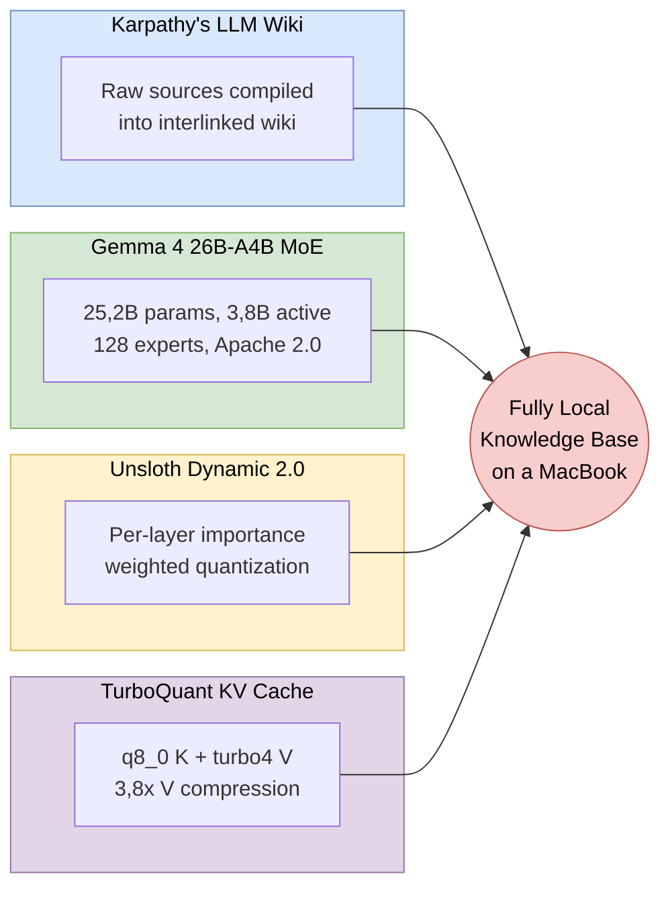

# LLM Wiki

A fully local implementation of [Karpathy's LLM Knowledge Base](https://x.com/karpathy/status/2039805659525644595) pattern. No cloud APIs, no data exfiltration, no external Python dependencies beyond the standard library.

Drop source documents into a folder. A local LLM reads them, extracts entities and concepts, writes interlinked wiki pages and maintains a persistent, compounding knowledge graph, all on-device, all offline.


This project is a proof-of-concept that integrates four recent developments into one working system:

1. **[Karpathy's LLM Wiki pattern](https://x.com/karpathy/status/2039805659525644595)** (April 2026), the idea that an LLM should *build and maintain a wiki* from raw sources, rather than doing one-shot RAG retrieval. Raw data is "compiled" into interlinked Markdown, then operated on by CLI tools for Q&A, linting and incremental enrichment.

2. **[Gemma 4 27B-A4B](https://ai.google.dev/gemma/docs/core/model_card_4)** (April 2026), Google DeepMind's open-weights Mixture-of-Experts model. 25,2B total parameters, but only 3,8B active per token via learned routing across 128 experts. This gives 27B-class output quality at roughly 4B-class inference cost ([model card](https://ai.google.dev/gemma/docs/core/model_card_4): MMLU Pro 82,6%, GPQA Diamond 82,3%, within 2-3% of the 31B Dense variant on all benchmarks). Apache 2.0 licensed.

3. **[Unsloth Dynamic 2.0 (UD)](https://unsloth.ai/blog/dynamic-v2)**, per-layer importance-weighted quantization for GGUF files ([docs](https://unsloth.ai/docs/basics/unsloth-dynamic-2.0-ggufs)). Unlike standard Q4_K_M which applies uniform bit-width across all layers, UD selectively adjusts quantization precision per layer based on importance analysis, attention layers that matter more for output quality get higher precision, less impactful MLP layers get lower precision. Same ~16GB file size, measurably better output quality.

4. **[TurboQuant KV Cache Compression](https://arxiv.org/abs/2504.19874)** (Zandieh et al. ICLR 2026), runtime KV cache compression using PolarQuant with Walsh-Hadamard rotation. We use the asymmetric `q8_0` K + `turbo4` V configuration via the [llama-cpp-turboquant](https://github.com/TheTom/llama-cpp-turboquant) fork (not yet in mainline llama.cpp). Full-precision keys preserve attention routing accuracy; compressed values (3,8×) reduce the KV cache from ~5 GB to ~3 GB, freeing ~3 GB of headroom for longer context windows or additional parallel slots.

Everything runs on a single MacBook. The 16 GB model loads into Metal GPU unified memory, processes documents through a structured extraction pipeline and produces an [Obsidian](https://obsidian.md)-compatible knowledge base with hundreds of interlinked pages.


*The wiki after ingesting ~25 sources on local LLM inference: 500+ interlinked pages organised by topic clusters. Color groups show how the LLM cross-references entities across sources, red = TurboQuant, orange = Gemma 4, green = Karpathy, lime = agents.*



---

## Documentation map

**This README is a landing page.** The depth is in [`docs/`](docs/), structured according to the [arc42 template](https://arc42.org/) (Starke & Hruschka) and the [C4 model](https://c4model.com/) (Simon Brown). Architecture decisions use [Michael Nygard's ADR format](https://cognitect.com/blog/2011/11/15/documenting-architecture-decisions.html); quality scenarios use the [ISO/IEC 25010](https://www.iso.org/standard/35733.html) attribute set.

### arc42 (twelve sections + appendix)

- [`docs/arc42/README.md`](docs/arc42/README.md), **start here**. Reading orders, cross-reference conventions, section map.
- [§ 1, Introduction and Goals](docs/arc42/01-introduction-and-goals.md), five quality goals, prioritised
- [§ 2, Architecture Constraints](docs/arc42/02-architecture-constraints.md), TC-1 through TC-8
- [§ 3, System Scope and Context](docs/arc42/03-system-scope-and-context.md), C4 Level 1 and the mapping to Karpathy's gist
- [§ 4, Solution Strategy](docs/arc42/04-solution-strategy.md), the big choices
- [§ 5, Building Block View](docs/arc42/05-building-block-view.md), C4 Level 2 and Level 3 inline
- [§ 6, Runtime View](docs/arc42/06-runtime-view.md), sequence diagrams for ingest, query, the six-stage resolver, context-overflow recovery
- [§ 7, Deployment View](docs/arc42/07-deployment-view.md), infrastructure, memory budget, one-time setup
- [§ 8, Cross-cutting Concepts](docs/arc42/08-crosscutting-concepts.md), domain model, error handling, concurrency, prompt discipline
- [§ 9, Architecture Decisions](docs/arc42/09-architecture-decisions.md), ADR-001 through ADR-007 (zero deps, fork llama.cpp, FTS5+graph, asymmetric KV, six-stage resolver, F1 gates, reverse-index idempotency)
- [§ 10, Quality Requirements](docs/arc42/10-quality-requirements.md), 23 ISO/IEC 25010 scenarios in arc42 S/E/R/M format
- [§ 11, Risks and Technical Debt](docs/arc42/11-risks-and-technical-debt.md), **security audit, PII audit**, known limitations, debt, risk register
- [§ 12, Glossary](docs/arc42/12-glossary.md), ~75 alphabetical terms
- [**Appendix A, Academic Retrospective**](docs/arc42/appendix-a-academic-retrospective.md), **what we did, what we did and failed (F-1..F-6), what we did and succeeded but didn't fit (D-1..D-5), meta-lessons (M-1..M-5)**

### C4 model (standalone)

- [`docs/c4/L1-system-context.md`](docs/c4/L1-system-context.md), Level 1, System Context
- [`docs/c4/L2-container.md`](docs/c4/L2-container.md), Level 2, Containers
- [`docs/c4/L3-component.md`](docs/c4/L3-component.md), Level 3, Components

### Quick links by question

| Question | Go to |
|---|---|
| "What does the system do and why?" | [arc42 § 1](docs/arc42/01-introduction-and-goals.md) + [§ 3](docs/arc42/03-system-scope-and-context.md) |
| "How is it decomposed?" | [arc42 § 5](docs/arc42/05-building-block-view.md) or [C4 L2](docs/c4/L2-container.md) / [L3](docs/c4/L3-component.md) |
| "How does ingestion work, step by step?" | [arc42 § 6.2](docs/arc42/06-runtime-view.md) |
| "How does retrieval work?" | [arc42 § 6.3](docs/arc42/06-runtime-view.md) + [C4 L3.B](docs/c4/L3-component.md) |
| "How does entity resolution work?" | [arc42 § 6.4](docs/arc42/06-runtime-view.md) + [C4 L3.C](docs/c4/L3-component.md) |
| "Why did you pick FTS5 over a vector DB?" | [arc42 § 9, ADR-003](docs/arc42/09-architecture-decisions.md) |
| "Why zero dependencies?" | [arc42 § 9, ADR-001](docs/arc42/09-architecture-decisions.md) |
| "Why fork llama.cpp?" | [arc42 § 9, ADR-002](docs/arc42/09-architecture-decisions.md) and [ADR-004](docs/arc42/09-architecture-decisions.md) |
| "What are the quality goals?" | [arc42 § 1.2](docs/arc42/01-introduction-and-goals.md) + [§ 10](docs/arc42/10-quality-requirements.md) |
| "What went wrong?" | [Appendix A § A.4](docs/arc42/appendix-a-academic-retrospective.md) |
| "What are the security and PII findings?" | [arc42 § 11.1-11.2](docs/arc42/11-risks-and-technical-debt.md) |
| "What is a term I don't recognise?" | [arc42 § 12, Glossary](docs/arc42/12-glossary.md) |

---

## Quick Start

The full setup and deployment procedure is in [arc42 § 7 (Deployment View)](docs/arc42/07-deployment-view.md). The short version lives here.

### Prerequisites

- **macOS on Apple Silicon**, tested on M5 Pro / 32 GB; should work on M1+ / 16 GB+
- **Python 3.12+**, `python3 --version`
- **Poppler** for PDF text extraction, `brew install poppler`
- **[Obsidian](https://obsidian.md)**, optional but recommended for the graph view

### 1. Clone and download the model

```bash
git clone https://github.com/DimitrisLianos/LLM_Wiki_SecondBrain.git
cd LLM_Wiki_SecondBrain

mkdir -p models
huggingface-cli download unsloth/gemma-4-26B-A4B-it-GGUF \
 gemma-4-26B-A4B-it-UD-Q4_K_M.gguf \
 --local-dir models/
```

### 2. Build llama.cpp (TurboQuant fork)

```bash
git clone https://github.com/TheTom/llama-cpp-turboquant.git llama.cpp
cd llama.cpp
git checkout feature/turboquant-kv-cache
cmake -B build -DGGML_METAL=ON -DCMAKE_BUILD_TYPE=Release
cmake --build build --config Release -j
cd ..
```

> **Why a fork?** TurboQuant KV cache compression ([paper](https://arxiv.org/abs/2504.19874)) is not yet merged into mainline llama.cpp. The [TheTom/llama-cpp-turboquant](https://github.com/TheTom/llama-cpp-turboquant) fork adds `turbo4` cache types with validated Metal / Apple Silicon support (M1-M5). Full rationale: [ADR-002](docs/arc42/09-architecture-decisions.md) and [ADR-004](docs/arc42/09-architecture-decisions.md).

### 3. Start the server

```bash
bash scripts/start_server.sh
```

Wait for `llama server listening` (~30 s for the 16 GB model to load into Metal). Leave this terminal open.

### 4. Ingest sources

In a second terminal:

```bash
# Create the vault directories (first time only):
mkdir -p obsidian_vault/raw obsidian_vault/wiki/{sources,entities,concepts,synthesis}

# Drop files into obsidian_vault/raw/, then:
python3 scripts/ingest.py --list # see what's available
python3 scripts/ingest.py article.md # ingest one file
python3 scripts/ingest.py --all # ingest everything pending
```

### 5. Query the wiki

```bash
python3 scripts/query.py "what themes connect these sources?"
python3 scripts/query.py -i # interactive mode
python3 scripts/query.py -s "compare X and Y" # save answer as wiki page
```

---

## Operations reference (short)

For the full ops reference including fallback configurations for 16 GB machines, see [arc42 § 7 (Deployment View)](docs/arc42/07-deployment-view.md).

| Command | What it does |
|---|---|
| `bash scripts/start_server.sh` | Start the generation server (Gemma 4, 127.0.0.1:8080) |
| `bash scripts/start_server.sh stop` | Stop the server |
| `bash scripts/start_embed_server.sh` | Start the optional embedding server (bge-m3, 127.0.0.1:8081) for resolver stage 5 |
| `python3 scripts/ingest.py --all` | Ingest all pending sources |
| `python3 scripts/ingest.py --list` | List sources and their ingest status |
| `python3 scripts/ingest.py --reprocess file` | Re-ingest, overwriting existing pages |
| `python3 scripts/query.py "question"` | Ask a question |
| `python3 scripts/query.py -i` | Interactive query mode |
| `python3 scripts/query.py -s "question"` | Query and save answer as wiki page |
| `python3 scripts/search.py "terms"` | Test retrieval (no LLM needed, ~5 ms) |
| `python3 scripts/search.py --rebuild` | Rebuild the FTS5 search index |
| `python3 scripts/lint.py` | Health-check the wiki graph |
| `python3 scripts/cleanup_dedup.py` | Find and merge duplicate pages (dry run; use `--apply` to write) |
| `bash scripts/watch.sh` | Auto-ingest new files dropped into `raw/` |
| `bash scripts/watch.sh --lint` | Auto-ingest + lint after each |

### Supported file types

| Type | Extension | Processing | Requires |
|---|---|---|---|
| PDF | `.pdf` | Text extracted via `pdftotext`, chunked by paragraphs | `brew install poppler` |
| Markdown | `.md` | Read as-is, chunked if large | - |
| SMS backup XML | `.xml` | Parsed via `xml.etree.ElementTree` (XXE-safe) | - |
| Plain text | `.txt` | Same as markdown | - |

Any other file type is read as plain text with UTF-8 decoding.

---

## Project structure

```
SecondBrain_POC/
├── README.md # this landing page
├── CLAUDE.md # wiki schema, LLM instructions
├── LICENSE # MIT
├── pyproject.toml # project metadata (zero runtime deps)
├── awake_mac.py # prevent Mac sleep via caffeinate
│
├── docs/ # architecture documentation
│ ├── arc42/ # full arc42 template (12 sections + appendix)
│ │ ├── README.md # arc42 index, start here
│ │ ├── 01-introduction-and-goals.md
│ │ ├── 02-architecture-constraints.md
│ │ ├── 03-system-scope-and-context.md
│ │ ├── 04-solution-strategy.md
│ │ ├── 05-building-block-view.md
│ │ ├── 06-runtime-view.md
│ │ ├── 07-deployment-view.md
│ │ ├── 08-crosscutting-concepts.md
│ │ ├── 09-architecture-decisions.md
│ │ ├── 10-quality-requirements.md
│ │ ├── 11-risks-and-technical-debt.md
│ │ ├── 12-glossary.md
│ │ └── appendix-a-academic-retrospective.md
│ └── c4/ # C4 model (standalone)
│ ├── L1-system-context.md
│ ├── L2-container.md
│ └── L3-component.md
│
├── scripts/
│ ├── llm_client.py # shared LLM client, paths, constants, safe_filename
│ ├── search.py # FTS5 + wikilink graph + RRF retrieval
│ ├── ingest.py # ingestion pipeline (write path)
│ ├── query.py # wiki query interface (read path)
│ ├── resolver.py # six-stage entity resolver (stages 0-5)
│ ├── aliases.py # gazetteer sidecar (seed + runtime tiers)
│ ├── data/
│ │ └── seed_aliases.json # 149 curated canonical entries
│ ├── cleanup_dedup.py # offline duplicate merger
│ ├── lint.py # wiki health checker
│ ├── start_server.sh # generation server launcher
│ ├── start_embed_server.sh # embedding server launcher (optional)
│ └── watch.sh # filesystem watcher for auto-ingestion
│
├── obsidian_vault/ # the knowledge base
│ ├── raw/ # source documents (immutable, gitignored)
│ │ └── assets/ # downloaded images and attachments
│ └── wiki/ # LLM-generated pages (gitignored)
│ ├── index.md # content catalogue
│ ├── log.md # chronological operations log
│ ├── sources/ # one summary per ingested source
│ ├── entities/ # people, orgs, tools, datasets, models
│ ├── concepts/ # methods, theories, frameworks, patterns
│ └── synthesis/ # filed query answers
│
├── db/ # derived state (auto-generated, gitignored)
│ ├── wiki_search.db # SQLite FTS5 + source_files reverse index
│ ├── alias_registry.json # runtime-promoted gazetteer
│ ├── judge_cache.json # resolver stage-4 verdicts
│ ├── embed_cache.json # bge-m3 vectors (stage 5 cache)
│ └── resolver_calibration.json # F1 threshold calibration data
│
├── models/ # GGUF weights (gitignored)
└── llama.cpp/ # TurboQuant fork build (gitignored)
```

The full static decomposition with responsibilities, interfaces and allowed-dependency matrix is in [arc42 § 5](docs/arc42/05-building-block-view.md) and [C4 L2](docs/c4/L2-container.md).

---

## Troubleshooting (short)

For the full troubleshooting table including memory-pressure fallbacks, the `turbo3` quality warning and the context-overflow recovery procedure, see [arc42 § 11.3 (Known limitations)](docs/arc42/11-risks-and-technical-debt.md#113-known-limitations).

| Problem | Pointer |
|---|---|
| "Cannot reach llama.cpp server" | `bash scripts/start_server.sh`, wait for `llama server listening` |
| Server runs out of memory | Reduce `CONTEXT` to `32768` or `16384` in `scripts/start_server.sh`. See [arc42 § 7.4](docs/arc42/07-deployment-view.md). |
| Ingest produces 0 entities / 0 concepts | Verify `--reasoning off`: `grep reasoning scripts/start_server.sh`. Full story: [Appendix A F-3](docs/arc42/appendix-a-academic-retrospective.md). |
| HTTP 400 during ingest | Handled automatically, the pipeline auto-splits and retries up to 2 levels. See [arc42 § 6.5](docs/arc42/06-runtime-view.md). |
| "unknown cache type turbo4" | You are on mainline llama.cpp instead of the TurboQuant fork. Re-clone step 2 of Quick Start. |
| Quality degradation at inference | Do not use `turbo3` on Gemma 4 Q4_K_M (PPL > 100K). Use `turbo4` only. See [Appendix A F-5](docs/arc42/appendix-a-academic-retrospective.md). |
| Obsidian doesn't show new pages | Filesystem watch delay, click a different folder and back, or reopen the vault. |
| llama.cpp build fails | `xcode-select --install`, then rebuild. |

---

## Security and privacy posture

This project is single-user, offline and local. The security and PII audit findings are documented in [arc42 § 11.1-11.2](docs/arc42/11-risks-and-technical-debt.md). The short version:

- **No outbound network.** `grep -R "https://" scripts/` returns only documentation comments. Verified.
- **Loopback-only server binding.** Both llama.cpp servers bind to `127.0.0.1` only.
- **One-way `raw/`.** The pipeline reads from `raw/` and never writes to it. Enforced by convention and by [CLAUDE.md Rule 1](CLAUDE.md).
- **Path-containment on all writes.** Every write under `wiki/` goes through `safe_filename()` in [`scripts/llm_client.py`](scripts/llm_client.py). See [arc42 § 11.1 SEC-2](docs/arc42/11-risks-and-technical-debt.md#111-security-posture).
- **XXE-safe XML parsing.** Python's `xml.etree.ElementTree` does not expand external entities. See [arc42 § 11.1 SEC-3](docs/arc42/11-risks-and-technical-debt.md#111-security-posture).
- **Four PII findings** (historical personal data in git history, documented in [arc42 § 11.2](docs/arc42/11-risks-and-technical-debt.md#112-pii-audit)).

Anything that would require a new outbound network edge, telemetry, crash reporters, update checks, cloud LLM fallback, is a breaking change to [Quality Goal Q1 (privacy)](docs/arc42/01-introduction-and-goals.md#12-quality-goals) and requires an ADR.

---

## Honest retrospective

The user's original brief asked for "what we did, what we did and failed, what we did and succeeded but didn't fit purpose", an academic-rigour retrospective rather than marketing copy. That retrospective lives in full in [**Appendix A, Academic Retrospective**](docs/arc42/appendix-a-academic-retrospective.md). Brief selection:

**Worked and fit the purpose:**
- Four-pillar integration (Karpathy + Gemma 4 + UD + TurboQuant)
- FTS5 + graph + RRF retrieval, replaces an LLM-driven page selector that hit a scaling ceiling at ≈ 500 pages
- Six-stage entity resolver with a canonical alias gazetteer, the fix for the cross-document proper-noun fork epidemic
- Asymmetric `q8_0` K + `turbo4` V KV cache, ~3 GB reclaimed vs. symmetric Q8
- Zero Python runtime dependencies, ~2 000 LOC of stdlib code against Python 3.12
- Reverse-index idempotency via `source_files` table, replaces an O(N) directory scan
- Hard gates on the F1 threshold tuner, `MIN_SAMPLES=20`, `MIN_NEG=5`, `MIN_POS=5`
- Consolidation of `safe_filename()` in `llm_client.py` after a duplicated-implementation incident

**Succeeded but did not fit purpose (kept as opt-in, or dropped):**
- bge-m3 stage-5 embedding cosine, kept as opt-in behind a flag
- Age-gap tiebreaker, gated behind `--use-embeddings`
- Greek Snowball stemmer, dropped; Porter stemmer + stopwords covered the actual corpus
- GraphRAG community summaries, dropped; found to underperform plain RAG on single-hop QA ([Han et al. 2025](https://arxiv.org/abs/2502.11371))
- LLM page compression, dropped; quality not worth the cost

**Failed outright, then fixed:**
- **F-1** LLM-based page selection scaling ceiling → replaced with FTS5 + graph + RRF
- **F-2** F1 threshold degenerated on 51/1 imbalance → hard gates on sample counts
- **F-3** Gemma 4 thinking tokens consumed output budget → `--reasoning off` at the server
- **F-4** ChatGPT 5-way fork epidemic → canonical alias gazetteer at stage 0
- **F-5** `turbo3` caused PPL > 100K on Gemma 4 Q4_K_M → only `turbo4`, asymmetric
- **F-6** *Aedes aegypti* fork from LLM type noise → narrowed the type-constraint stage

Each failure has a full *symptom / root cause / mitigation / status / lesson* block in [Appendix A § A.4](docs/arc42/appendix-a-academic-retrospective.md#a4-what-we-did-and-failed-f-series).

---

## License

[MIT](LICENSE)

---

## References

The complete reference list, with inline citations at the point of use, lives inside the arc42 sections. The core references are:

**Pattern.** Andrej Karpathy, ["LLM Knowledge Bases"](https://x.com/karpathy/status/2039805659525644595) and [architecture gist](https://gist.github.com/karpathy/442a6bf555914893e9891c11519de94f), April 2026.

**Model and quantization.** [Gemma 4 model card](https://ai.google.dev/gemma/docs/core/model_card_4) (Google DeepMind, 2026); [Unsloth Dynamic 2.0](https://unsloth.ai/blog/dynamic-v2); A. Zandieh, M. Daliri, M. Hadian, V. Mirrokni, ["TurboQuant: Online KV Cache Quantization via Rotated Random Projections"](https://arxiv.org/abs/2504.19874), ICLR 2026; I. Han et al. ["PolarQuant"](https://arxiv.org/abs/2502.02617), AISTATS 2026; A. Zandieh, M. Daliri, I. Han, ["QJL"](https://arxiv.org/abs/2406.03482), 2024.

**Retrieval.** G. V. Cormack, C. L. A. Clarke, S. Büttcher, ["Reciprocal Rank Fusion"](https://dl.acm.org/doi/10.1145/1571941.1572114), SIGIR 2009; N. Thakur et al. ["BEIR"](https://arxiv.org/abs/2104.08663), NeurIPS 2021; G. M. B. Rosa et al. ["BM25 Is a Strong Baseline for Legal Case Retrieval"](https://arxiv.org/abs/2105.05686), 2021; S. Bruch et al. ["Analysis of Fusion Functions for Hybrid Retrieval"](https://arxiv.org/abs/2210.11934), 2022; S. Mandikal, R. J. Mooney, ["Sparse Meets Dense"](https://arxiv.org/abs/2401.04055), 2024.

**Entity resolution.** P. Ferragina, U. Scaiella, ["TAGME"](https://doi.org/10.1145/1871437.1871689), CIKM 2010; L. Wu et al. ["BLINK"](https://arxiv.org/abs/1911.03814), EMNLP 2020; T. Ayoola et al. ["ReFinED"](https://arxiv.org/abs/2207.04108), NAACL 2022; N. De Cao et al. ["mGENRE"](https://arxiv.org/abs/2103.12528), TACL 2022; W. L. Hamilton, J. Leskovec, D. Jurafsky, ["Diachronic Word Embeddings Reveal Statistical Laws of Semantic Change"](https://arxiv.org/abs/1605.09096), ACL 2016; T. Fawcett, ["An Introduction to ROC Analysis"](https://doi.org/10.1016/j.patrec.2005.10.010), 2006.

**Graph-augmented retrieval.** D. Edge et al. ["From Local to Global: A GraphRAG Approach"](https://arxiv.org/abs/2404.16130), 2024; Z. Han et al. ["RAG vs. GraphRAG"](https://arxiv.org/abs/2502.11371), 2025; Z. Li et al. ["Simple is Effective"](https://arxiv.org/abs/2410.20724), 2024.

**Infrastructure.** [llama.cpp](https://github.com/ggml-org/llama.cpp) by Georgi Gerganov et al.; [TheTom/llama-cpp-turboquant](https://github.com/TheTom/llama-cpp-turboquant) fork; [TheTom/turboquant_plus](https://github.com/TheTom/turboquant_plus) research workspace; [Obsidian](https://obsidian.md); [SQLite FTS5](https://www.sqlite.org/fts5.html); Simon Willison, ["Exploring Search Relevance Algorithms with SQLite"](https://simonwillison.net/2019/Jan/7/exploring-search-relevance-algorithms-sqlite/), 2019.

**Methodology.** arc42 template (Gernot Starke, Peter Hruschka); [C4 model](https://c4model.com/) (Simon Brown); [Michael Nygard's ADR format](https://cognitect.com/blog/2011/11/15/documenting-architecture-decisions.html); [ISO/IEC 25010](https://www.iso.org/standard/35733.html) software product quality model.
