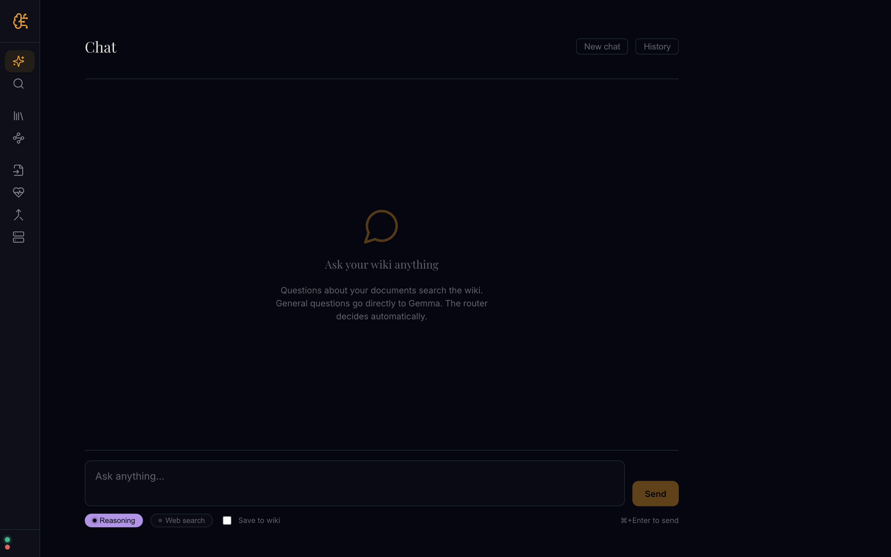
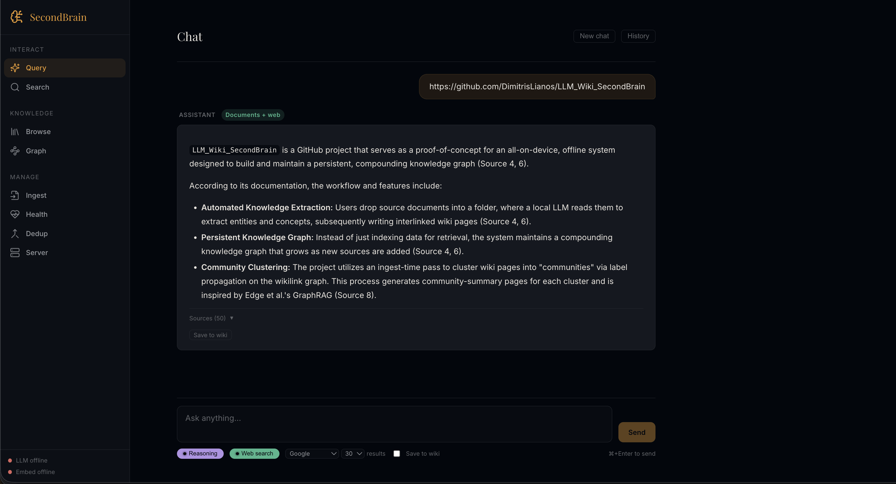
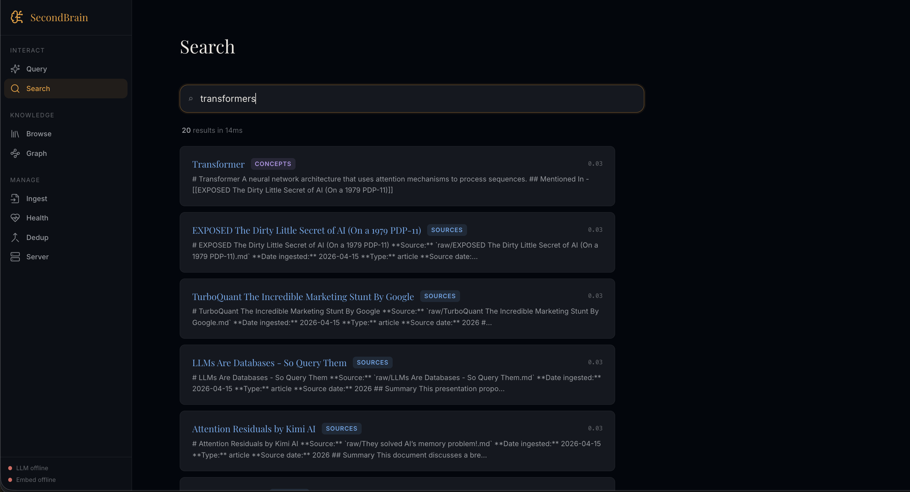
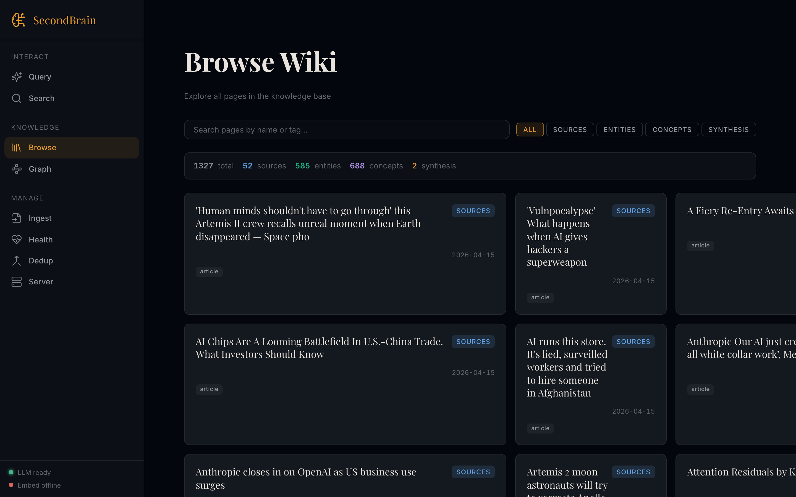
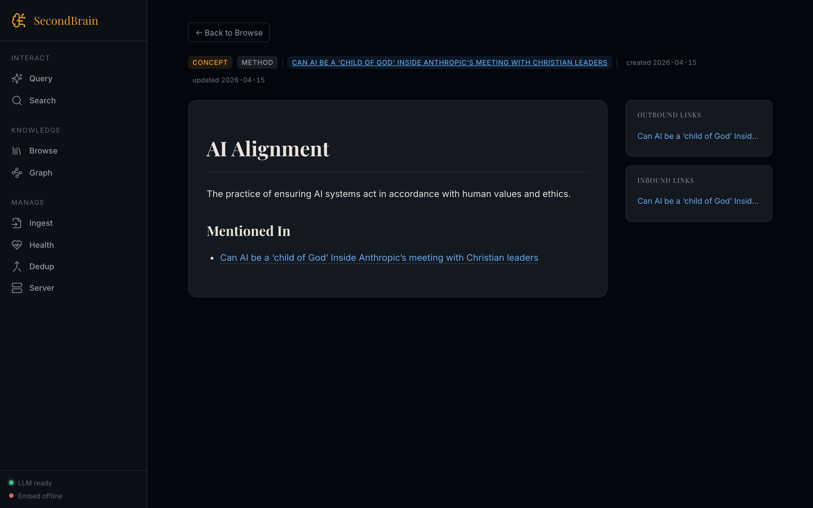
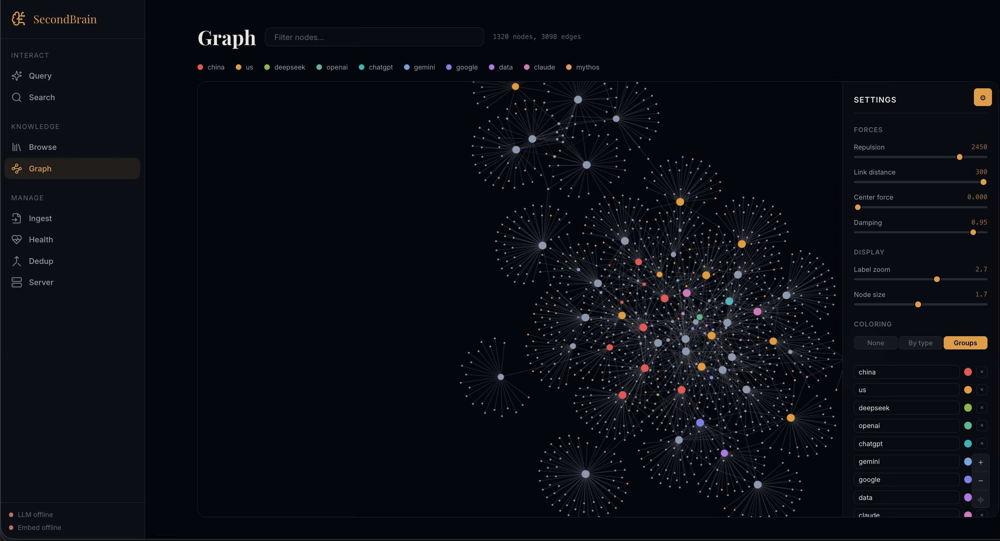
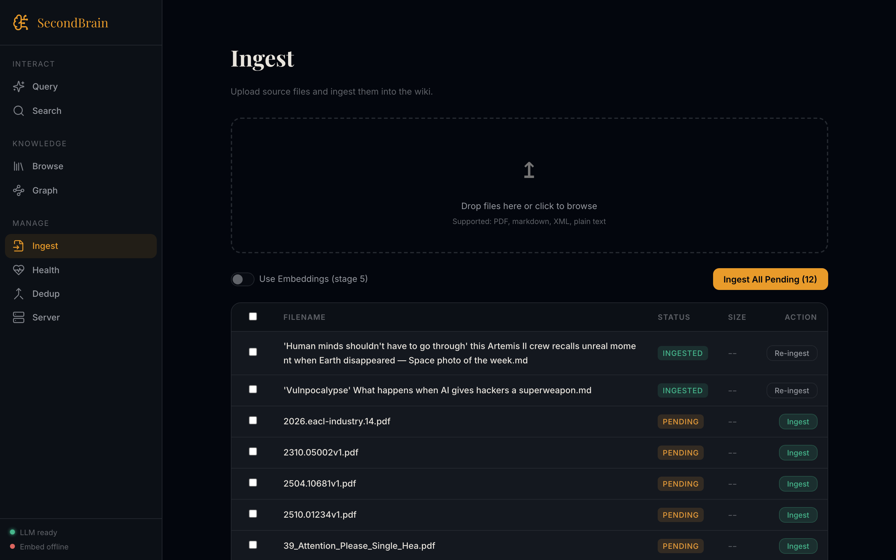
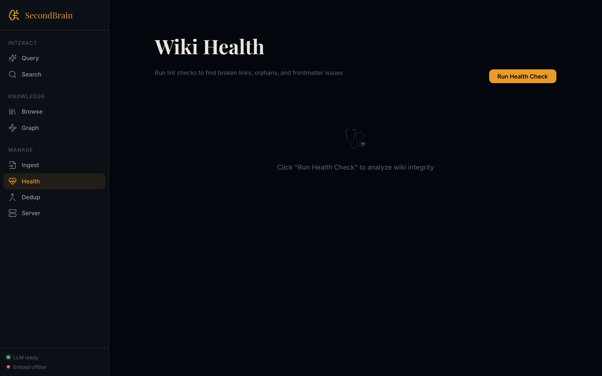
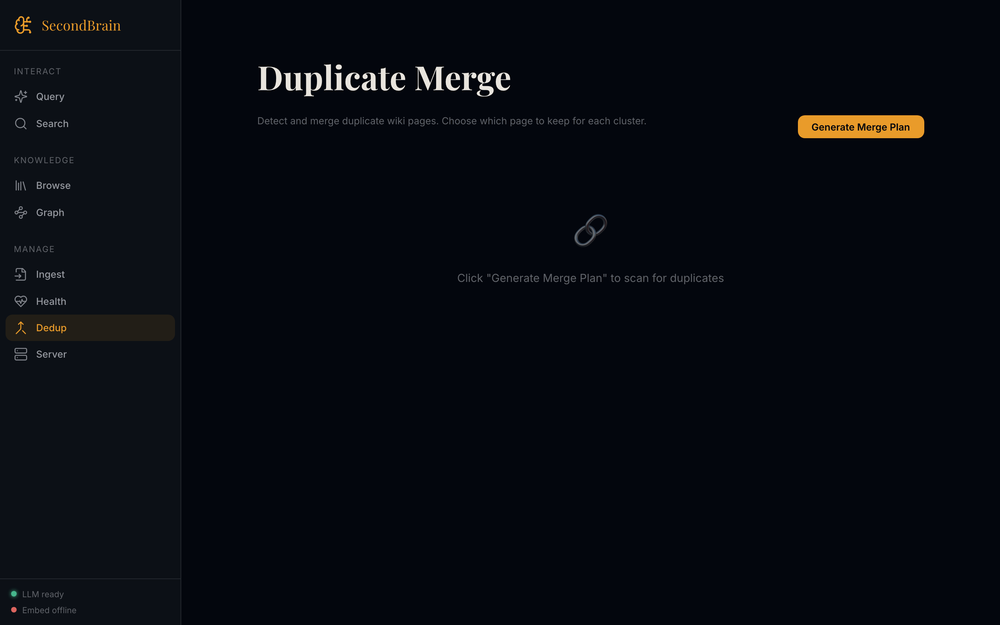
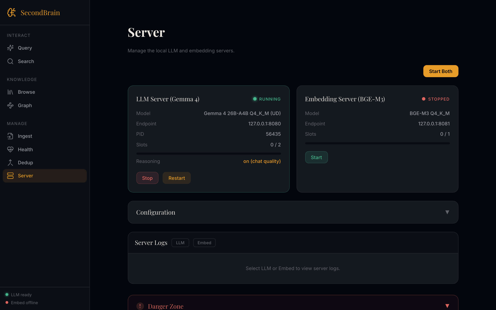

# Web UI Guide

The SecondBrain web UI is an optional, loopback-only interface that wraps the
same scripts you would run on the command line. It is served by a small
FastAPI app under `web/` and built with Lit on the front-end. Everything runs
on your machine. No data leaves the device.

- **Backend:** FastAPI on `http://127.0.0.1:3000`
- **Frontend:** Lit + Vite, served as a static bundle by the API
- **Dependencies:** `fastapi`, `uvicorn`, `ddgs` on the Python side; `lit`,
  `marked`, `dompurify` on the front-end

---

## Launching

From the repository root:

```bash
# start the llama.cpp server (required)
bash scripts/start_server.sh

# then launch the web UI (separate terminal)
python3 web/api/app.py
```

Open [http://127.0.0.1:3000](http://127.0.0.1:3000) in your browser.

The sidebar footer shows two status lights:

- **LLM**: green when the llama.cpp chat server (port 8080) is reachable
- **Embed**: green when the BGE-M3 embedding server (port 8081) is
  reachable. The embedding server is optional and used only by the
  reranker and semantic-resolver stages.

---

## Layout

The app is a two-column shell. A left-hand navigation rail organises the
panels into three groups: **Interact**, **Knowledge**, and **Manage**. The
brand mark at the top collapses the rail to an icon-only strip.



The main pane renders the active panel. Navigation is URL-routed
(`#/query`, `#/search`, `#/browse/…`), so every view is bookmarkable and
the browser back/forward buttons work as expected.

---

## Panels

### Query



Free-form chat against the wiki. The backend routes each question either
through the RAG pipeline (FTS + wikilink-graph traversal + RRF → LLM) or
directly to Gemma for general questions. The router decides automatically.

- **Reasoning** toggle controls Gemma's `<think>` mode. On by default for
  chat quality; `<think>` blocks are stripped from the rendered output.
- **Web search** augments answers with live DuckDuckGo results via `ddgs`.
  Loopback-only; the backend proxies the request.
- **Save to wiki** files the answer as a new synthesis page once the
  response completes.
- **New chat** starts a fresh conversation. **History** reopens older ones
  (kept in-memory for the current session).
- Keyboard shortcut: `⌘/Ctrl + Enter` sends.

### Search



Full-text search over every wiki page. Uses the same SQLite FTS5 index as
`scripts/search.py`, so ranking matches the CLI. Start typing to get live
results grouped by type (source / entity / concept / synthesis).

**Rebuild Index** re-walks `obsidian_vault/wiki/` and repopulates the FTS
database. Run this if you have edited pages outside the app or restored
from a backup.

### Browse



A card view of every page in the wiki. Tabs at the top filter by type
(**All / Sources / Entities / Concepts / Synthesis**) and show live
counts. The search input on the left filters by title or tag. Each card
shows the title, primary tag, and the last update date. Clicking a card
opens the page viewer.

### Page viewer



Rendered Markdown with the wiki's type-tag chips at the top, creation and
update metadata, and, on the right, inbound and outbound links derived
from the wikilink graph. A **Mentioned In** section lists every page that
backlinks to the current one. Wikilinks inside the body navigate without a
full reload.

Markdown is parsed by `marked` and sanitised by `DOMPurify` before
rendering, the raw wiki content is already trusted (you wrote it) but the
same pipeline is used for every page to keep the HTML path uniform.

### Graph



Force-directed visualisation of the whole wikilink graph. Nodes are
pages, edges are wikilinks. The counter at the top shows totals; the
filter input narrows the graph to nodes whose label matches.

The graph is most useful at small-to-medium wikis. At 1k+ nodes it
shows the characteristic dense-core shape that an indexed knowledge
base develops, useful as a sanity check that your sources are
cross-referencing rather than producing orphan islands.

### Ingest



Drag-and-drop uploader for `obsidian_vault/raw/`. Accepts the same formats
as the CLI pipeline:

- PDF
- Markdown
- XML (iOS SMS Archive format)
- Plain text

Uploaded files are staged as **PENDING**. **Ingest All Pending** runs the
same pipeline as `python3 scripts/ingest.py` for every pending file,
touching wiki pages in place. Already-processed files are marked
**INGESTED** and can be re-ingested per row.

The **Use Embeddings (stage 5)** toggle forces the embedding-based
semantic tiebreaker in the entity resolver. Leave it off for a faster run
if your sources are unambiguous; turn it on for dense domains where
Stage 3 Jaccard is likely to collide.

### Health



Front-end for `scripts/lint.py`. Clicking **Run Health Check** scans the
wiki and reports:

- Broken wikilinks (references to non-existent pages)
- Orphaned pages (no inbound links)
- Frontmatter issues (missing type/tags/sources/created/updated)
- Thin pages (unusually short bodies)
- Index consistency (`wiki/index.md` vs. the filesystem)

### Dedup



Front-end for `scripts/cleanup_dedup.py`. **Generate Merge Plan** produces
a dry-run: clusters of likely duplicates are shown with a suggested
"keep" page. You pick which page survives per cluster before applying.
The merger uses the same composite key as the CLI tool, gazetteer
canonical name when available, stem-based otherwise.

### Server



Runtime control panel for both the chat and embedding servers:

- **LLM Server (Gemma 4)**: model path, endpoint, PID, slot usage,
  reasoning toggle, Stop / Restart buttons.
- **Embedding Server (BGE-M3)**: model, endpoint, slot usage, Start
  button.
- **Configuration**: expandable view of the effective `start_server.sh`
  flags.
- **Server Logs**: tails the rotating log files under `logs/`, with
  LLM / Embed filters.
- **Danger Zone**: destructive maintenance actions (wipe index,
  reset state) behind a collapsed section to prevent accidental clicks.

The **Reasoning** value here mirrors the same toggle as the Query panel.
Flip it off before an ingest run, back on for chat, or change it from
`scripts/start_server.sh` before launch and restart.

---

## Security Properties

The UI is explicitly designed for a single-user, loopback-only workflow.

- All HTTP endpoints bind to `127.0.0.1`.
- No authentication layer, access control is the OS loopback boundary.
- Uploads are constrained to `obsidian_vault/raw/` via path-containment
  checks.
- All rendered Markdown passes through DOMPurify before insertion into the
  DOM. Inline `<script>` and event-handler attributes are stripped.
- A strict Content-Security-Policy header is set on the FastAPI app; no
  third-party script origins are allowed.

If you expose this UI to anything other than `localhost`, you are
responsible for adding authentication, TLS, and an egress-aware CSP.

---

## What's Next, UI Roadmap

The POC ships with a usable but deliberately narrow UI. The following
items are on the near-term list for the next release. They are ordered
roughly by impact for day-to-day use.

### Shipping soon

- **Streaming query responses.** Replace the current buffered render with
  token-by-token streaming from `/v1/chat/completions` for visible
  feedback during long generations.
- **Ingest progress.** A per-file progress bar for long PDFs, plus an
  estimated-time-remaining indicator. Right now the UI shows a single
  spinner for the whole batch.
- **Auto-start embedding server.** The LLM server is launched via a
  helper script; the embedding server still requires a manual shell
  invocation. The Server panel will gain a one-click "Start Both" that
  actually manages both processes end-to-end.
- **Graph filters by type and depth.** Currently only label filtering;
  add type chips (sources / entities / concepts / synthesis) and a
  neighbourhood depth control (`N` hops from a selected node).
- **In-page editing.** A lightweight editor in the page viewer for small
  corrections without leaving the app. Writes back to the same Markdown
  file, then re-indexes.

### On the horizon

- **Session persistence.** Chats and search queries reset on reload; a
  local JSON store will keep the last N sessions addressable by URL.
- **Keyboard-first navigation.** Command palette (`⌘K`) for jumping to
  any panel, page, or ingest action. Global `?` to show the shortcut
  reference.
- **Settings panel.** Surface the `start_server.sh` flags as a proper
  form, context size, slot count, reasoning default, instead of
  relying on editing the shell script.
- **Light theme.** Dark is currently the only theme. A system-preference
  light variant is wanted for documentation screenshots and
  accessibility testing under bright-ambient conditions.
- **Mobile layout.** The sidebar already collapses below 768px, but
  several panels (Graph, Ingest, Dedup) need dedicated small-viewport
  layouts.
- **Export / share.** Export a synthesis page, or a filtered slice of
  the graph, as a self-contained HTML bundle.

### Explicitly out of scope

- Multi-user authentication. The project is a local-first personal
  knowledge base; multi-user features belong in a different product.
- Cloud sync. All state is on disk and versioned by the user.
- Remote LLM fallback. The whole point of the stack is offline
  operation; a remote fallback would change the threat model.