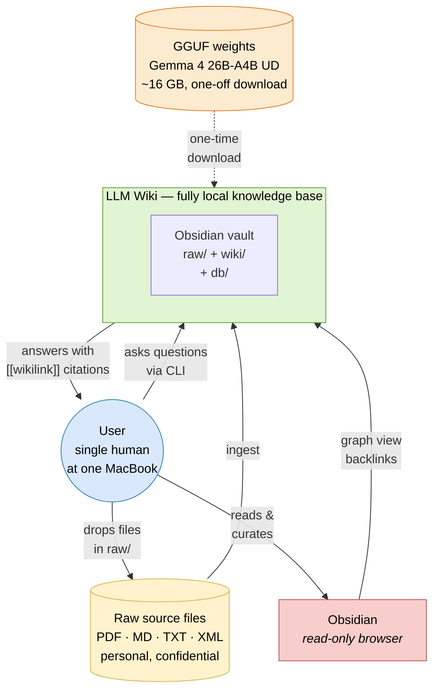
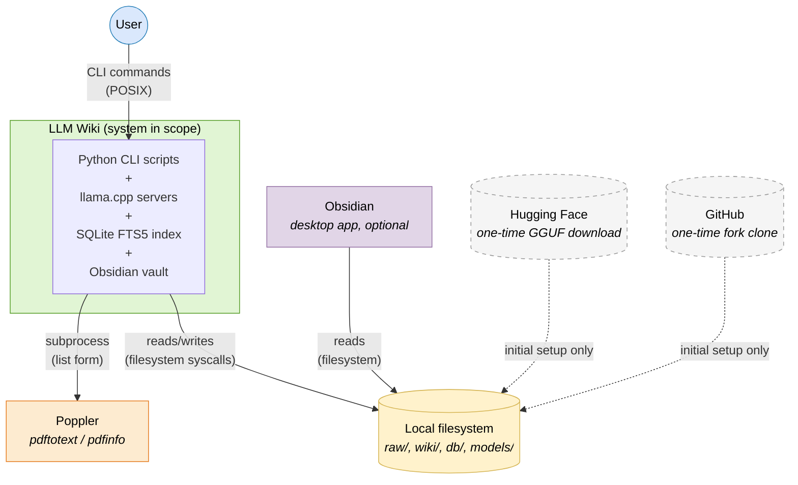

# 3. System Scope and Context

> **arc42, Section 3.** This section draws the boundary between the system and its environment. What is inside? What does it talk to? What walks in and walks out? This is the same question that the [C4 model](https://c4model.com/)'s Level 1 diagram answers, so we combine the two.

---

## 3.1 Business Context

The system exists to make one human, the user, able to ingest and then query their own documents without trusting a third party. Everything that crosses the boundary in either direction is pictured below.

| Actor / External Entity | Direction | What crosses the boundary | Protocol / Format |
|---|---|---|---|
| **User** | → System | Commands: `ingest`, `query`, `lint`, `watch` | POSIX CLI |
| **User** | ← System | Synthesized answers with `[[wikilink]]` citations; error messages; progress output | Stdout text |
| **User** | → Vault | Drops source files directly into `obsidian_vault/raw/` | Filesystem |
| **Raw source files** | → System | Document text and (for SMS exports) structured XML | UTF-8 text extracted via `pdftotext` for PDF, read directly for MD/TXT, parsed via `xml.etree.ElementTree` for XML |
| **Obsidian** | ↔ Vault | Reads wiki pages; renders graph view, backlinks, Dataview queries | Filesystem + Markdown + YAML frontmatter |
| **GGUF model weights** | → System | Model loaded by llama.cpp at server startup; never sent anywhere | Filesystem read; mmap into Metal unified memory |

There is nothing else in the picture. Specifically, there is **no** outbound HTTPS call, no telemetry, no update check, no crash reporter, no OpenAI fallback, no vector-database server, no message queue, no auth provider. This is not architectural aesthetics, it is [Quality Goal Q1](01-introduction-and-goals.md#12-quality-goals) enforced mechanically: `grep -R "https://" scripts/` returns only documentation comments, never a live request target.

---

## 3.2 Technical Context — C4 Level 1 (System Context)

The C4 model's Level 1 diagram focuses on one question: *what interacts with the system and over what protocol?* At Level 1, the entire LLM Wiki project is one box. The surrounding boxes are the actors and external software that touch it.

**Interpretation of the dashed lines:** Hugging Face and GitHub are shown because the reproducible setup procedure in [section 7](07-deployment-view.md) requires a one-time download of the GGUF model weights and a one-time clone of the [`llama-cpp-turboquant`](https://github.com/TheTom/llama-cpp-turboquant) fork. Once setup is complete, the system never talks to either again. During normal operation the dashed edges do not exist.

**Interpretation of the solid lines:**

- `user → app` is the primary user interaction, mediated through `python3 scripts/<command>.py`. Every interactive path terminates in stdout on the user's own terminal.
- `app → fs` is the only persistence mechanism. The "database" is a SQLite file. The "vector store" does not exist. The wiki is a folder of Markdown files.
- `app → poppler` is the single subprocess boundary. `scripts/ingest.py` calls `pdftotext` and `pdfinfo` in list form (`shell=False`) on a resolved `Path` object (see [section 11.1, Finding SEC-2](11-risks-and-technical-debt.md#111-security-posture) for the path-containment nuance).
- `obs → fs` is read-only from Obsidian's side: Obsidian renders what the pipeline wrote. Obsidian does not run during ingestion; it watches the filesystem.

The C4 model's Level 2 and Level 3 views zoom into what is inside the `SYS` box. Those are in [section 5 (Building Block View)](05-building-block-view.md), or, as standalone documents, in [`docs/c4/L2-container.md`](../c4/L2-container.md) and [`docs/c4/L3-component.md`](../c4/L3-component.md).

---

## 3.3 Mapping to Karpathy's Original Gist

[Karpathy's LLM Wiki architecture gist](https://gist.github.com/karpathy/442a6bf555914893e9891c11519de94f) enumerates the moving parts of the pattern. The mapping to this implementation is one-to-one where possible, with deliberate deviation where the scale or privacy constraints demanded it:

| Karpathy's description (paraphrased) | This system's answer |
|---|---|
| *"I index source documents into a `raw/` directory"* | `obsidian_vault/raw/`, immutable, untouched by any write path |
| *"Use an LLM to incrementally compile a wiki, which is just a collection of `.md` files"* | [`scripts/ingest.py`](../../scripts/ingest.py) + Gemma 4 26B-A4B running in [`llama.cpp`](https://github.com/TheTom/llama-cpp-turboquant) |
| *"The wiki includes summaries of all the data in `raw/`, backlinks, categorises data into concepts, writes articles for them"* | `wiki/sources/` (source summaries), `wiki/entities/` (people, organisations, tools, datasets, models), `wiki/concepts/` (methods, theories, frameworks), all cross-linked via `[[wikilinks]]` |
| *"I use Obsidian as the IDE frontend"* | Same, Obsidian reads the folder as a native vault with graph view and backlinks |
| *"The LLM writes and maintains all of the data of the wiki, I rarely touch it directly"* | The LLM is the librarian; the human is the curator. All wiki content is produced by `ingest.py` and `query.py`; `lint.py` is the human's oversight tool |
| *"You can ask your LLM agent all kinds of complex questions against the wiki"* | [`scripts/query.py`](../../scripts/query.py) with the three-stage retrieval pipeline (see [section 6.3](06-runtime-view.md#63-query-pipeline)) |
| *"I end up filing the outputs back into the wiki to enhance it for further queries"* | `query.py --save` writes the answer as a synthesis page in `wiki/synthesis/`, compounding future retrievals |
| *"I've run some LLM health checks over the wiki"* | [`scripts/lint.py`](../../scripts/lint.py), broken wikilinks, orphan pages, frontmatter errors, thin pages, index inconsistencies |
| *"I vibe coded a small and naive search engine over the wiki"* | Far less naive than the original vibe-code: [`scripts/search.py`](../../scripts/search.py) is SQLite FTS5 + BM25 + wikilink graph expansion + RRF. See [section 6.3](06-runtime-view.md#63-query-pipeline) for the lineage, we started with a more naive version and replaced it for reasons documented in [Appendix A, Failure F-1](appendix-a-academic-retrospective.md#f-1--llm-based-page-selection) |

### Deliberate deviations from the gist

The gist does not prescribe a retrieval architecture, an inference backend, or an entity-resolution strategy. The three big design choices where this implementation goes beyond the gist are:

1. **Structured FTS5 + graph + RRF retrieval** in place of "ask the LLM to pick pages from the index". We tried the LLM-picks path first. It failed at ≈ 500 pages for specific, documented reasons, see [Appendix A, F-1](appendix-a-academic-retrospective.md#f-1--llm-based-page-selection) and [ADR-003](09-architecture-decisions.md#adr-003--fts5--wikilink-graph--rrf-over-vector-search).
2. **A six-stage entity resolver with a canonical gazetteer** (`scripts/resolver.py` + `scripts/aliases.py` + `scripts/data/seed_aliases.json`), grounded in the entity-linking literature. Karpathy's gist does not mention entity resolution at all, which is accurate to the experience at small scale but becomes load-bearing once the wiki has hundreds of cross-cited pages. See [section 6.4](06-runtime-view.md#64-entity-resolution-stages-05) and [ADR-005](09-architecture-decisions.md#adr-005--six-stage-entity-resolver-with-gazetteer-anchor).
3. **Fully offline, Apple Silicon-native inference** via llama.cpp + Metal + TurboQuant, rather than calling an API. The gist is API-agnostic; we pin ourselves to on-device inference as a hard privacy constraint.

Everything else, folder layout, wikilink conventions, filing query answers back as synthesis pages, running health checks, is copied from the gist as faithfully as the environment allows.
