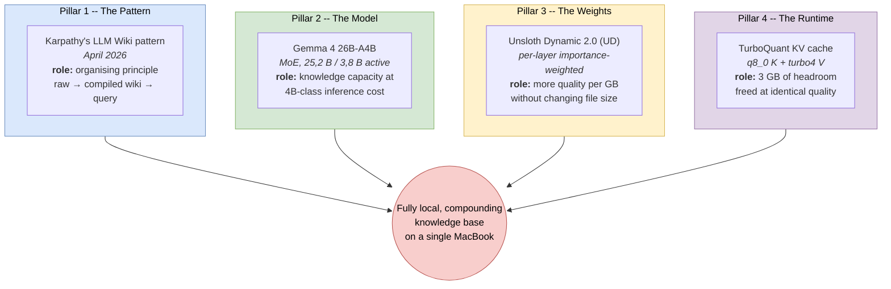
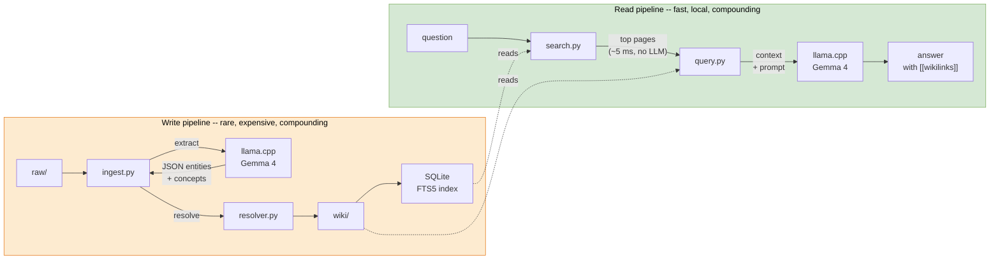

# 4. Solution Strategy

> **arc42, Section 4.** The strategic how. The shortest path from requirements to a buildable system, before the detail work of later sections. This section answers: *given the constraints, what is the high-level approach?*

---

## 4.1 The Four Pillars

The architecture integrates four independent recent developments. Each pillar is a "chosen ingredient" rather than a local innovation, the novelty lives in the assembly, not in any one component. This is the same set of innovations summarised in [section 1.4](01-introduction-and-goals.md#14-positioning-relative-to-prior-work), expanded here with the *strategic role* each one plays.

### Pillar 1 — The Pattern (Karpathy's LLM Wiki)

Strategic role: **organising principle**. Everything in the architecture collapses out of the claim that *an LLM should compile a wiki, not answer from embeddings*. This claim is the reason there is no vector database, the reason ingestion is expensive and retrieval is cheap and the reason entity resolution matters at all. Without this pillar, the project would be a small RAG POC with none of its distinctive properties.

### Pillar 2 — The Model (Gemma 4 26B-A4B)

Strategic role: **enough knowledge and reasoning to make extraction useful**. Extraction quality is the single point of failure in the ingestion pipeline, every entity and concept in the wiki is something Gemma 4 pulled out of text. The [Gemma 4 model card](https://ai.google.dev/gemma/docs/core/model_card_4) reports 82,6 % on MMLU Pro and 82,3 % on GPQA Diamond for the instruction-tuned 26B-A4B variant, within 2-3 % of the 31B dense variant at a fraction of the active parameters. For structured JSON extraction on a personal corpus, this is currently the best open-weights operating point.

The Mixture-of-Experts architecture matters operationally: 25,2 B total parameters fit in ≈ 16 GB of unified memory at Q4_K_M, but only 3,8 B are active per token via the learned router selecting 8 experts (plus 1 shared) from 128. This is what makes inference fast enough on a laptop.

### Pillar 3 — The Weights (Unsloth Dynamic 2.0)

Strategic role: **more quality per GB without paying for it**. [Unsloth Dynamic 2.0 (UD)](https://unsloth.ai/blog/dynamic-v2) is importance-aware per-layer quantization ([docs](https://unsloth.ai/docs/basics/unsloth-dynamic-2.0-ggufs)): attention-heavy layers that matter more for output quality get higher precision; less impactful MLP layers get lower precision. The GGUF file is the same ≈ 16 GB as vanilla Q4_K_M, the user-facing operation is identical and the output is measurably better. This is essentially free improvement, hence a pillar even though it changes no code on this side.

### Pillar 4 — The Runtime (TurboQuant KV Cache)

Strategic role: **buy back ≈ 3 GB of memory headroom**. [TurboQuant](https://arxiv.org/abs/2504.19874) (Zandieh et al. ICLR 2026) compresses the KV cache online via rotated random projections (PolarQuant with Walsh-Hadamard rotation). We use the asymmetric `q8_0` K + `turbo4` V configuration: full-precision keys preserve attention routing accuracy, compressed values reduce the KV cache from ≈ 5 GB to ≈ 3 GB.

The strategic payoff is that this freed 3 GB makes the 65 K-token context budget feasible on a 32 GB machine alongside the model and macOS. Without this pillar, the project would have had to choose between (a) a smaller context window, (b) only one parallel slot (halving ingest throughput), or (c) moving to a 64 GB machine. See [section 7 (Deployment)](07-deployment-view.md#72-memory-budget) for the memory breakdown.

The `turbo3` variant was tested and rejected for Gemma 4 Q4_K_M because of catastrophic perplexity loss, see [ADR-004](09-architecture-decisions.md#adr-004--turboquant-turbo4-v-only-q8_0-k) and [Appendix A, F-5](appendix-a-academic-retrospective.md#f-5--turbo3-on-gemma-4-q4_k_m).

---

## 4.2 Key Strategic Decisions

Beyond the four pillars (which are *things we use*), the architecture is held together by five *decisions we made*. Each has an ADR in [section 9](09-architecture-decisions.md) with full context and trade-offs.

| Decision | Short rationale | ADR |
|---|---|---|
| **Zero external Python dependencies** | Reproducibility (Q2) is worth rejecting every "nice to have" library. `urllib.request` + `json` + `sqlite3` + `concurrent.futures` covers the entire runtime. | [ADR-001](09-architecture-decisions.md#adr-001--zero-external-python-dependencies) |
| **Fork-on-uncertainty, never silently merge** | Entity resolution is lossy. Silent merges are unrecoverable; forks are recoverable with a subsequent lint pass. Every ambiguous case in [`scripts/resolver.py`](../../scripts/resolver.py) defaults to fork. | [ADR-002](09-architecture-decisions.md#adr-002--fork-on-uncertainty-never-silently-merge) |
| **FTS5 + wikilink graph + RRF over vector search** | BM25 is a [strong baseline](https://arxiv.org/abs/2105.05686) (Rosa et al. 2021) confirmed by [BEIR](https://arxiv.org/abs/2104.08663) (Thakur et al. NeurIPS 2021). The wiki's wikilink graph is already the semantic-neighbourhood signal that dense embeddings try to approximate. Why pay for embeddings? | [ADR-003](09-architecture-decisions.md#adr-003--fts5--wikilink-graph--rrf-over-vector-search) |
| **TurboQuant turbo4 V only, q8_0 K** | K compression was the only thing that hurt quality on Gemma 4 Q4_K_M. V can be compressed aggressively with negligible impact. Asymmetric is the safe default. | [ADR-004](09-architecture-decisions.md#adr-004--turboquant-turbo4-v-only-q8_0-k) |
| **Six-stage resolver with a canonical gazetteer** | Pure-similarity resolvers re-decide "is this the same ChatGPT?" on every ingest. A two-tier curated alias registry short-circuits the whole pipeline for known entities and eliminates the cross-document fork epidemic. | [ADR-005](09-architecture-decisions.md#adr-005--six-stage-entity-resolver-with-gazetteer-anchor) |

---

## 4.3 High-Level Data Flow

The strategic flow, one level above the building-block view. Two pipelines: *write* (ingestion) and *read* (query).

- **The write pipeline is where the cost lives.** Ingesting a research paper takes 2-4 minutes of wall clock and produces 20-50 new or updated wiki pages. Every chunk extracted, every entity resolved, every description canonicalised, those are the slow parts.
- **The read pipeline is where the value lives.** Retrieval is ~5 ms with zero LLM calls. The single LLM call is the answer synthesis pass and it runs on ~40 KB of already-relevant context rather than the full corpus.

This asymmetry, expensive writes, cheap reads, is the defining operational property. It is the opposite of one-shot RAG, where every query is expensive. The bet is that documents are ingested once and queried many times, which matches how a personal knowledge base is actually used.

---

## 4.4 Cross-Cutting Strategic Choices

| Concern | Strategic answer |
|---|---|
| **Persistence** | Files on disk. SQLite for the search index. No other database. |
| **Concurrency** | `concurrent.futures.ThreadPoolExecutor` bounded at `PARALLEL_SLOTS = 2` to match the llama.cpp server's `--parallel 2`. No async runtime. No process pool. |
| **Error handling** | Every boundary (HTTP, filesystem, subprocess, LLM JSON parse) handles its own failures explicitly with typed exceptions (`ContextOverflowError`, `EmbeddingUnavailableError`). Fallbacks are explicit, not silent. |
| **Observability** | Stdout and exit codes. No log files, no metrics daemon. Errors carry enough context to diagnose from the terminal. |
| **Security posture** | Minimised attack surface: no inbound ports, no third-party dependencies, no secrets anywhere in the tree, parameterised SQL only. Full audit in [section 11.1](11-risks-and-technical-debt.md#111-security-posture). |
| **Schema evolution** | The wiki is just Markdown. A schema change means updating `lint.py` and running it. Data never needs a migration step. |

These strategic choices are deliberately boring. The interesting architecture is in the pipelines ([section 6](06-runtime-view.md)), the entity resolver ([section 6.4](06-runtime-view.md#64-entity-resolution-stages-05)) and the ADRs ([section 9](09-architecture-decisions.md)). The foundation underneath is intentionally flat and standard-library-only so that attention can go to the interesting parts.
