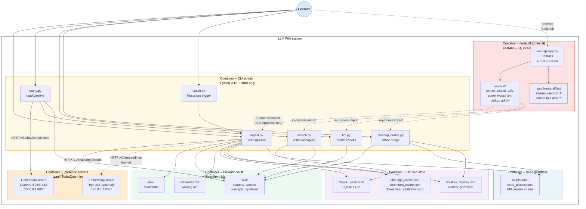
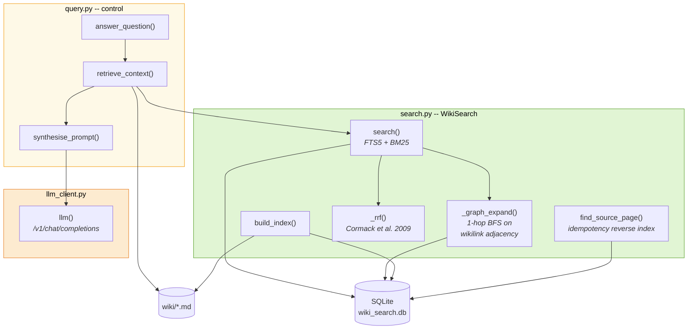
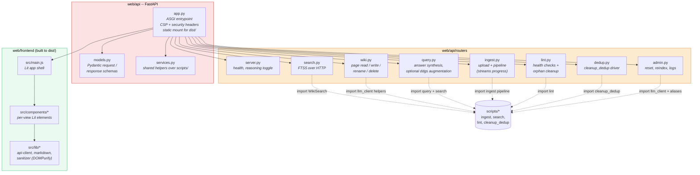

# 5. Building Block View

> **arc42, Section 5.** Static decomposition. This is where the C4 model's Level 2 (Container) and Level 3 (Component) diagrams live, because arc42 and C4 are complementary and their Level 2/3 views answer the same questions arc42 expects in section 5.

Standalone C4 documents with the same diagrams and additional detail are also available at [`docs/c4/L2-container.md`](../c4/L2-container.md) and [`docs/c4/L3-component.md`](../c4/L3-component.md).

---

## 5.1 Whitebox Overall System, C4 Level 2 (Container View)

Opening the black box from [section 3](03-system-scope-and-context.md#32-technical-context--c4-level-1-system-context), the LLM Wiki system is composed of six *containers*, independently runnable or inspectable units of software and data. Five are always present; the **Web UI** container is optional and only materialises if the operator opts in by launching `web/api/app.py`.

### Containers

| Container | Technology | Responsibility | Lifecycle |
|---|---|---|---|
| **CLI scripts** | Python 3.12+, stdlib only | User-facing commands. Everything the operator interacts with on the terminal lives here. | Short-lived per command |
| **Web UI (optional)** | FastAPI + Uvicorn (Python), Lit + Marked + DOMPurify (frontend), bundled by Vite | Browser surface for the same operations as the CLI. Wraps `scripts/*` as an in-process library, serves the Vite-built frontend, adds CSP + security headers. Binds to `127.0.0.1:3000`, no auth, no rate limiting. | Long-running while the browser tab is open |
| **Inference servers** | [llama.cpp](https://github.com/TheTom/llama-cpp-turboquant) with Metal, Gemma 4 26B-A4B UD Q4_K_M | Text generation (mandatory); embeddings for entity resolution stage 5 (optional) | Long-running daemons, started on demand |
| **Obsidian vault** | Filesystem (Markdown + YAML frontmatter) | Persistent source and generated content. The only durable, human-facing state. | Permanent, managed by the operator |
| **Derived state** | Filesystem (SQLite + JSON) | Regeneratable indices, caches and calibration data. `.gitignore`-d. | Rebuilt by `search.py --rebuild` or automatically after each ingest |
| **Seed gazetteer** | JSON committed to git | 149 curated canonical alias entries covering major AI/tech entities. Read-only at runtime. | Updated via hand edits + code review |

### Container-level interfaces

| Consumer → Producer | Interface | Notes |
|---|---|---|
| `ingest.py` → generation server | HTTP POST `/v1/chat/completions` | OpenAI-compatible shape. `urllib.request` stdlib only. |
| `query.py` → generation server | same | One call per query (answer synthesis). |
| `ingest.py` → embedding server | HTTP POST `/v1/embeddings` | Optional, behind `--use-embeddings` flag. Only used by resolver stage 5. |
| `search.py` → SQLite FTS5 | `sqlite3` stdlib, parameterised queries | Column weights `(10.0, 3.0, 5.0, 1.0)` for `(name, type, tags, content)` passed via `?` placeholders. |
| `ingest.py` / `query.py` → wiki | Filesystem writes/reads under a `safe_filename()` discipline | Path traversal defences in [`llm_client.safe_filename()`](../../scripts/llm_client.py). |
| `resolver.py` → seed + runtime gazetteer | JSON file reads with on-access normalisation | Seed tier is read-only; runtime tier is append-only via `aliases.promote()`. |
| browser → Web UI | HTTP over `127.0.0.1:3000` | CSP (`script-src 'self'`), `X-Frame-Options: DENY`, `Referrer-Policy: strict-origin-when-cross-origin`, `X-Content-Type-Options: nosniff`. Markdown passes through DOMPurify with an explicit URI allowlist before `unsafeHTML`. |
| Web UI routers → `scripts/*` | Python import (in-process) | Web UI reuses the CLI modules directly; no extra subprocess boundary. Path-containment guards (`resolve()` + `relative_to()`) on all endpoints that take a page name. |

---

## 5.2 Whitebox `ingest.py`, C4 Level 3 (Component View)

The ingestion pipeline is the single largest module. `scripts/ingest.py` is roughly 1 850 lines organised into cohesive component groups. Decomposed at the component level:

```mermaid
graph TB
 subgraph INGEST ["ingest.py -- components"]
 direction LR

 subgraph READ ["Read layer"]
 parse["detect_and_parse()<br/><i>per-type parsers</i>"]
 pdf["_parse_pdf()<br/><i>pdftotext subprocess</i>"]
 xml["_parse_sms_xml()<br/><i>ElementTree</i>"]
 date["_extract_source_date()<br/><i>pdfinfo + regex</i>"]
 end

 subgraph CHUNK ["Chunking layer"]
 split["chunk_text()<br/><i>paragraph-boundary split<br/>max 50K chars</i>"]
 end

 subgraph EXTRACT ["Extraction layer"]
 parallel["extract_chunks_parallel()<br/><i>ThreadPoolExecutor<br/>PARALLEL_SLOTS=2</i>"]
 one["extract_chunk()<br/><i>LLM JSON extraction<br/>auto-split on overflow</i>"]
 parse_json["_parse_json()<br/><i>tolerant JSON parser</i>"]
 end

 subgraph MERGE ["Merge + canonicalize layer"]
 merge_fn["merge_extractions()<br/><i>dedup, richest desc wins</i>"]
 canon["_canonicalize_descriptions()<br/><i>fix 'the model' / 'our framework'<br/>via targeted LLM calls</i>"]
 norm["_normalize_via_aliases()<br/><i>gazetteer short-circuit</i>"]
 end

 subgraph RESOLVE ["Resolve layer"]
 resolve["resolver.resolve()<br/><i>stages 0-5</i>"]
 end

 subgraph WRITE ["Write layer"]
 write_source["_write_source_page()"]
 write_items["_write_item_pages()<br/><i>entities + concepts</i>"]
 update_idx["_update_index_and_log()"]
 rebuild["WikiSearch.build_index()<br/><i>FTS5 rebuild</i>"]
 end

 parse --> split
 pdf --> parse
 xml --> parse
 date --> parse
 split --> parallel
 parallel --> one
 one --> parse_json
 parse_json --> merge_fn
 merge_fn --> canon
 canon --> norm
 norm --> resolve
 resolve --> write_source
 resolve --> write_items
 write_source --> update_idx
 write_items --> update_idx
 update_idx --> rebuild
 end

 style READ fill:#fff2cc,stroke:#d6b656,color:#000
 style CHUNK fill:#d5e8d4,stroke:#82b366,color:#000
 style EXTRACT fill:#dae8fc,stroke:#6c8ebf,color:#000
 style MERGE fill:#e1d5e7,stroke:#9673a6,color:#000
 style RESOLVE fill:#f8cecc,stroke:#b85450,color:#000
 style WRITE fill:#fdebd0,stroke:#e67e22,color:#000
```

Each layer is one responsibility and the handoffs are the only seams. Layers are:

| Layer | Components | Responsibility |
|---|---|---|
| **Read** | `detect_and_parse`, `_parse_pdf`, `_parse_sms_xml`, `_extract_source_date` | Turn a file in `raw/` into UTF-8 text and an optional source date. PDF via Poppler subprocess. SMS XML via `xml.etree.ElementTree`, whose default Python 3.12 behaviour does not expand external entities (XXE-safe by construction). |
| **Chunking** | `chunk_text` | Paragraph-boundary splits at ≤ 50 000 chars per chunk. Most single articles fit in one chunk; long PDFs split into 2-8. |
| **Extraction** | `extract_chunks_parallel`, `extract_chunk`, `_parse_json` | Parallel LLM calls across the two llama.cpp slots. Structured prompt asks for `{title, summary, key_claims, entities, concepts}`. Tolerant JSON parser recovers from the LLM's occasional half-valid output. Context-overflow errors auto-split the chunk and retry recursively (up to depth 2). |
| **Merge + canonicalize** | `merge_extractions`, `_canonicalize_descriptions`, `_normalize_via_aliases` | Deduplicate across chunks; richest description wins. Then a second LLM pass rewrites context-local descriptions ("the model", "our framework") into stand-alone ones, this is essential for the resolver's Jaccard stage to work. Finally the alias gazetteer short-circuits known entities. |
| **Resolve** | `resolver.resolve()` | Six stages 0-5. See [section 6.4](06-runtime-view.md#64-entity-resolution-stages-05) for the runtime view. |
| **Write** | `_write_source_page`, `_write_item_pages`, `_update_index_and_log`, `WikiSearch.build_index` | Write the source summary page, create-or-update entity and concept pages, update `wiki/index.md` and `wiki/log.md`, rebuild the FTS5 index. |

---

## 5.3 Whitebox `search.py` and `query.py`, retrieval and synthesis

The read pipeline is intentionally much thinner than the write pipeline.

`WikiSearch` (in [`scripts/search.py`](../../scripts/search.py)) is the reusable retrieval library. It holds all the SQL, all the BM25 weights (`(10.0, 3.0, 5.0, 1.0)` for `(name, type, tags, content)`), all the graph-expansion logic and the `_rrf` fusion primitive. `query.py` is the thin controller: it calls `WikiSearch.search()`, assembles the context within the 40 000-char budget and issues one LLM call for synthesis.

The `find_source_page()` method on `WikiSearch` is load-bearing for idempotency: when a source is re-ingested, the pipeline asks the reverse index (a `source_files` table in SQLite) for its previous page stem, avoiding an O(N) linear scan across all source pages on disk. This replaced an earlier per-ingest directory scan, see [Appendix A, section A.2.F](appendix-a-academic-retrospective.md#a2-succeeded-and-fits-purpose).

---

## 5.4 Whitebox `resolver.py`, the entity resolution pipeline

The resolver is the single most complex module. Its internal structure is covered in [section 6.4 (Runtime View, stages 0-5)](06-runtime-view.md#64-entity-resolution-stages-05). At the *static* building-block level, the components are:

| Component | Lines (approx.) | Responsibility |
|---|---|---|
| `Resolution` dataclass | 20 | Immutable return type carrying action (`create`, `merge`, `fork`), resolved name, reason and the stage that produced the verdict |
| `Resolver` class | 600 | Stateful pipeline holding the gazetteer, judge cache, embed cache and calibration store |
| `_stage_0_alias_anchor()` | 110 | Gazetteer short-circuit, canonical alias registry lookup ([`scripts/aliases.py`](../../scripts/aliases.py)) |
| `_stage_1_exact_path()` | 30 | Direct path check, if no file exists, create |
| `_stage_2_type_constraint()` | 70 | Fork on type mismatch *only when descriptions also disagree* (narrowed after the Aedes aegypti incident, see [Appendix A, F-6](appendix-a-academic-retrospective.md#f-6--aedes-aegypti-fork-from-llm-type-noise)) |
| `_stage_3_jaccard()` | 50 | Stemmed Jaccard similarity over descriptions with `MERGE=0.55` and `FORK=0.15` thresholds |
| `_stage_4_llm_judge()` | 90 | Pairwise LLM judge call for borderline cases, verdict cached in `db/judge_cache.json` |
| `_stage_5_embed_cosine()` | 130 | Optional bge-m3 cosine similarity with F1-tuned threshold, gated behind `use_embeddings` flag |
| `_f1_optimal_threshold()` | 60 | Fawcett (2006) precision-recall sweep with `MIN_SAMPLES_FOR_TUNING=20`, `MIN_NEGATIVES=5`, `MIN_POSITIVES=5` gates |

The `aliases.py` sidecar (544 lines) manages the two-tier gazetteer: the committed seed tier in `scripts/data/seed_aliases.json` (149 entries) and the runtime-promoted tier in `db/alias_registry.json`. Promotion happens automatically when a wiki page accumulates ≥ 3 distinct sources and a non-generic description.

---

## 5.5 `llm_client.py`, the shared foundation

The smallest and most load-bearing module. Every other script imports from it. Its job is to be the single source of truth for three things:

1. **Paths** (`BASE_DIR`, `RAW_DIR`, `WIKI_DIR`, `DB_PATH`, `LLAMA_URL`, `EMBED_URL`), so nothing else in the tree hardcodes a filesystem location.
2. **HTTP boilerplate** (`llm()`, `embed()`, `require_server()`, `require_embed_server()`), so `ingest.py`, `query.py` and `resolver.py` all go through the same retry/timeout/error-handling path.
3. **Safe filesystem helpers** (`safe_filename()`, `find_existing_page()`), consolidated here after a duplicated-implementation incident (see [Appendix A, A.2.H](appendix-a-academic-retrospective.md#a2-succeeded-and-fits-purpose)).

The two typed exceptions, `ContextOverflowError` and `EmbeddingUnavailableError`, also live here, so callers do not need to parse `urllib.error.HTTPError` bodies themselves.

---

## 5.6 Whitebox `web/`, the optional UI container

The web UI is structurally a thin wrapper: it adds no new pipelines. Every router imports the same `scripts/*` modules the CLI uses and delegates to them in-process. The value it adds is presentation, request routing, HTTP-level hardening and a browser-friendly form of the operator loop.

Three design choices are load-bearing for this container:

1. **No new persistence layer.** The routers do not hold mutable state. They re-enter `scripts/*` for every request, and state lives exclusively in the existing Obsidian vault and `db/` side-state containers. Re-reading the disk on every request is cheap compared to the LLM call it almost always ends in.
2. **Strict CSP, no inline scripts.** The CSP header set in `app.py` forbids `'unsafe-inline'` on `script-src`; the Vite build emits hashed bundle entrypoints and every `<script>` element in the built `index.html` loads from `self`. Inline markdown is rendered via Marked then passed through DOMPurify with an explicit allowlist for `http:`/`https:`/`mailto:`/`tel:` before Lit's `unsafeHTML` inserts it.
3. **Path-containment on every endpoint that takes a page name.** `web/api/routers/wiki.py` and `admin.py` always resolve the user-supplied path and call `relative_to(WIKI_DIR)` before touching the filesystem, matching the same discipline `scripts/llm_client.safe_filename()` applies in the CLI.

The container is optional by design: deleting `web/` does not change any behaviour under `scripts/`. This is what keeps the privacy posture of [Q1](01-introduction-and-goals.md#12-quality-goals) intact, neither `fastapi` nor `ddgs` is on the code path that runs during a pure-CLI ingest.

---

## 5.7 Why this decomposition

The modules are organised around three orthogonal axes:

- **The write/read split.** `ingest.py` and everything it calls (the resolver, the aliases module) are write-path. `query.py` and `search.py` are read-path. `llm_client.py` is shared infrastructure.
- **Pure functions vs. stateful classes.** `search.py` exposes a `WikiSearch` class because the SQLite connection is its state. `resolver.py` exposes a `Resolver` class because the gazetteer + caches are its state. Everything else is plain functions.
- **Stdlib-first core, optional surfaces second.** The core pipeline under `scripts/` runs on stdlib and `llama-server` only. The embedding server, the web UI (`web/`) and web-search augmentation (`ddgs`) are all additive surfaces that can be omitted without changing anything under `scripts/`.

This structure is the direct result of the "stdlib-only core" and "fork-on-uncertainty" strategic choices from [section 4](04-solution-strategy.md#42-key-strategic-decisions). Were either of those relaxed, the decomposition would be different, for example, a typical RAG project would have a `VectorStore` container here instead of `WikiSearch`.
