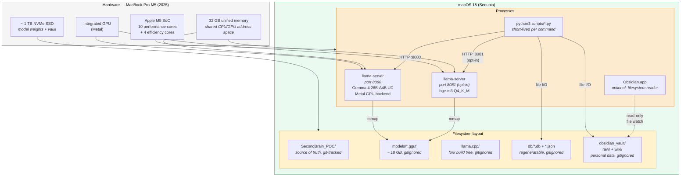
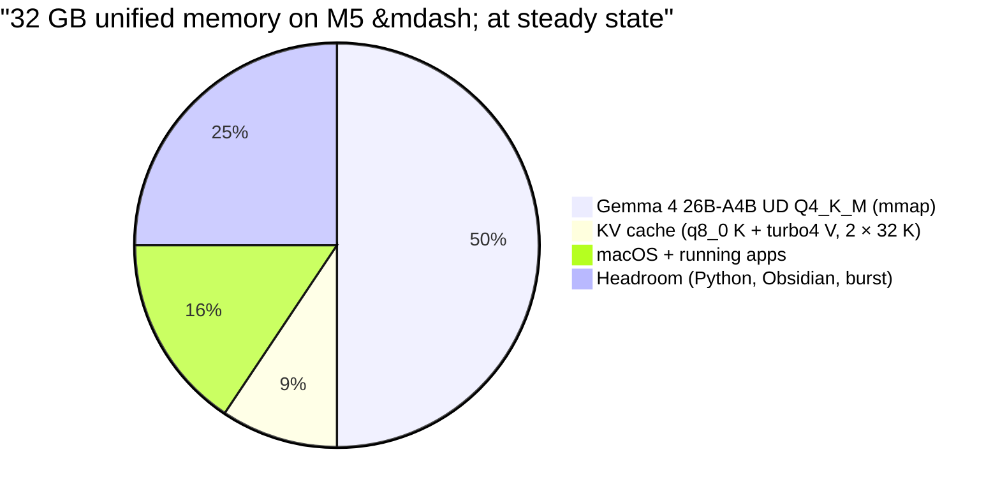
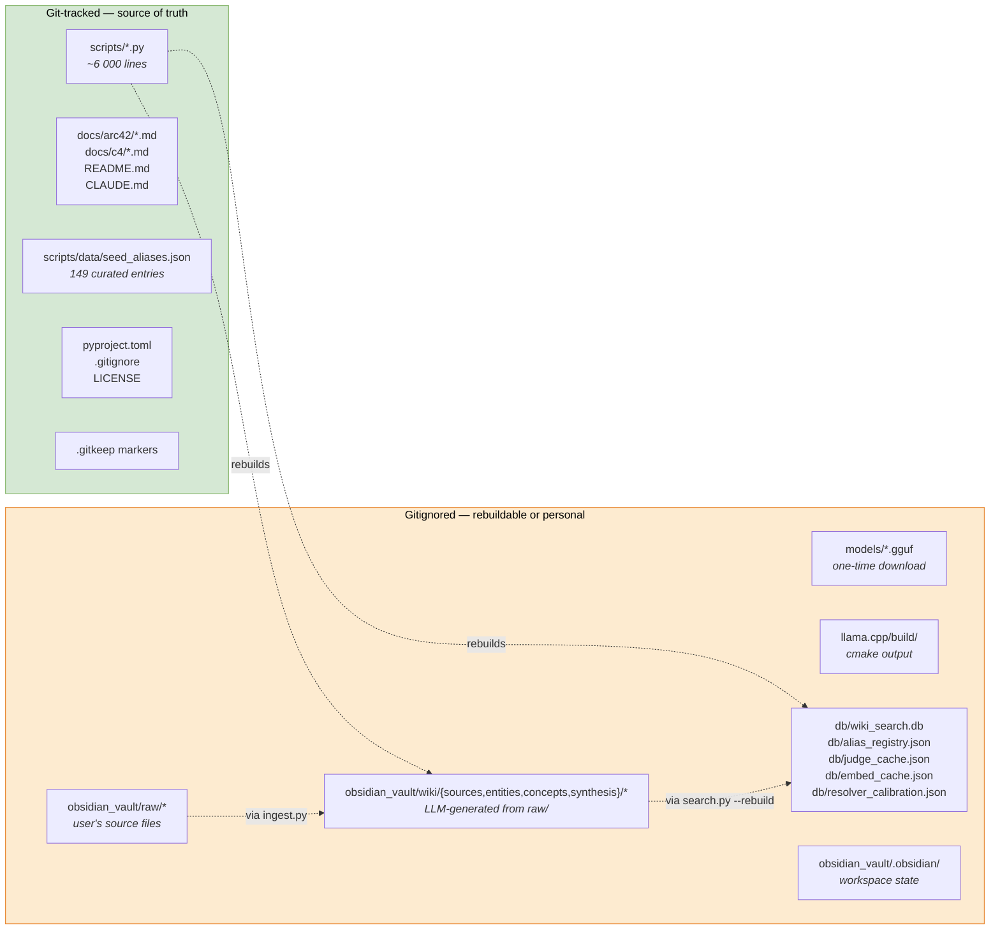

# 7. Deployment View

> **arc42, Section 7.** Infrastructure and process layout. Where does each container from [section 5](05-building-block-view.md) actually run, on what hardware and with what memory, CPU, GPU and network budget? For a single-machine POC this is a short section, but the memory budget is the load-bearing artefact of the whole project, it is the reason every other decision in [section 4](04-solution-strategy.md) had to be the way it was.

---

## 7.1 Infrastructure

The deployment target is a **single Apple Silicon laptop**. There is no cluster, no container runtime, no orchestration layer. The only "deployment" operation is to clone the repo, clone the llama.cpp fork, download the GGUF weights and run the start script.



### Hardware choice

The M5 MacBook Pro with 32 GB unified memory is the current sweet spot for this workload. Unified memory is the critical feature: the model weights, the KV cache and the Python process all share one physical address space, so there is no host-to-GPU copy on every token and no discrete-GPU VRAM ceiling. The same code runs on M1 Pro / M2 / M3 / M4 MacBook Pros with ≥ 16 GB, at reduced parallel throughput. See [§ 7.3](#73-fallback-configurations) for the 16 GB configuration.

### Process layout

Three classes of process:

1. **`llama-server` (generation)**, long-running daemon started by [`scripts/start_server.sh`](../../scripts/start_server.sh). Binds to `127.0.0.1:8080`. Must be running before any ingest or query command. Loads the Gemma 4 26B-A4B GGUF weights via `mmap` into unified memory once, then serves HTTP requests for its lifetime.
2. **`llama-server` (embeddings, optional)**, second daemon on `127.0.0.1:8081`, started by [`scripts/start_embed_server.sh`](../../scripts/start_embed_server.sh) only when the user opts into resolver stage 5. Loads the bge-m3 GGUF weights (~ 2,2 GB).
3. **`python3 scripts/<command>.py`**, short-lived per user command. Ingest takes minutes; query takes seconds; lint takes under a second. Every CLI invocation is a fresh Python process.

Obsidian is not required for operation. If present, it watches the `obsidian_vault/` directory and renders the wiki as an Obsidian vault with graph view and backlinks. Obsidian is never invoked by the pipeline; the two are decoupled via the filesystem.

### Network topology

Exactly three endpoints exist, all bound to the loopback interface:

| Endpoint | Who binds it | Who calls it | Reachable from LAN? |
|---|---|---|---|
| `127.0.0.1:8080/v1/chat/completions` | `llama-server` (generation) | `ingest.py`, `query.py`, `resolver.py` stage 4 | **No**, bound to `127.0.0.1` |
| `127.0.0.1:8081/v1/embeddings` | `llama-server` (embeddings, opt-in) | `resolver.py` stage 5 via `llm_client.embed()` | **No**, bound to `127.0.0.1` |
| `127.0.0.1:8080/health` | `llama-server` | `scripts/start_server.sh status` | **No**, bound to `127.0.0.1` |

Nothing else. No outbound HTTPS, no telemetry, no update check. The entire system surface area to the network is three URLs that refuse connections from anything but the local host. This is [Quality Goal Q1](01-introduction-and-goals.md#12-quality-goals) and [Technical Constraint TC-3](02-architecture-constraints.md#21-technical-constraints) made operational.

---

## 7.2 Memory Budget

This is the single most load-bearing table in the document. Every decision in [section 4](04-solution-strategy.md) exists to keep this budget solvent.



### Line item breakdown

| Component | Footprint | Notes |
|---|---:|---|
| Gemma 4 26B-A4B Q4_K_M (UD) | ≈ 16,0 GB | `mmap`-ed by llama-server; the pages are demand-loaded but the working set is the full file |
| KV cache, `q8_0` K + `turbo4` V, 2 slots × 32 K tokens | ≈ 3,0 GB | Full-precision keys (routing-critical) + TurboQuant-compressed values. See [ADR-004](09-architecture-decisions.md#adr-004--turboquant-turbo4-v-only-q8_0-k) |
| macOS baseline (WindowServer, kernel, background daemons) | ≈ 5,0 GB | Measured with `vm_stat` + Activity Monitor on an idle session |
| Headroom for Python, Obsidian, browser, IDE, terminal | ≈ 8,0 GB | The working headroom during a real session |
| **Total** | **≈ 32,0 GB** | Fits on M-series 32 GB laptops |

**The savings that make this possible.** Without TurboQuant, the same KV cache with `q8_0` keys and `q8_0` values would be ≈ 5,0 GB. TurboQuant's `turbo4` V cache reduces that to ≈ 3,0 GB, a 2 GB saving that moves the system from "memory-pressured" to "comfortable". On a 32 GB machine those 2 GB are the difference between a usable headroom and a thrashing one. See [Appendix A, F-5](appendix-a-academic-retrospective.md#f-5--turbo3-on-gemma-4-q4_k_m) for why `turbo4` is used instead of the even-more-aggressive `turbo3`.

**With the embedding server running.** The optional bge-m3 server adds ≈ 2,5 GB (≈ 2,2 GB model + its own small KV cache), eating into the 8 GB of headroom. This is still comfortable on a 32 GB machine, which is why stage 5 is marked "opt-in" rather than forbidden. On a 16 GB machine the embedding server is not viable, see [§ 7.3](#73-fallback-configurations).

### Why the KV cache is a pillar, not a footnote

The original design (mainline llama.cpp, `q8_0` KV for both K and V) left ≈ 6 GB of headroom on a 32 GB machine. That sounds like a lot until one remembers that Obsidian, a browser and a Python ingest session run simultaneously during real use and that macOS expands its working set under memory pressure rather than swapping aggressively. The actual observed symptom at 6 GB nominal headroom was intermittent stalls when the system started paging out the `mmap`-ed model. TurboQuant's 3 GB saving pushes this into the safe zone. This is why [Pillar 4](04-solution-strategy.md#pillar-4--the-runtime-turboquant-kv-cache) is a pillar and not a footnote.

---

## 7.3 Fallback Configurations

### 16 GB machine (M1 Pro / M2 / M3 base)

Feasible with two changes:

| Change | Effect |
|---|---|
| `--parallel 1` instead of `--parallel 2` in `start_server.sh` | Halves ingest throughput (chunks are extracted one at a time); query latency unchanged. KV cache drops to ≈ 1,5 GB. |
| Drop the optional embedding server | Resolver stage 5 is unavailable. Stage 4 (LLM judge) still handles borderline cases. |

Recomputed budget for 16 GB:

| Component | Footprint |
|---|---:|
| Gemma 4 26B-A4B Q4_K_M (UD) | ≈ 16,0 GB |
| macOS + Python + terminal | ≈ 5,0 GB *(impossible)* |

At this point the arithmetic fails. A more honest 16 GB configuration uses a smaller model:

| Component | Footprint |
|---|---:|
| Gemma 4 12B-A3B Q4_K_M (UD) | ≈ 7,5 GB |
| KV cache (1 slot × 32 K, `q8_0` K + `turbo4` V) | ≈ 1,5 GB |
| macOS + apps + headroom | ≈ 7,0 GB |
| **Total** | **≈ 16,0 GB** |

The 12B model is a reasonable downgrade. Its MMLU Pro score is ≈ 74 % vs 82,6 % for the 26B variant ([Gemma 4 model card](https://ai.google.dev/gemma/docs/core/model_card_4)) and its extraction quality on structured JSON is noticeably lower. The pattern still works; the extraction step simply produces fewer, shallower entities per chunk. The wiki compounds more slowly.

### Mainline llama.cpp (no TurboQuant)

If the TurboQuant fork is unavailable, for example on a CI system that has to use a shipped package, the fallback is documented in [ADR-004](09-architecture-decisions.md#adr-004--turboquant-turbo4-v-only-q8_0-k):

1. Clone mainline llama.cpp instead of [`TheTom/llama-cpp-turboquant`](https://github.com/TheTom/llama-cpp-turboquant).
2. In `scripts/start_server.sh`, change `KV_TYPE_V="turbo4"` → `KV_TYPE_V="q8_0"`.
3. Accept the ≈ 2 GB larger KV cache. On a 32 GB machine this still fits with a tighter headroom.

No Python code changes are needed, the pipeline is agnostic to the KV cache type. The HTTP API is unchanged between mainline and fork.

---

## 7.4 Repository Hygiene and Rebuildable State

Every file in the repository is either source code, documentation, or a `.gitkeep` preserving a directory layout. Everything else is gitignored. The rule is: *a fresh clone plus a model download must rebuild the entire runtime state*.

### What lives where



### Rebuildability invariant

Any file in the gitignored set can be destroyed and recovered by running a deterministic command:

| File / directory | Recovery command | Cost |
|---|---|---:|
| `models/*.gguf` | `curl -L -o models/... https://huggingface.co/...` | One-time, ~ 16 GB download |
| `llama.cpp/build/` | `cd llama.cpp && cmake -B build -DGGML_METAL=ON && cmake --build build -j` | ~ 5 min on M5 |
| `db/wiki_search.db` | `python3 scripts/search.py --rebuild` | < 1 s for hundreds of pages |
| `db/alias_registry.json` | Rebuilt automatically on next ingest (promotion logic) | Incremental |
| `db/judge_cache.json` | Rebuilt on demand as stage-4 calls happen | Incremental |
| `db/embed_cache.json` | Rebuilt on demand as stage-5 calls happen | Incremental |
| `db/resolver_calibration.json` | Rebuilt from a labelled validation set (if the user maintains one) | Manual |
| `obsidian_vault/wiki/{sources,entities,concepts,synthesis}/*` | `python3 scripts/ingest.py --all` | Minutes per source |

The **only** non-rebuildable content is:

- The **source code** itself (tracked in git).
- The **personal raw source documents** in `obsidian_vault/raw/`, which are the user's own data and belong to the user, not the repo. They are backed up by the user outside the system.

This rebuildability rule is why the `.gitignore` in [§ 7.4](#74-repository-hygiene-and-rebuildable-state) is aggressive, it has to be, or the repo would leak personal data as soon as an ingest runs.

### .gitignore coverage (summary)

The [`.gitignore`](../../.gitignore) covers, in order:

1. OS junk (`.DS_Store`, `Thumbs.db`, `._*`).
2. Python artefacts (`__pycache__/`, `*.pyc`, `.venv/`, `.pytest_cache/`, build output, coverage).
3. Editor and IDE state (`.vscode/`, `.idea/`, vim swap files).
4. AI assistant caches (`.claude/`, `.cursor/`, aider history).
5. Obsidian workspace state (`.obsidian/`, `.trash/`).
6. llama.cpp build tree (`llama.cpp/`).
7. Model weights (`models/**` except `.gitkeep`, all `*.gguf`).
8. Derived state (`db/**` except `.gitkeep`, all `*.db*`).
9. Raw source documents (`obsidian_vault/raw/**` except `.gitkeep`).
10. Generated wiki pages (`obsidian_vault/wiki/{sources,entities,concepts,synthesis}/**`).
11. Logs and pid files (`*.log`, `scripts/.server.pid`, `nohup.out`).
12. Editor backup files (`*.bak`, `*.tmp`, `*.orig`).

---

## 7.5 One-Time Setup Procedure

For reference, the end-to-end setup flow for a brand-new machine:

```bash
# 1. Clone the repo.
git clone <this-repo> SecondBrain_POC
cd SecondBrain_POC

# 2. Clone and build the llama.cpp TurboQuant fork.
git clone https://github.com/TheTom/llama-cpp-turboquant.git llama.cpp
cd llama.cpp
cmake -B build -DGGML_METAL=ON -DCMAKE_BUILD_TYPE=Release
cmake --build build --config Release -j
cd ..

# 3. Download the Gemma 4 26B-A4B GGUF weights (Unsloth Dynamic Q4_K_M).
mkdir -p models
cd models
curl -L -o gemma-4-26B-A4B-it-UD-Q4_K_M.gguf \
 https://huggingface.co/unsloth/gemma-4-26B-A4B-it-GGUF/resolve/main/gemma-4-26B-A4B-it-UD-Q4_K_M.gguf
cd ..

# 4. Create the vault layout.
mkdir -p obsidian_vault/raw
mkdir -p obsidian_vault/wiki/{sources,entities,concepts,synthesis}

# 5. Start the inference server.
bash scripts/start_server.sh

# 6. (optional) start the embedding server for resolver stage 5.
bash scripts/start_embed_server.sh # in a second terminal
```

There is no `pip install`, no `requirements.txt`, no virtual environment. Python 3.12+ from the system's standard install is enough ([TC-1](02-architecture-constraints.md#21-technical-constraints)). There is also no configuration file: every parameter is either a constant at the top of a script (see [`scripts/llm_client.py`](../../scripts/llm_client.py) lines 1-50) or a command-line flag.

The total setup footprint is:

- Source code: ~ 6 000 Python lines + docs
- llama.cpp fork with Metal build: ~ 200 MB (sources) + ~ 300 MB (build)
- Gemma 4 26B-A4B Q4_K_M UD: ~ 16 GB
- Optional bge-m3 Q4_K_M: ~ 2,2 GB

Everything else grows from the user's own ingests.

---

## 7.6 Runtime Deployment Invariants

These invariants must hold for the deployed system to be sound. They are in addition to the runtime invariants of [section 6.7](06-runtime-view.md#67-runtime-invariants).

1. **The llama.cpp server binds only to `127.0.0.1`.** Any change to `HOST="127.0.0.1"` in `start_server.sh` is a security regression; see [§ 11.1, SEC-1](11-risks-and-technical-debt.md#111-security-posture).
2. **The `MODEL`, `KV_TYPE_K`, `KV_TYPE_V`, `CONTEXT` and `PARALLEL` constants in `start_server.sh` are the single source of truth for the runtime configuration.** No Python script overrides them; no environment variable layers on top.
3. **Model weights are never committed.** The `.gitignore` covers `*.gguf` globally and `models/**` specifically.
4. **A fresh clone + model download + server start is the entire installation.** If a new dependency is introduced that requires more than that, it violates [TC-1](02-architecture-constraints.md#21-technical-constraints) and the PR must be rejected.
5. **Reinstalling the system destroys no user data.** All user data lives under `obsidian_vault/raw/` and the user's ingest-derived wiki pages; the installation touches neither.

These invariants are what makes the deployment reproducible and reproducibility is [Quality Goal Q2](01-introduction-and-goals.md#12-quality-goals).
