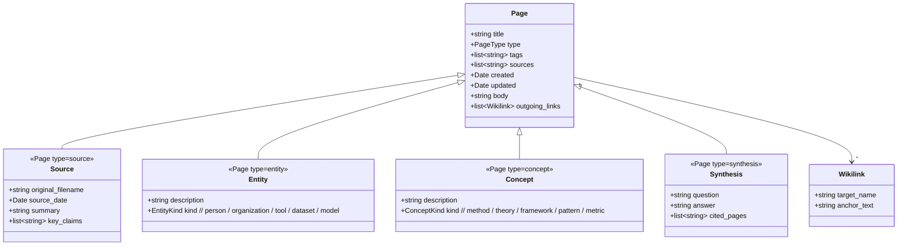
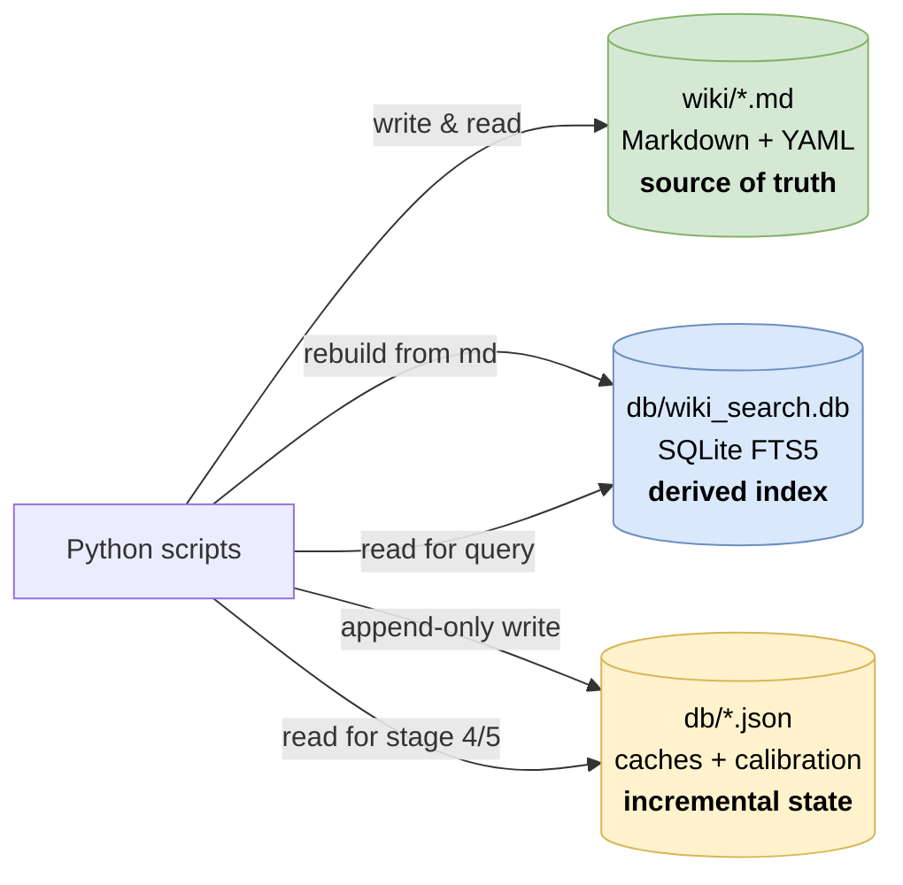

# 8. Crosscutting Concepts

> **arc42, Section 8.** Concepts that cut across the building blocks, things that apply "everywhere" and deserve a single place to be defined instead of being re-stated in every component. In this project, six concepts recur: the domain model, the persistence pattern, error handling, security, concurrency and the prompt discipline.

---

## 8.1 Domain Model

The wiki has a small, flat domain model. There are only four page types and every page is a plain Markdown file with YAML frontmatter.



### Page type semantics

| Type | Directory | Written by | Read by |
|---|---|---|---|
| **Source** | `wiki/sources/` | `ingest.py` (one per ingested file) | `query.py` as primary context |
| **Entity** | `wiki/entities/` | `ingest.py` (many per source) | `query.py` as secondary context |
| **Concept** | `wiki/concepts/` | `ingest.py` (many per source) | `query.py` as secondary context |
| **Synthesis** | `wiki/synthesis/` | `query.py --save` | `query.py` as high-value context in subsequent queries |

Synthesis is the recursive step: a query that produces a useful answer can be filed back into the wiki as a first-class page and that page compounds future retrievals. This is Karpathy's "file the outputs back into the wiki" principle ([section 3.3](03-system-scope-and-context.md#33-mapping-to-karpathys-original-gist)).

### Frontmatter schema

Every page MUST have a YAML frontmatter block at the top with at least:

```yaml
---
type: source | entity | concept | synthesis
tags: [list, of, short, strings]
sources: [stem-of-source-page-1, stem-of-source-page-2]
created: YYYY-MM-DD
updated: YYYY-MM-DD
---
```

The schema is enforced by `scripts/lint.py` (frontmatter presence + required keys) and by `scripts/ingest.py` on write. There is no JSON schema file and no Pydantic model; the rule is stdlib-only ([TC-1](02-architecture-constraints.md#21-technical-constraints)) so the schema is checked via a small hand-written validator in `lint.py`.

### Wikilinks

`[[Target Page]]` is the only inter-page reference mechanism. The target is resolved at read time by `search.py._graph_expand()`, which scans for `[[…]]` patterns and looks up the corresponding file across all page-type subdirectories. File names on disk use spaces to match the wikilink text directly: `Speculative Cascading.md` matches `[[Speculative Cascading]]` (see `llm_client.safe_filename()`). This is an explicit Obsidian compatibility choice, Obsidian's graph view and backlinks panel depend on it.

---

## 8.2 Persistence Pattern

The persistence story is deliberately boring: **files on disk, plus one SQLite database for search**.



### Layers

1. **Markdown files under `wiki/`** are the canonical, durable source of truth. Every architectural invariant ("no vector store", "Obsidian-compatible", "schema is just YAML") derives from this. If the database is deleted, the wiki survives untouched; `search.py --rebuild` will regenerate the index in under a second on hundreds of pages.
2. **SQLite FTS5 index** (`db/wiki_search.db`) is a derived search structure. It is never the source of truth. It contains: a `pages` table (one row per wiki page with `name`, `type`, `tags`, `content`), a `pages_fts` virtual table with FTS5 tokenisation, a `wikilinks` table (one row per `(source_page, target_page)` directed edge) and a `source_files` reverse-index table that maps each ingested source filename back to the stem of its source page for idempotent re-ingestion.
3. **JSON caches under `db/`** (`judge_cache.json`, `embed_cache.json`, `alias_registry.json`, `resolver_calibration.json`) are incremental state for the resolver and gazetteer. They are gitignored and rebuildable, but rebuilding them costs LLM calls (for the judge cache) or embedding calls (for the embed cache), so in practice they are kept alive across runs.

### Why SQLite

- **Zero-install, stdlib-native.** `sqlite3` is part of Python's standard library, satisfying [TC-1](02-architecture-constraints.md#21-technical-constraints).
- **FTS5 is a first-class feature.** Full-text search with BM25 ranking, tokenisation and column weights is built in, with no extra extension to load.
- **Single-file durability.** The entire index is one file. Corruption recovery is trivial (delete and rebuild).
- **Parameterised queries are idiomatic.** Every SQL statement in `search.py` uses `?` placeholders, eliminating SQL injection as an attack class ([§ 11.1, Verified Safe](11-risks-and-technical-debt.md#111-security-posture)).

### Why not a vector database

Covered in [ADR-003](09-architecture-decisions.md#adr-003--fts5--wikilink-graph--rrf-over-vector-search). Short version: BM25 over a structured wiki with wikilink graph expansion is a strong baseline ([Rosa et al. 2021](https://arxiv.org/abs/2105.05686); [Thakur et al. BEIR, NeurIPS 2021](https://arxiv.org/abs/2104.08663)), the wikilink graph already encodes semantic neighbourhood and the extraction step canonicalises descriptions so content words carry real signal. Paying for a vector store would give marginal recall at the cost of an extra process, an extra dependency and violation of [TC-1](02-architecture-constraints.md#21-technical-constraints).

---

## 8.3 Error Handling Discipline

Every boundary handles its own failures explicitly with typed errors. Two custom exceptions carry semantic meaning across the boundary between `llm_client.py` and its callers:

| Exception | Raised by | Caught by | Caller's recovery |
|---|---|---|---|
| `ContextOverflowError` | `llm_client.llm()` on HTTP 400 with `n_prompt_tokens > n_ctx` | `ingest.py.extract_chunk()` | Split the chunk in half at a paragraph boundary and recurse up to depth 2 (see [§ 6.5](06-runtime-view.md#65-context-overflow-recovery)) |
| `EmbeddingUnavailableError` | `llm_client.embed()` on connection refused to `127.0.0.1:8081` | `resolver.Resolver._stage_5_embed_cosine()` | Skip stage 5 entirely; resolution completes on stages 0-4 |

Other failure modes handled explicitly:

- **HTTP 5xx on generation**, `llm_client.llm()` retries with exponential backoff (bounded attempts), then re-raises as `urllib.error.HTTPError`. `ingest.py` logs and fails the current chunk; the ingest continues with the remaining chunks. A failed ingest prints the offending chunk's first 200 chars to aid debugging.
- **Malformed JSON from the LLM**, `_parse_json()` in `ingest.py` is tolerant: it unwraps ```...``` code fences, recovers from trailing commas and on total failure returns an empty extraction (which propagates to a "no entities extracted" warning rather than a crash).
- **Filesystem races (re-ingestion of same file)**, `find_existing_page()` in `llm_client.py` is the single source of truth for "does this page exist"; it is consistent with the `source_files` reverse index and prefers the stem recorded there to any directory scan.
- **SQLite locking**, `sqlite3` in Python is thread-local; the `ThreadPoolExecutor` in `extract_chunks_parallel` never touches the DB, only the generation server. `WikiSearch.build_index()` runs after all parallel extraction has completed, so there is no concurrent writer.

### Never silently swallowed

No `except:` bare clause anywhere in the code. Every `except` names the exception class it is catching and either re-raises, logs and continues, or raises a wrapped exception. This is the one coding-standard rule that is actively enforced by review rather than by tooling.

### Error messages carry context

An ingest failure prints:

- The source filename.
- The chunk index (e.g. "chunk 3 of 7").
- The first 200 characters of the failed chunk.
- The exception class name and message.
- The suggested remediation (e.g. "try `--use-embeddings` off" or "split the source manually").

No stack trace on routine failures; a stack trace only on genuinely unexpected conditions. This keeps the terminal output useful for debugging without drowning the operator.

---

## 8.4 Security

Covered in detail in [§ 11.1](11-risks-and-technical-debt.md#111-security-posture), this subsection is the cross-cutting summary.

### Attack surface

| Surface | Status |
|---|---|
| Inbound network ports | None. Both `llama-server` processes bind to `127.0.0.1` only. |
| Outbound network | Only during one-time setup (HuggingFace download, GitHub clone). Runtime never makes an outbound call. |
| User input to SQL | All parameterised. `search.py` uses `?` placeholders exclusively. |
| User input to shell | `subprocess.run(... shell=False)` with list-form arguments only. Paths are resolved to absolute `Path` objects and validated for containment under `RAW_DIR` before subprocess invocation. |
| User input to filesystem | `llm_client.safe_filename()` strips `..`, path separators and control characters. Page writes always go under `WIKI_DIR`. |
| XML parsing | `xml.etree.ElementTree`, does not expand external entities by default in Python 3.12, so XXE is not reachable on the SMS XML path. |
| LLM output to filesystem | Filenames from LLM output are always passed through `safe_filename()` before becoming a path. |
| Secrets in git | None, per [OC-4](02-architecture-constraints.md#22-organizational-constraints) and the [PII audit](11-risks-and-technical-debt.md#112-pii-and-privacy-audit). |

### Findings from the audit

Seven findings were recorded in the forensic security audit ([§ 11.1](11-risks-and-technical-debt.md#111-security-posture)):

- **2 MEDIUM**, log files written under `scripts/` by an earlier version of `watch.sh` (now redirected) and a path-containment check that happens after `pdftotext` argv assembly (no actual vulnerability because the containment check is before the subprocess invocation, but the order was confusing).
- **2 LOW**, `127.0.0.1` binding trust assumption (correct but worth documenting) and a deprecated exception class in one place.
- **2 INFO**, alignment suggestions for error messages.

Zero CRITICAL, zero HIGH. The attack surface is small enough that the findings are about hygiene, not vulnerabilities.

### What a malicious source file can and cannot do

A source file planted in `raw/` by an attacker can:

- Cause the LLM to extract nonsensical entities. The resolver handles this gracefully, worst case a few junk pages that the user deletes.
- Cause the LLM to produce very long output, consuming token budget. Bounded by `max_tokens=2048` at the server level.
- Cause `pdftotext` to extract malformed text that the LLM cannot parse. The tolerant JSON parser degrades gracefully to "no extraction".

A source file planted in `raw/` by an attacker **cannot**:

- Make outbound network connections (no network at runtime).
- Write outside `WIKI_DIR` or `DB_DIR` (all write paths are rooted).
- Execute shell commands (no `shell=True`, no `eval`, no `exec`).
- Escalate to arbitrary file read (the only file reads are of `raw/` files the attacker already placed).

The threat model is single-user ([OC-1](02-architecture-constraints.md#22-organizational-constraints)), so "attacker plants file in raw/" is not a realistic scenario for the intended use, but the system is still designed as though it were.

---

## 8.5 Concurrency

The concurrency model is minimal and deliberate.

### One pool, one depth

`ingest.py.extract_chunks_parallel()` is the only place in the system where concurrent execution happens. It uses `concurrent.futures.ThreadPoolExecutor(max_workers=PARALLEL_SLOTS)` with `PARALLEL_SLOTS = 2`, to match the llama.cpp server's `--parallel 2` flag. The executor wraps around N chunks for one source; all results are collected before the pipeline proceeds.

```python
# scripts/ingest.py (paraphrased)
with ThreadPoolExecutor(max_workers=PARALLEL_SLOTS) as pool:
 futures = [pool.submit(extract_chunk, chunk, source_stem, idx)
 for idx, chunk in enumerate(chunks)]
 results = [f.result() for f in futures]
```

### Nothing else is concurrent

- `query.py` is single-threaded, the retrieval is so fast that parallelism buys nothing.
- `resolver.py` is single-threaded, it is called inside the per-chunk extraction (which is already parallel) and serialises on the resolver's in-memory state.
- `search.py` is single-threaded, SQLite is accessed from the main thread only.
- `lint.py` is single-threaded.

### Why not asyncio

`asyncio` would add a runtime (event loop), a mental model (colored functions) and a set of gotchas around blocking calls into C libraries (llama.cpp, SQLite). For a program whose hot path is "hit an HTTP endpoint on localhost and wait for 3 seconds", two OS threads is simpler and has no observable downside. This is deliberate, see [ADR-001](09-architecture-decisions.md#adr-001--zero-external-python-dependencies).

### Why not multiprocessing

Multiprocessing would require serialising arguments across process boundaries (Python pickles), which is slow for the ~ 50 KB chunks. It would also duplicate the Python interpreter's memory footprint twice, with no benefit, the CPU-bound work happens on the llama.cpp side, not in the Python process.

### The shared server is the arbiter

llama.cpp's `--parallel 2` is the real concurrency primitive. The Python side's thread pool exists only to give both slots something to chew on simultaneously. Oversubscribing the Python thread pool would queue requests behind our own slots and add no speedup.

---

## 8.6 Prompt Discipline

Every LLM call is a function call in disguise. Three rules apply to every prompt in the codebase:

1. **The prompt is narrow.** No prompt asks the model to "explain", "elaborate", or "be helpful". Each prompt is shaped to produce exactly one thing: a JSON object with a defined key set, a YES/NO verdict, or a paragraph of a known maximum length.
2. **The output is typed on the server side.** Every structured-output prompt sets `max_tokens` appropriately (~2 048 for extractions, ~256 for judges, ~1 024 for summaries) and, where possible, uses `"response_format": {"type": "json_object"}` so the server enforces JSON.
3. **The parser is tolerant.** Even with the `response_format` nudge, Gemma 4 occasionally wraps its JSON in ```...``` or adds a trailing comma. `_parse_json()` in `ingest.py` handles both without a crash.

### Prompt locations

| Prompt | Location | Role |
|---|---|---|
| Chunk extraction | `ingest.py` → `extract_chunk()` | Produce `{entities, concepts, key_claims}` JSON from a 50K-char chunk |
| Description canonicalisation | `ingest.py` → `_canonicalize_descriptions()` | Rewrite context-local phrases ("the model", "our framework") into stand-alone ones |
| Source summary | `ingest.py` → `_write_source_page()` | One paragraph, 3-4 sentences, factual |
| Pairwise disambiguation | `resolver.py` → `_stage_4_llm_judge()` | YES / NO with one-sentence rationale |
| Query synthesis | `query.py` → `answer_question()` | Paragraph-form answer with `[[wikilink]]` citations |

### No chain-of-thought

Gemma 4's "thinking" mode is disabled at the server level via `--reasoning off` in `scripts/start_server.sh`. Without this flag, invisible thinking tokens consume the output budget and truncate visible content to zero. This is documented in [Appendix A, F-3](appendix-a-academic-retrospective.md#f-3--thinking-tokens-consume-the-output-budget) and was one of the most painful early failures.

### Temperature and sampling

| Call | Temperature | Top-p |
|---|---:|---:|
| Extraction | 0,2 | 0,9 |
| Canonicalisation | 0,3 | 0,9 |
| Summary | 0,5 | 0,95 |
| Judge | 0,0 | 1,0 |
| Query synthesis | 0,4 | 0,95 |

Low temperatures for structured outputs, near-zero for the judge (deterministic-like behaviour), moderate for summaries and synthesis where some prose variety is welcome. The numbers were tuned empirically on a small held-out set of ingests and have been stable since.

---

## 8.7 Stdlib-Only as a Cross-Cutting Constraint

The "zero external Python dependencies" rule ([TC-1](02-architecture-constraints.md#21-technical-constraints), [ADR-001](09-architecture-decisions.md#adr-001--zero-external-python-dependencies)) touches every component. A short tour of what it forbids and what replaces it:

| What a typical RAG stack uses | What this project uses instead |
|---|---|
| `openai` / `anthropic` SDK | `urllib.request.urlopen()` with a hand-rolled JSON body |
| `pydantic` for schema validation | Hand-written validation in `lint.py` and at extraction write-time |
| `langchain` / `llamaindex` for orchestration | Direct function composition in `ingest.py` and `query.py` |
| `chromadb` / `qdrant` / `weaviate` | `sqlite3` with FTS5 |
| `sentence-transformers` for embeddings | `llama.cpp` server on port 8081 with bge-m3 GGUF |
| `PyPDF2` / `pdfplumber` / `pdfminer` | `subprocess.run(["pdftotext", …])` |
| `python-frontmatter` | Hand-written YAML reader in `lint.py` |
| `watchdog` for filesystem watching | `fswatch` via `watch.sh` |
| `rich` / `click` for CLI | Plain `argparse` and plain `print()` |

The operational benefit: any MacBook with `python3 --version ≥ 3.12` can run the entire system, *today*, with no environment setup, no wheel cache, no interpreter version mismatch and no dependency-resolution failure. The cost is that some re-implementation (the tolerant JSON parser, the YAML reader, the stemmed Jaccard) lives in this repo that would otherwise live in `pip install`. The cost is explicit and bounded; the benefit compounds with every reader who can audit and run the system in 60 seconds.

---

## 8.8 Observability

Observability is deliberately minimal.

- **Stdout is the entire observability surface.** Every script prints its progress to the terminal, using plain ASCII tables, `echo`-friendly prefixes and no ANSI colors by default (though modern terminals render fine).
- **Exit codes are meaningful.** `0` on success, non-zero on failure. `ingest.py` exits non-zero if any chunk failed; the caller (a `for` loop or `watch.sh`) can detect it.
- **No log files, no metrics, no tracing.** `.gitignore` still excludes `*.log` and `scripts/*.log` because an earlier draft of `watch.sh` used to write them, but the current version redirects through the user's terminal redirection instead.
- **Error messages are self-contained.** A single line of output is supposed to carry enough context to diagnose from the terminal. Stack traces are reserved for unexpected conditions.

This is a single-user POC ([OC-1](02-architecture-constraints.md#22-organizational-constraints)); there is no ops team that needs Prometheus. If it becomes a multi-user or production system, this is the single biggest thing that would need to change.

---

## 8.9 What Is Intentionally Missing

A useful closing list for a crosscutting section is the list of concepts that a reader might *expect* to see here but won't, with a one-line justification each:

| Missing concept | Why |
|---|---|
| Authentication / authorization | Single-user POC ([OC-1](02-architecture-constraints.md#22-organizational-constraints)). No users to authenticate. |
| Caching layer | The FTS5 query is ~ 2 ms; there is nothing to cache. The judge and embed caches exist because they skip expensive LLM calls, not for latency. |
| Rate limiting | No inbound network; nothing to rate-limit. |
| Retry with jitter / circuit breakers | The HTTP retry in `llm_client.llm()` is simple exponential backoff with a small bounded attempt count. A circuit breaker would be meaningful only if there were many concurrent callers. |
| Feature flags | The closest thing is the `--use-embeddings` flag on `ingest.py`. No feature flag system exists. |
| Dependency injection | Scripts compose by plain import and function call. No DI container. |
| Unit of work / repository pattern | The single SQLite database is the unit of work, accessed through `WikiSearch`. |
| Logging framework | Stdout and exit codes ([§ 8.8](#88-observability)). |
| Configuration management | Constants at the top of scripts; no config file, no env vars. |

The throughline: **add complexity only when it pays for itself**. None of the above pay for themselves in a single-user, single-machine POC with a Python stdlib footprint. If the project grows past that constraint, each of these becomes negotiable.
