# 10. Quality Requirements

> **arc42, Section 10.** The quality goals from [section 1.2](01-introduction-and-goals.md#12-quality-goals) are the high-level "what matters". This section is the operational version: the concrete quality scenarios the system must satisfy, expressed in [ISO/IEC 25010](https://iso25000.com/index.php/en/iso-25000-standards/iso-25010) quality-attribute form with explicit stimulus, environment, response and response measure. Every scenario below is testable and most are verified by code already in the repo.

---

## 10.1 Quality Tree

```mermaid
graph TB
 root["Quality of the<br/>LLM Wiki system"]

 priv["Privacy /<br/>data sovereignty<br/><b>P1</b>"]
 repro["Reproducibility<br/><b>P2</b>"]
 retr["Retrieval quality<br/><b>P3</b>"]

 opseff["Operational<br/>efficiency"]
 maint["Maintainability"]
 sec["Security"]
 corr["Correctness"]
 usab["Usability"]

 root --> priv
 root --> repro
 root --> retr
 root --> opseff
 root --> maint
 root --> sec
 root --> corr
 root --> usab

 priv --> QS1[QS-1 No outbound network]
 priv --> QS2[QS-2 No secrets committed]
 priv --> QS3[QS-3 No telemetry]

 repro --> QS4[QS-4 Zero-install setup]
 repro --> QS5[QS-5 Rebuildable derived state]
 repro --> QS6[QS-6 Same input &rarr; same output]

 retr --> QS7[QS-7 Retrieval latency &lt; 10 ms]
 retr --> QS8[QS-8 Relevant page in top-5]
 retr --> QS9[QS-9 Answer cites real pages]

 opseff --> QS10[QS-10 Ingest 1 MB PDF in &lt; 5 min]
 opseff --> QS11[QS-11 Query answer in &lt; 10 s]
 opseff --> QS12[QS-12 Memory fits 32 GB]

 maint --> QS13[QS-13 Files &le; 800 lines]
 maint --> QS14[QS-14 Re-readable by one human]
 maint --> QS15[QS-15 Tests cover resolver]

 sec --> QS16[QS-16 Parameterised SQL]
 sec --> QS17[QS-17 Path containment on raw/]
 sec --> QS18[QS-18 No shell injection]

 corr --> QS19[QS-19 No silent merges]
 corr --> QS20[QS-20 Lint catches broken links]
 corr --> QS21[QS-21 Idempotent re-ingest]

 usab --> QS22[QS-22 Errors diagnosable from stdout]
 usab --> QS23[QS-23 Obsidian-compatible output]

 style priv fill:#f8cecc,stroke:#b85450,color:#000
 style repro fill:#d5e8d4,stroke:#82b366,color:#000
 style retr fill:#dae8fc,stroke:#6c8ebf,color:#000
 style opseff fill:#fff2cc,stroke:#d6b656,color:#000
 style maint fill:#e1d5e7,stroke:#9673a6,color:#000
 style sec fill:#fdebd0,stroke:#e67e22,color:#000
 style corr fill:#eafaf1,stroke:#27ae60,color:#000
 style usab fill:#fef9e7,stroke:#f39c12,color:#000
```

**P1-P3** are the top-priority quality goals from [section 1.2](01-introduction-and-goals.md#12-quality-goals). The five secondary attributes below them (operational efficiency, maintainability, security, correctness, usability) are necessary but not strategic, they must hold, but they did not drive the four-pillar decision in [section 4.1](04-solution-strategy.md#41-the-four-pillars).

---

## 10.2 Quality Scenarios

Each scenario follows the format: **Stimulus → Environment → Response → Response measure**. The "Verified by" column names the test file, inspection command, or audit section that demonstrates the scenario holds.

### P1 — Privacy / data sovereignty

#### QS-1 — No outbound network connections at runtime

| Field | Value |
|---|---|
| **Source** | Operational invariant, [TC-3](02-architecture-constraints.md#21-technical-constraints) |
| **Stimulus** | User runs any script (`ingest.py`, `query.py`, `lint.py`, `cleanup_dedup.py`) |
| **Environment** | Normal runtime; server started; LAN may or may not be connected |
| **Response** | Zero HTTP calls leave the loopback interface. All LLM calls go to `127.0.0.1:8080`; all embedding calls go to `127.0.0.1:8081`. |
| **Measure** | Exactly 2 URL constants in the tree: `LLAMA_URL = "http://127.0.0.1:8080"` and `EMBED_URL = "http://127.0.0.1:8081"`, both in [`scripts/llm_client.py`](../../scripts/llm_client.py) lines 19-20. No user-overridable URL anywhere. |
| **Verified by** | `grep -R "https://" scripts/` returns only documentation strings and docstrings. `grep -R "urlopen" scripts/` shows only calls built from `LLAMA_URL` or `EMBED_URL`. [§ 11.1 (Security posture)](11-risks-and-technical-debt.md#111-security-posture) independently verifies this. |

#### QS-2 — No secrets committed to git

| Field | Value |
|---|---|
| **Source** | [OC-4](02-architecture-constraints.md#22-organizational-constraints) |
| **Stimulus** | Any commit (past or future) |
| **Environment** | Git history over all branches |
| **Response** | No API keys, tokens, passwords, private keys, or cloud credentials appear in any committed file. |
| **Measure** | [`git log -p`](https://git-scm.com/docs/git-log#Documentation/git-log.txt--p) scan for `AKIA`, `sk-`, `ghp_`, `-----BEGIN.*PRIVATE KEY-----`, `password=`, `api_key=` returns no matches. |
| **Verified by** | [§ 11.2 (PII and privacy audit)](11-risks-and-technical-debt.md#112-pii-and-privacy-audit) covers both the current tree and the history. |

#### QS-3 — No telemetry, no crash reporting, no update checks

| Field | Value |
|---|---|
| **Source** | Quality Goal Q1 |
| **Stimulus** | Any script run, including crashes |
| **Environment** | Normal runtime, any network state |
| **Response** | No process attempts to report a crash, usage event, or version check to any external host. |
| **Measure** | `grep -R "sentry\|bugsnag\|rollbar\|analytics\|telemetry" scripts/` returns nothing. `llm_client.llm()` on failure prints to stdout and re-raises locally. |
| **Verified by** | Code inspection; [§ 8.8 (Observability)](08-crosscutting-concepts.md#88-observability). |

### P2 — Reproducibility

#### QS-4 — Zero-install setup

| Field | Value |
|---|---|
| **Source** | [TC-1](02-architecture-constraints.md#21-technical-constraints), [ADR-001](09-architecture-decisions.md#adr-001--zero-external-python-dependencies) |
| **Stimulus** | A new user clones the repo on a fresh machine |
| **Environment** | macOS 15+, Python 3.12 from the system installer, Poppler (`brew install poppler`) |
| **Response** | After cloning the llama.cpp fork and downloading the GGUF weights, the scripts run without any `pip install`, `venv`, or `requirements.txt`. |
| **Measure** | `pyproject.toml` declares `dependencies = []`. `python3 scripts/ingest.py --help` runs on a system with no site-packages and succeeds. |
| **Verified by** | `pyproject.toml` inspection; manual run on a scratch user account. |

#### QS-5 — Derived state is fully rebuildable

| Field | Value |
|---|---|
| **Source** | [§ 7.4 (Repository hygiene)](07-deployment-view.md#74-repository-hygiene-and-rebuildable-state) |
| **Stimulus** | `rm -rf db/ llama.cpp/build/` |
| **Environment** | Repo clone with `obsidian_vault/` populated |
| **Response** | The system returns to a usable state via `cmake --build`, `python3 scripts/search.py --rebuild` and restarting the server. |
| **Measure** | Every file in the gitignored set has a documented recovery command in [§ 7.4](07-deployment-view.md#74-repository-hygiene-and-rebuildable-state). |
| **Verified by** | Manual rebuild; `git status` is clean after recovery. |

#### QS-6 — Same input produces same output (modulo LLM temperature)

| Field | Value |
|---|---|
| **Source** | Operational expectation |
| **Stimulus** | The same file in `raw/` is ingested twice |
| **Environment** | Identical seed, same model, same temperature |
| **Response** | The second ingest finds the existing source page via the `source_files` reverse index and updates it in place rather than creating a duplicate. |
| **Measure** | `WikiSearch.find_source_page(filename)` returns the existing stem; the source page on disk is rewritten, not appended. Entity and concept pages either no-op or merge via the resolver. |
| **Verified by** | `scripts/test_ingest_dedup.py` and [ADR-007](09-architecture-decisions.md#adr-007--reverse-index-source_files-for-idempotent-re-ingestion). |

### P3 — Retrieval quality

#### QS-7 — Retrieval latency below 10 ms

| Field | Value |
|---|---|
| **Source** | Quality Goal Q3 |
| **Stimulus** | User runs `python3 scripts/query.py "question"` |
| **Environment** | Wiki has 100-1 000 pages; SQLite FTS5 index is current |
| **Response** | The retrieval phase (FTS5 query + graph expansion + RRF fusion + context assembly) completes before the LLM call begins. |
| **Measure** | ≤ 10 ms wall-clock for retrieval. The breakdown in [§ 6.3](06-runtime-view.md#63-query-pipeline) shows FTS5 ≈ 2 ms, graph BFS ≈ 1 ms, RRF < 1 ms, file reads ≈ 5 ms. |
| **Verified by** | `python3 scripts/query.py` with `--profile` flag (planned, currently timed by hand via `time`). |

#### QS-8 — The relevant page appears in the top-5 retrieval hits

| Field | Value |
|---|---|
| **Source** | Quality Goal Q3 |
| **Stimulus** | Any of a curated set of test queries |
| **Environment** | Wiki built from the author's real corpus |
| **Response** | For ≥ 90 % of curated test queries, at least one of the top-5 retrieved pages is a correct primary source for the question. |
| **Measure** | Relevance-at-5 on a manual test set of 30 queries. |
| **Verified by** | Manual audit; no automated relevance test exists yet. This is listed as a known gap in [§ 11.3, L-1](11-risks-and-technical-debt.md#113-known-limitations). |

#### QS-9 — Answers cite real wiki pages via `[[wikilinks]]`

| Field | Value |
|---|---|
| **Source** | Karpathy's gist ([§ 3.3](03-system-scope-and-context.md#33-mapping-to-karpathys-original-gist)) |
| **Stimulus** | `query.py` returns an answer |
| **Environment** | Any query on a populated wiki |
| **Response** | The answer text contains `[[Wikilink]]` citations that resolve to real pages in the wiki. |
| **Measure** | The synthesis prompt instructs the LLM to cite via `[[wikilinks]]`; `scripts/lint.py` checks every `[[…]]` in wiki pages against the filesystem and flags broken ones. |
| **Verified by** | `python3 scripts/lint.py` after any `query.py --save`. |

### Operational efficiency

#### QS-10 — Ingest a 1 MB PDF in under 5 minutes

| Field | Value |
|---|---|
| **Source** | User experience target |
| **Stimulus** | `python3 scripts/ingest.py article.pdf` on a ≈ 1 MB text-extracted PDF |
| **Environment** | M5 MacBook, 32 GB RAM, llama-server running, 2 parallel slots |
| **Response** | The pipeline completes ingestion in ≤ 5 minutes (2-4 minutes typical). |
| **Measure** | Wall-clock time from invocation to "wrote N + M + K pages". |
| **Verified by** | Manual measurement; observed on real author corpus. |

#### QS-11 — Query answer within 10 seconds

| Field | Value |
|---|---|
| **Source** | User experience target |
| **Stimulus** | `python3 scripts/query.py "question"` |
| **Environment** | Server running, wiki has 100-1 000 pages |
| **Response** | The answer is streamed to stdout within 10 s (3-10 s typical, synthesis dominates). |
| **Measure** | Wall-clock time. Retrieval is ~ 10 ms; the remainder is the LLM synthesis. |
| **Verified by** | Manual measurement. |

#### QS-12 — Memory footprint fits a 32 GB machine with headroom

| Field | Value |
|---|---|
| **Source** | Quality Goal Q1 (the hardware constraint) |
| **Stimulus** | Server running, ingest in progress, Obsidian open, terminal open |
| **Environment** | M5 MacBook, 32 GB unified memory |
| **Response** | The system remains responsive without swapping. |
| **Measure** | Resident set size ≤ 24 GB combined (model + KV + Python + Obsidian + macOS baseline), leaving ≥ 8 GB for burst headroom. |
| **Verified by** | `vm_stat` and Activity Monitor during ingest. See [§ 7.2 (Memory budget)](07-deployment-view.md#72-memory-budget). |

### Maintainability

#### QS-13 — All source files stay under 800 lines

| Field | Value |
|---|---|
| **Source** | Readability invariant |
| **Stimulus** | Any code change |
| **Environment** | Code review |
| **Response** | No file in `scripts/` exceeds 800 lines except `ingest.py` (~ 1 850 lines) and `resolver.py` (~ 1 060 lines), which are documented exceptions. |
| **Measure** | `wc -l scripts/*.py`. The two exceptions are called out in [section 5.2](05-building-block-view.md#52-whitebox-ingestpy--c4-level-3-component-view) and [section 5.4](05-building-block-view.md#54-whitebox-resolverpy--the-entity-resolution-pipeline) with their internal decomposition. |
| **Verified by** | `wc -l scripts/*.py` + manual review. |

#### QS-14 — The whole codebase can be re-read by one human in under 3 hours

| Field | Value |
|---|---|
| **Source** | Quality Goal Q2 (reproducibility includes auditability) |
| **Stimulus** | A new reader picks up the repo |
| **Environment** | No prior context |
| **Response** | The reader can understand the architecture, run the system and modify a component within one sitting. |
| **Measure** | Total Python line count ≤ 6 000; every module under 1 000 lines (exceptions documented); `docs/arc42/` provides the top-down guide; `CLAUDE.md` is the agent-facing summary. |
| **Verified by** | `wc -l scripts/*.py docs/**/*.md` and self-review. |

#### QS-15 — The entity resolver has full scenario coverage

| Field | Value |
|---|---|
| **Source** | The resolver is the single most error-prone component |
| **Stimulus** | Any change to `resolver.py` or `aliases.py` |
| **Environment** | Test run |
| **Response** | The test suite exercises each stage (0-5) independently and in combination. |
| **Measure** | Three dedicated test files: `test_resolver.py` (stage-level unit tests), `test_resolver_scenarios.py` (end-to-end scenarios including the Aedes aegypti, ChatGPT and Python language/snake cases), `test_aliases.py` (gazetteer promotion and guards). Plus `test_ingest_dedup.py` for the reverse-index path. |
| **Verified by** | `python3 -m unittest discover scripts/` (or direct invocation). |

### Security

#### QS-16 — All SQL uses parameterised queries

| Field | Value |
|---|---|
| **Source** | OWASP A03:2021 Injection |
| **Stimulus** | Any SQL call |
| **Environment** | `search.py`, `ingest.py`, `query.py` |
| **Response** | Every `cursor.execute` call uses `?` placeholders. No string concatenation into SQL. |
| **Measure** | `grep -R "execute(" scripts/` inspection confirms. Column weights in `bm25(pages_fts, 10, 3, 5, 1)` are passed as literals, not as user input. |
| **Verified by** | [§ 11.1 (Security posture), Verified Safe](11-risks-and-technical-debt.md#111-security-posture). |

#### QS-17 — Path containment on `raw/` access

| Field | Value |
|---|---|
| **Source** | Path traversal prevention |
| **Stimulus** | User invokes `ingest.py` with a filename |
| **Environment** | Argument may be absolute, relative, or contain `..` |
| **Response** | The resolved absolute path is checked for containment under `RAW_DIR`. If not contained, the ingest aborts. |
| **Measure** | `Path(filename).resolve().is_relative_to(RAW_DIR.resolve())` check in `ingest.py` before any file read. |
| **Verified by** | Code inspection; [§ 11.1 (SEC-2)](11-risks-and-technical-debt.md#111-security-posture). |

#### QS-18 — No shell injection in `subprocess.run`

| Field | Value |
|---|---|
| **Source** | OWASP A03:2021 Injection |
| **Stimulus** | `pdftotext` or `pdfinfo` subprocess call |
| **Environment** | Filename may contain spaces, quotes, or shell metacharacters |
| **Response** | `subprocess.run` is called with a list of arguments (`shell=False`). No shell interpolation. |
| **Measure** | `grep -R "subprocess.run\|subprocess.Popen" scripts/` shows every call uses the list form. |
| **Verified by** | [§ 11.1, Verified Safe #2](11-risks-and-technical-debt.md#111-security-posture). |

### Correctness

#### QS-19 — No silent merges during entity resolution

| Field | Value |
|---|---|
| **Source** | [ADR-002](09-architecture-decisions.md#adr-002--fork-on-uncertainty-never-silently-merge) |
| **Stimulus** | A borderline resolution case (Jaccard in the `(0,15, 0,55)` band) |
| **Environment** | `resolver.Resolver.resolve()` invocation |
| **Response** | The resolver forks rather than merges unless the evidence is strong. |
| **Measure** | Every merge path in stages 3-5 requires an explicit threshold crossing; every unclear case routes to fork. `resolver.Resolution` carries the `reason` field explaining the verdict. |
| **Verified by** | `test_resolver.py`, `test_resolver_scenarios.py`. |

#### QS-20 — Lint catches broken wikilinks

| Field | Value |
|---|---|
| **Source** | F6 ([§ 1.1](01-introduction-and-goals.md#11-requirements-overview)) |
| **Stimulus** | `python3 scripts/lint.py` run after any ingest |
| **Environment** | Wiki with pages and `[[wikilinks]]` |
| **Response** | Every `[[X]]` in the wiki is checked against the filesystem across all page-type subdirectories; broken ones are reported with source file and line. |
| **Measure** | `lint.py` exit code non-zero on broken links; console output names them. |
| **Verified by** | `python3 scripts/lint.py` on the current wiki. |

#### QS-21 — Re-ingestion is idempotent

| Field | Value |
|---|---|
| **Source** | [ADR-007](09-architecture-decisions.md#adr-007--reverse-index-source_files-for-idempotent-re-ingestion) |
| **Stimulus** | The same file is ingested twice |
| **Environment** | `source_files` reverse index exists in `wiki_search.db` |
| **Response** | The second ingest updates the existing source page in place; entity and concept pages are no-op'd or merged. |
| **Measure** | Number of source pages on disk equals number of distinct raw filenames, not number of ingest invocations. |
| **Verified by** | `scripts/test_ingest_dedup.py`. |

### Usability

#### QS-22 — All errors are diagnosable from stdout alone

| Field | Value |
|---|---|
| **Source** | [§ 8.3 (Error handling)](08-crosscutting-concepts.md#83-error-handling-discipline), [§ 8.8 (Observability)](08-crosscutting-concepts.md#88-observability) |
| **Stimulus** | Any runtime error |
| **Environment** | Terminal running a script |
| **Response** | The error message includes the filename, chunk index (if applicable), first 200 chars of the failing input, exception class and a suggested remediation. |
| **Measure** | No log files needed; no external tool needed; a user can paste the terminal output into a bug report and get a diagnosis. |
| **Verified by** | Code review of `except` clauses in `ingest.py` and `query.py`. |

#### QS-23 — Output is byte-compatible with Obsidian

| Field | Value |
|---|---|
| **Source** | F5 ([§ 1.1](01-introduction-and-goals.md#11-requirements-overview)) |
| **Stimulus** | Any wiki page written by the pipeline |
| **Environment** | Obsidian reads the `obsidian_vault/` folder as a vault |
| **Response** | Every page renders correctly in Obsidian: YAML frontmatter is parsed, `[[wikilinks]]` are clickable, graph view and backlinks populate, Dataview queries work. |
| **Measure** | Manual verification in Obsidian. No special rendering hooks; the output is plain Markdown + YAML. |
| **Verified by** | Direct opening of `obsidian_vault/` in Obsidian. |

---

## 10.3 Quality-Scenario Coverage Matrix

| Scenario | Implemented | Tested | Audited |
|---|:---:|:---:|:---:|
| QS-1 No outbound network | ✓ | - | ✓ |
| QS-2 No secrets | ✓ | - | ✓ |
| QS-3 No telemetry | ✓ | - | ✓ |
| QS-4 Zero-install | ✓ | - | ✓ |
| QS-5 Rebuildable state | ✓ | - | ✓ |
| QS-6 Idempotent ingest | ✓ | ✓ | ✓ |
| QS-7 Retrieval < 10 ms | ✓ | - (manual) | ✓ |
| QS-8 Relevance@5 | partial | - |, |
| QS-9 Citations | ✓ | ✓ (via lint) | - |
| QS-10 Ingest < 5 min | ✓ | - (manual) | - |
| QS-11 Query < 10 s | ✓ | - (manual) | - |
| QS-12 Fits 32 GB | ✓ | - (manual) | ✓ |
| QS-13 ≤ 800 lines | ✓ | - |, |
| QS-14 Re-readable | ✓ | - |, |
| QS-15 Resolver coverage | ✓ | ✓ | - |
| QS-16 Parameterised SQL | ✓ | - | ✓ |
| QS-17 Path containment | ✓ | - | ✓ |
| QS-18 No shell injection | ✓ | - | ✓ |
| QS-19 No silent merges | ✓ | ✓ | - |
| QS-20 Lint broken links | ✓ | ✓ | - |
| QS-21 Idempotent re-ingest | ✓ | ✓ | - |
| QS-22 Errors from stdout | ✓ | - |, |
| QS-23 Obsidian compat | ✓ | - |, |

**Gaps worth noting:**

- **QS-8 (relevance@5)** is manual and therefore the weakest testable quality in the set. A labelled evaluation set would let us measure precision/recall and track regression. This is [§ 11.3, L-1](11-risks-and-technical-debt.md#113-known-limitations).
- **QS-7 / QS-10 / QS-11** have no automated profiling; they are measured by stopwatch on the author's machine. A profile harness would belong in `scripts/`.
- **QS-22 / QS-23** are verified by use, not by test. This is acceptable for a POC but would be a pre-flight check in a production system.

---

## 10.4 Traceability

Each quality scenario traces back to either a quality goal, a technical constraint, or an explicit user expectation:

| Scenario | Traces to |
|---|---|
| QS-1, QS-2, QS-3 | Quality Goal Q1 (privacy) + [TC-3](02-architecture-constraints.md#21-technical-constraints) + [OC-4](02-architecture-constraints.md#22-organizational-constraints) |
| QS-4, QS-5, QS-6 | Quality Goal Q2 (reproducibility) + [TC-1](02-architecture-constraints.md#21-technical-constraints) + [ADR-001](09-architecture-decisions.md#adr-001--zero-external-python-dependencies) + [ADR-007](09-architecture-decisions.md#adr-007--reverse-index-source_files-for-idempotent-re-ingestion) |
| QS-7, QS-8, QS-9 | Quality Goal Q3 (retrieval) + [ADR-003](09-architecture-decisions.md#adr-003--fts5--wikilink-graph--rrf-over-vector-search) + F3 ([§ 1.1](01-introduction-and-goals.md#11-requirements-overview)) |
| QS-10, QS-11, QS-12 | Hardware target + [§ 7.2 (Memory budget)](07-deployment-view.md#72-memory-budget) + [Pillar 4 (TurboQuant)](04-solution-strategy.md#pillar-4--the-runtime-turboquant-kv-cache) |
| QS-13, QS-14, QS-15 | Maintainability as pre-requisite for auditability |
| QS-16, QS-17, QS-18 | OWASP baseline + [§ 11.1 (Security posture)](11-risks-and-technical-debt.md#111-security-posture) |
| QS-19, QS-20, QS-21 | [ADR-002](09-architecture-decisions.md#adr-002--fork-on-uncertainty-never-silently-merge) + F2 + F6 |
| QS-22, QS-23 | F5 + user experience expectations |

Every quality goal in [section 1.2](01-introduction-and-goals.md#12-quality-goals) is covered by at least three scenarios. Every scenario has an owner (the module or audit that verifies it).

---

## 10.5 Non-Goals

Some qualities are *intentionally not optimised*. Listing them keeps the scope honest:

- **Horizontal scalability.** There is no scenario for "serve 100 concurrent users". The target is one user.
- **High availability.** There is no HA story. The server is one process on one machine; if it dies, the user restarts it.
- **Streaming answers.** The CLI prints the answer after the LLM completes synthesis, not token-by-token. This would be nice but does not affect any quality goal.
- **Multi-language UI.** Error messages are English-only. Source documents can be in any language the LLM reads.
- **Accessibility (a11y).** The CLI is the only interface; accessibility is delegated to the user's terminal.
- **Conformance to an external schema (JSON Schema, OpenAPI, etc.).** The only schema is the Markdown frontmatter + `[[wikilinks]]` contract, enforced by `lint.py`.

These non-goals are deliberate and are documented together with the out-of-scope list in [section 2.4](02-architecture-constraints.md#24-what-is-explicitly-out-of-scope).
