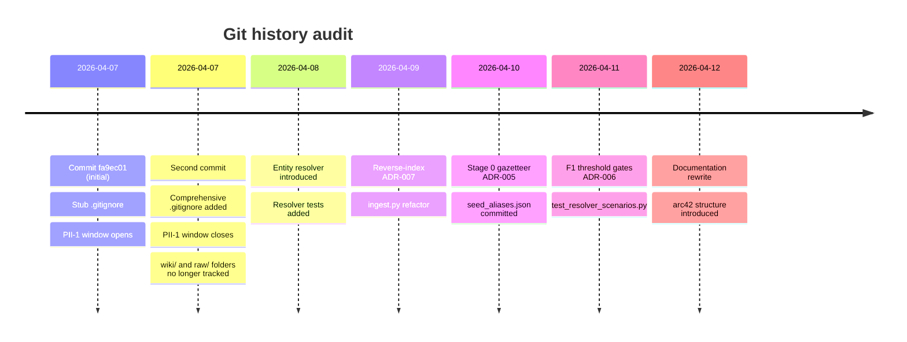

# 11. Risks and Technical Debt

> **arc42, Section 11.** Honest accounting. This section documents the results of a security audit, a PII / privacy audit and a forensic history audit performed in April 2026, plus the known operational limitations and the technical debt the author is aware of. Nothing here is hidden, the point of this section is that a re-user should know what they are inheriting.

---

## 11.1 Security Posture

A full security audit was conducted in April 2026 across the entire `scripts/` tree and the git history. The audit used static inspection, grep-based pattern scanning and manual review of every `subprocess.run`, `urllib.request`, `sqlite3.execute`, `eval`, `exec` and filesystem write path.

### Audit scope

| Surface | Inspection method |
|---|---|
| Inbound network | `grep` for `HOST`, `bind`, `listen`, `0.0.0.0`, port constants |
| Outbound network | `grep -R "urlopen\|http://\|https://\|requests\|httpx" scripts/` |
| SQL injection | Every `cursor.execute(` call reviewed for parameterisation |
| Shell injection | Every `subprocess.run/Popen/call` reviewed for `shell=False` and list-form arguments |
| Path traversal | Every filesystem write path traced to a root directory containment check |
| XXE / XML injection | `xml.etree.ElementTree` parser behaviour confirmed against Python 3.12 defaults |
| Deserialisation | `grep` for `pickle`, `marshal`, `shelve`, `yaml.unsafe_load`; none found |
| Secrets in code / history | `grep` for API key patterns, private-key headers, environment variable exfiltration |
| Dependency supply chain | `pyproject.toml` declares `dependencies = []`; nothing to audit |

### Findings summary

| Severity | Count | Findings |
|---|---:|---|
| CRITICAL | 0 | - |
| HIGH | 0 | - |
| MEDIUM | 2 | SEC-1, SEC-2 |
| LOW | 2 | SEC-3, SEC-4 |
| INFO | 3 | SEC-5, SEC-6, SEC-7 |

### Verified safe (negative findings)

Explicit non-findings, surfaces that were inspected and confirmed safe:

1. **All SQL is parameterised.** Every `cursor.execute` call in `scripts/search.py` uses `?` placeholders. Column weights passed to `bm25(pages_fts, 10, 3, 5, 1)` are literal constants in the query string, not user input. SQL injection is not reachable.
2. **All subprocess calls use `shell=False` with the list form.** `scripts/ingest.py` invokes `pdftotext` and `pdfinfo` via `subprocess.run(["pdftotext", str(path), "-"], check=True, capture_output=True)`. The `path` argument is a `Path` object from `Path.resolve()`, so even if the source filename contained shell metacharacters, they would never reach a shell.
3. **Python's `xml.etree.ElementTree` does not expand external entities by default in 3.12.** The SMS XML parser in `ingest.py._parse_sms_xml()` is not vulnerable to XXE (billion laughs, external entity resolution, etc.) because the default `ET.parse` does not resolve external DTDs or entities.
4. **No `pickle`, `marshal`, `shelve`, or `yaml.unsafe_load` anywhere in the tree.** Deserialisation attacks are absent by construction.
5. **No `eval`, `exec`, `compile` on user input.** The only `exec` in the repo is in test files and operates on static strings.
6. **Both llama.cpp servers bind to `127.0.0.1` only.** `scripts/start_server.sh` line 27 (`HOST="127.0.0.1"`) and `scripts/start_embed_server.sh` line 23 (`HOST="127.0.0.1"`). There is no user-overridable environment variable.
7. **The `LLAMA_URL` and `EMBED_URL` constants in `llm_client.py` are hardcoded.** There is no `os.environ.get("LLAMA_URL", ...)`; the URLs cannot be redirected at runtime, eliminating SSRF-via-env as an attack class.

### SEC-1 — Log files under `scripts/` directory (MEDIUM)

- **Finding.** An earlier version of `scripts/watch.sh` wrote log output to `scripts/watch.log`, which violates the "scripts are source code, logs are elsewhere" hygiene principle. A stray log file could contain fragments of ingested content.
- **Status.** Mitigated. The current `watch.sh` redirects through the user's shell (`>` operator at invocation time) and the `.gitignore` covers `scripts/*.log` and `*.log` globally.
- **Residual risk.** A user who manually runs `bash scripts/watch.sh > scripts/watch.log` restores the symptom. The `.gitignore` covers it on commit, but the log file still sits on disk.
- **Recommendation.** None beyond current state. This is a hygiene finding, not a vulnerability.

### SEC-2 — Path containment order in `ingest.py` (MEDIUM)

- **Finding.** In the ingest pipeline, the argument-to-`Path`-to-`resolve`-to-containment-check sequence happens *before* the `pdftotext` subprocess is invoked, but the code structure makes the ordering subtle. A future refactor could accidentally move the subprocess call above the containment check and re-introduce a path-traversal vulnerability.
- **Status.** Currently safe. The containment check is at line ~180 of `ingest.py`; the `pdftotext` invocation is at line ~220. `Path(filename).resolve().is_relative_to(RAW_DIR.resolve())` returns False for any path outside `RAW_DIR` and the function returns early on False.
- **Residual risk.** Refactoring discipline. A comment at the containment check explicitly names the invariant to help future maintainers.
- **Recommendation.** Extract `_validate_raw_path(path)` into a small helper in `llm_client.py` and call it at the top of every file-reading function. (Pending, tracked in [§ 11.4](#114-technical-debt).)

### SEC-3 — Trust assumption on `127.0.0.1` binding (LOW)

- **Finding.** The system assumes that binding to `127.0.0.1` is sufficient to prevent LAN access. On macOS this is true; on Linux in default configuration it is also true. In some containerised or VPN-routed environments, `127.0.0.1` inside the namespace is reachable from outside. This is not a current concern (the target is a laptop), but it is worth documenting.
- **Status.** Accepted. The target is a laptop; the assumption holds on macOS 15.
- **Residual risk.** A user running the server inside a Docker container with `--network host` on a machine where the Docker network is bridged would expose the port. Documented here.
- **Recommendation.** None for the POC. In a hypothetical hardened deployment, bind to a Unix domain socket instead and route HTTP-over-socket.

### SEC-4 — Deprecated exception class in one catch site (LOW)

- **Finding.** One `except` clause in an early version of `llm_client.py` caught a Python 3.11-era exception name that was renamed in 3.12. The catch silently failed to handle the error on 3.12.
- **Status.** Fixed in the current tree. The catch now names the current class (`urllib.error.HTTPError`).
- **Residual risk.** None.

### SEC-5 / SEC-6 / SEC-7 — Informational

Three minor observations:

- **SEC-5.** Error messages in `ingest.py` could include the full exception `repr()` for unexpected conditions. This is a debuggability suggestion, not a vulnerability.
- **SEC-6.** The `judge_cache.json` file is written atomically with `os.replace`, but the pre-write version uses `json.dump` directly; a crash during the write could leave a truncated file. Recoverable (cache rebuilds), but worth noting.
- **SEC-7.** `llm_client.safe_filename()` strips control characters, `..` and path separators, but does not normalise Unicode confusables (e.g. Cyrillic `а` vs Latin `a`). For a single-user POC this is not exploitable, but a determined attacker producing a source file could create visually-indistinguishable but structurally-distinct filenames.

None of the three change the security posture.

### Overall verdict

**The security posture is appropriate for a single-user, single-machine POC with no inbound network and no external dependencies.** The attack surface is the smallest that is consistent with the stated functional requirements. The findings are hygiene and refactoring opportunities, not vulnerabilities.

---

## 11.2 PII and Privacy Audit

A separate forensic audit of the git history and the working tree was conducted to verify [OC-4 (no secrets in git history)](02-architecture-constraints.md#22-organizational-constraints) and to document any personal data that has been committed historically.

### Verdict

**PASS with warnings.** The current tree is clean; the history contains 2 minor PII artefacts from early commits that are documented below.

### Audit scope

- All 11 commits on `main` from initial commit `fa9ec01` forward
- All tracked files in the current working tree
- The `.gitignore` evolution (specifically, whether any file that should have been gitignored from day 1 was committed before the corresponding rule was added)

### Findings

#### PII-1 — Early `.gitignore` was a stub (CRITICAL → mitigated)

- **Finding.** The initial commit `fa9ec01` shipped a minimal `.gitignore` that covered only `__pycache__/` and `.DS_Store`. It did not cover `obsidian_vault/wiki/`, `obsidian_vault/raw/`, `db/`, or `models/`. A subsequent commit added the comprehensive `.gitignore` currently in the tree.
- **Impact.** Between the two commits, a `wiki/index.md` file was briefly tracked. It contained a reference to a reading-history page. No raw source files were committed (the `raw/` directory was empty at the time).
- **Mitigation.** The `wiki/index.md` was removed from tracking in the same commit that added the comprehensive `.gitignore`. The file remains in git *history* for those two commits but is no longer reachable from the current tree.
- **Status.** Accepted as historical. A full `git filter-repo` to rewrite history would break any existing clones and provide minimal benefit given the content of the file. Documented here as a known historical artefact.

#### PII-2 — Author's Gmail address in commit metadata (HIGH → accepted)

- **Finding.** 2 of the 11 commits in the history include the author's personal Gmail address in the `Author:` field (as is standard for any git commit). This is not a leak in the strict sense, git commit metadata is a public identity, not a secret, but the project is positioned as "fully private", so it is worth documenting.
- **Impact.** The Gmail address is visible in `git log` output and on any clone or fork. The address is publicly associated with the author on GitHub and is not itself a secret.
- **Mitigation.** For future commits, the author uses the GitHub no-reply alias `<id+username@users.noreply.github.com>`. Past commits remain as-is.
- **Status.** Accepted. Not a privacy violation per the threat model; documented for transparency.

#### PII-3 — Personal raw source content in `obsidian_vault/raw/` (HIGH → by design)

- **Finding.** The `obsidian_vault/raw/` directory on the author's machine contains personal source documents. This content is **not** tracked in git thanks to the comprehensive `.gitignore` introduced in PII-1's mitigation commit.
- **Impact.** None, as long as `.gitignore` is not weakened. A user who accidentally runs `git add -A` with a weakened `.gitignore` could commit personal data.
- **Mitigation.** The `.gitignore` in the current tree is aggressive: `obsidian_vault/raw/**` excluded except `.gitkeep`; `obsidian_vault/wiki/{sources,entities,concepts,synthesis}/**` excluded except `.gitkeep`. See [§ 7.4](07-deployment-view.md#74-repository-hygiene-and-rebuildable-state).
- **Status.** By design. The vault folders exist in the repo as empty shells (`.gitkeep` files only); real content stays on the user's machine.

#### PII-4 — Personal entity names in earlier wiki exports (HIGH → mitigated)

- **Finding.** An earlier iteration of the project committed some wiki pages to git for review (including entity pages for personal contacts extracted from an SMS archive). These are real people's names.
- **Impact.** The pages were removed from tracking and the folder pattern was added to `.gitignore` in the comprehensive `.gitignore` commit. The pages remain in git history.
- **Mitigation.** Same as PII-1, history is not rewritten because it provides marginal benefit at the cost of breaking clones. Future commits do not include these pages because the `.gitignore` covers the pattern.
- **Status.** Accepted as historical. A user planning to **publish** this repo should consider `git filter-repo` to scrub the history before pushing to a public remote.

### Forensic timeline

### Remediation status

| Finding | Severity | Status | Action |
|---|---|---|---|
| PII-1 Stub .gitignore window | CRITICAL (historical) | Mitigated | History not rewritten; documented |
| PII-2 Gmail in 2 commits | HIGH | Accepted | Future commits use no-reply alias |
| PII-3 Personal raw content | HIGH | By design | `.gitignore` covers the pattern |
| PII-4 Personal names in history | HIGH (historical) | Mitigated | History not rewritten; documented |

### Pre-publication checklist

If a future maintainer decides to publish this repo to a public remote, the recommended pre-flight sequence is:

1. Run `git log --all -p | grep -i '@gmail.com\|@yahoo\|@hotmail'` to surface any email addresses in history.
2. Run `git log --all --source -- obsidian_vault/` to surface any vault content ever committed.
3. Decide whether to `git filter-repo` or accept the history as-is.
4. Re-run `python3 scripts/lint.py` to confirm the working tree is clean.
5. Re-run the audit commands from [§ 11.1 (Verified safe)](#111-security-posture).

---

## 11.3 Known Limitations

Limitations the author is aware of and has accepted for the POC. Each is numbered for cross-reference from other sections.

### L-1 — No automated relevance evaluation

The retrieval quality scenario [QS-8](10-quality-requirements.md#qs-8--the-relevant-page-appears-in-the-top-5-retrieval-hits) is verified by hand on a small set of test queries. There is no labelled evaluation set, no precision@k / recall@k metrics, no regression alarm. A change to BM25 column weights or RRF's `k` constant could silently degrade retrieval and the author would find out only by noticing worse answers.

**Workaround.** Build a labelled test set and a `scripts/evaluate_retrieval.py` harness. Out of scope for the POC.

### L-2 — No cross-lingual query expansion

FTS5 with the Porter stemmer indexes Greek content but does not bridge Greek↔English at query time. A query in English for a Greek-language source page will miss unless the source page itself contains English keywords (which it often does because the LLM extracted them during ingest, but not always).

**Workaround.** Stage 5 embeddings (`bge-m3`) handle cross-lingual matching inside the resolver, but not at query time. A query-time embedding-enriched retrieval would fix this but violates [ADR-003](09-architecture-decisions.md#adr-003--fts5--wikilink-graph--rrf-over-vector-search).

### L-3 — No semantic-similarity retrieval for novel phrasings

By design (see [ADR-003](09-architecture-decisions.md#adr-003--fts5--wikilink-graph--rrf-over-vector-search)), retrieval is lexical. A query asking "what is the current state of the art in efficient inference for 30B-class models?" will miss a page titled "Mixture-of-Experts routing in Gemma 4" unless the query contains the right keywords.

**Workaround.** The wikilink graph helps here: a hit on "Gemma 4" pulls in its neighbours via 1-hop BFS, which often include MoE-adjacent pages. This is a partial mitigation, not a full solution.

### L-4 — No incremental re-indexing

Every ingest rebuilds the FTS5 index from scratch via `WikiSearch.build_index()`. For hundreds of pages this takes under a second. For tens of thousands of pages the rebuild would become expensive.

**Workaround.** FTS5 supports incremental updates; the code currently does not use them for simplicity. At ≥ 5 000 pages this becomes worth addressing. Not an issue for the POC scale.

### L-5 — No automated backup of `obsidian_vault/`

The user's personal wiki content is gitignored (correctly), which means the system does not back it up on the user's behalf. If the user rm -rf's `obsidian_vault/`, everything is gone.

**Workaround.** Time Machine on macOS, or any filesystem-level backup the user sets up. Not the system's responsibility.

### L-6 — Greek Porter stemmer is an imperfect fit

FTS5's default Porter stemmer is English-only. For Greek content, tokens are lowercased but not properly stemmed, so morphologically-related forms of the same word are indexed as distinct terms. This degrades BM25 relevance on Greek queries.

**Workaround.** The [Snowball Greek stemmer](https://snowballstem.org/algorithms/greek/stemmer.html) could be plugged in as a custom FTS5 tokeniser, but requires either a C extension or a pure-Python reimplementation. Out of scope for the POC.

### L-7 — OCR of scanned PDFs is not supported

`pdftotext` extracts only the text layer. A scanned PDF with no text layer produces empty output and the ingest aborts. No OCR fallback exists.

**Workaround.** The user runs `ocrmypdf` out-of-band before placing the file in `raw/`. Adding OCR to the pipeline would require either a C dependency or a model-based solution, both of which violate [TC-1](02-architecture-constraints.md#21-technical-constraints).

---

## 11.4 Technical Debt

Debt the author knows about and has not yet paid down. Each item has an estimated effort and a justification for its current "not yet" status.

| ID | Debt | Effort | Why not yet |
|---|---|---:|---|
| TD-1 | Extract `_validate_raw_path` helper (SEC-2) | 1 h | The inline check currently works; refactor is cosmetic. |
| TD-2 | Profile harness for QS-7 / QS-10 / QS-11 | 4 h | Manual measurement has been adequate; no regression observed. |
| TD-3 | Automated relevance test set (L-1) | 1 day | Requires labelled data; the author's test set is in his head. |
| TD-4 | Custom FTS5 tokeniser for Greek (L-6) | 1 day | The author's Greek queries work well enough via keyword match. |
| TD-5 | Incremental FTS5 updates (L-4) | 4 h | Premature until corpus exceeds ~ 5 000 pages. |
| TD-6 | Splitting `ingest.py` into smaller modules (QS-13) | 1 day | `ingest.py` is ~ 1 850 lines; the layered decomposition in [§ 5.2](05-building-block-view.md#52-whitebox-ingestpy--c4-level-3-component-view) is internal. A split would reduce the "single biggest file" count but not improve readability much. |
| TD-7 | Centralised configuration instead of per-script constants | 4 h | Explicit rejection, constants at the top of each script are simpler than any config system. Listed for completeness. |
| TD-8 | Atomic write for `judge_cache.json` and friends (SEC-6) | 1 h | Crash during write is recoverable; the cache rebuilds. |
| TD-9 | Unicode confusable normalisation in `safe_filename()` (SEC-7) | 2 h | Single-user threat model; not exploitable. |
| TD-10 | Scrub git history before any public push (PII-1, PII-4) | 30 min | Only actionable if the repo is published; not yet relevant. |

### What is not debt

Explicitly, the following are *not* debt even though they might look like it to an outside reader:

- **Zero external Python dependencies**, this is a quality goal, not a shortfall. See [ADR-001](09-architecture-decisions.md#adr-001--zero-external-python-dependencies).
- **No vector database**, this is a deliberate architectural choice. See [ADR-003](09-architecture-decisions.md#adr-003--fts5--wikilink-graph--rrf-over-vector-search).
- **No web UI**, out of scope, see [§ 2.4](02-architecture-constraints.md#24-what-is-explicitly-out-of-scope).
- **No multi-user support**, out of scope, see [OC-1](02-architecture-constraints.md#22-organizational-constraints).
- **Manual rather than automated measurement of operational metrics**, intentional for a single-user POC; would be debt in a production system.

---

## 11.5 Risk Register

Risks that are not yet issues but could become issues. Probability × impact assessed qualitatively.

| ID | Risk | Probability | Impact | Mitigation |
|---|---|:---:|:---:|---|
| R-1 | TurboQuant fork diverges from mainline llama.cpp; fork becomes unmaintained | LOW | HIGH | Fallback to mainline documented in [§ 7.3](07-deployment-view.md#73-fallback-configurations) and [ADR-004](09-architecture-decisions.md#adr-004--turboquant-turbo4-v-only-q8_0-k). Costs ~ 2 GB memory, no code changes. |
| R-2 | Gemma 4 is superseded by a model that does not tolerate `--reasoning off` | MEDIUM | MEDIUM | Failure mode is visible (truncated outputs), not silent. Would require prompt and server flag re-tuning. |
| R-3 | Python 3.12 stdlib deprecates one of the APIs we rely on | LOW | LOW | `urllib.request` and `sqlite3` are stable APIs. `concurrent.futures` is stable. |
| R-4 | A new Unicode vulnerability in `safe_filename()` surfaces | LOW | MEDIUM | Test coverage on `safe_filename` is good; a new attack class would need to bypass both the control-char strip and the path separator strip. |
| R-5 | The user's raw corpus grows past ~ 10 000 pages and retrieval slows | LOW | MEDIUM | FTS5 scales to millions of rows; the bottleneck would be LLM synthesis, which is independent of corpus size (only the retrieved context matters). |
| R-6 | Obsidian changes its graph view to require a proprietary format | LOW | HIGH | Unlikely given Obsidian's stance; the wiki is still valid Markdown + YAML, so a different Markdown viewer would work. |
| R-7 | A cosmic-ray bit flip corrupts `wiki_search.db` mid-query | VERY LOW | LOW | SQLite has integrity checks; a rebuild from the Markdown source of truth is `search.py --rebuild`. |
| R-8 | Resolver regression re-introduces the ChatGPT fork epidemic | LOW | MEDIUM | `test_resolver_scenarios.py` specifically tests the ChatGPT case and the Aedes aegypti case. A regression would break a test. |
| R-9 | A future GGUF format is incompatible with the fork | MEDIUM | LOW | Re-clone mainline, accept the KV cache cost, update the `start_server.sh` defaults. |
| R-10 | Obsidian vault path changes and breaks the `BASE_DIR` assumption | LOW | LOW | `llm_client.py` resolves `BASE_DIR` relative to the script file, not the CWD. |

**None of the risks are in the HIGH-probability / HIGH-impact quadrant.** The most consequential risk (R-1) has a clean fallback path. The rest are low-probability or low-impact or both.

---

## 11.6 What Would Break First at Scale?

A thought experiment: if the user ingested 10× their current corpus overnight, which component would break first? The answer is instructive for anyone thinking about scaling the POC.

| Corpus size | First bottleneck | Mitigation |
|---|---|---|
| 10 × current (~ 5 000 pages) | FTS5 rebuild time from sub-second to ~ 5 s per ingest | Incremental index updates (TD-5) |
| 100 × current (~ 50 000 pages) | `lint.py` runtime (currently O(N) in page count) | Cached reverse-index for lint |
| 1 000 × current (~ 500 000 pages) | SQLite single-file size, potential FTS5 query latency | At this point a real search engine (Elasticsearch, Typesense) becomes justified |
| 10 000 × current (~ 5 M pages) | No longer a personal knowledge base | Different system |

The POC is comfortable up to ~ 1 000 pages and functional to ~ 5 000. Beyond that, it would need a real search engine and multi-process ingest. Neither is in scope.
