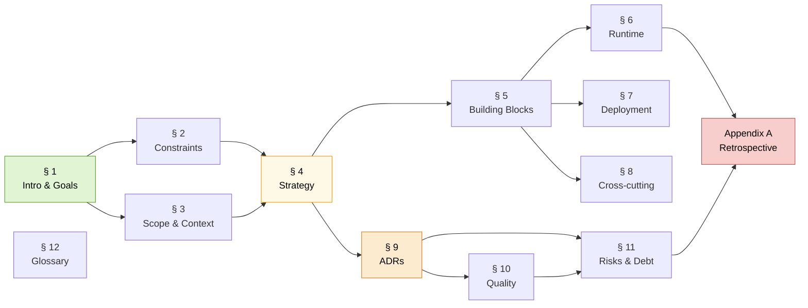

# LLM Wiki — arc42 Architecture Documentation

> This is the full architecture documentation for the LLM Wiki project, structured according to the [arc42 template](https://arc42.org/) (v8.2). The arc42 template is a pragmatic template for software architecture documentation, maintained by Gernot Starke and Peter Hruschka; it is de facto standard for architecture-level documentation in the German-speaking software engineering community and widely used internationally.
>
> The repository's top-level [`README.md`](../../README.md) is a short landing page. This folder is the depth.

---

## What you will find here

Twelve numbered sections following the arc42 structure, plus one appendix:

| § | Section | What it answers |
|---|---|---|
| [1](01-introduction-and-goals.md) | **Introduction and Goals** | What is this system? Who is it for? What are its top-5 quality goals, prioritised and unambiguous? |
| [2](02-architecture-constraints.md) | **Architecture Constraints** | Hard constraints (technical, organisational, conventions) that are not up for negotiation |
| [3](03-system-scope-and-context.md) | **System Scope and Context** | Business context (who interacts with it) and technical context (C4 Level 1). What crosses the boundary? |
| [4](04-solution-strategy.md) | **Solution Strategy** | The big strategic choices, fork vs. rewrite, FTS5 vs. vector, stdlib vs. deps, gazetteer-first resolver |
| [5](05-building-block-view.md) | **Building Block View** | Static decomposition. C4 Level 2 (container) and Level 3 (component) diagrams inline. |
| [6](06-runtime-view.md) | **Runtime View** | Dynamic behaviour, sequence diagrams for ingestion, query, six-stage resolver, context-overflow recovery and lint |
| [7](07-deployment-view.md) | **Deployment View** | Infrastructure, processes, memory budget, network topology, fallback configurations, one-time setup procedure |
| [8](08-crosscutting-concepts.md) | **Cross-cutting Concepts** | Domain model, persistence, error handling, security posture, concurrency, prompt discipline, observability |
| [9](09-architecture-decisions.md) | **Architecture Decisions** | Seven ADRs in Michael Nygard format: zero deps, fork llama.cpp, FTS5+graph over vector, asymmetric KV, six-stage resolver, F1 gates, reverse-index idempotency |
| [10](10-quality-requirements.md) | **Quality Requirements** | Quality tree and 23 ISO/IEC 25010 quality scenarios (S/E/R/M format). Traceability to goals, ADRs and constraints. |
| [11](11-risks-and-technical-debt.md) | **Risks and Technical Debt** | Security audit (7 findings), PII audit (4 findings), known limitations, technical debt register, risk register, scaling thought experiment |
| [12](12-glossary.md) | **Glossary** | Alphabetical glossary of ~75 domain and technical terms |
| [A](appendix-a-academic-retrospective.md) | **Appendix A, Academic Retrospective** | What we did, what we did and failed, what we did and succeeded but didn't fit purpose. Six labelled failures (F-1..F-6), five "succeeded but didn't fit" items (D-1..D-5), eight "succeeded and fits" items, five meta-lessons (M-1..M-5). |

Each section is a single Markdown file in this folder. Every cross-reference uses a relative link and every anchor resolves.

---

## Recommended reading orders

Different readers want different things. Four orders cover most use cases:

### Reading order A — The 20-minute overview

If you have 20 minutes, read in this order:

1. [§ 1 (Introduction and Goals)](01-introduction-and-goals.md), the five quality goals
2. [§ 3 (System Scope and Context)](03-system-scope-and-context.md), the Level 1 diagram and the mapping to Karpathy's gist
3. [§ 4 (Solution Strategy)](04-solution-strategy.md), the strategic choices
4. [Appendix A § A.2 (Succeeded and fits purpose)](appendix-a-academic-retrospective.md#a2-succeeded-and-fits-purpose), what actually worked

You will understand *what* the system is, *why* the boundary is drawn where it is and *what in it was worth building*.

### Reading order B — "Show me how it works"

If you want to understand the mechanics:

1. [§ 3 (System Scope and Context)](03-system-scope-and-context.md), the Level 1 boundary
2. [§ 5 (Building Block View)](05-building-block-view.md), the Level 2 and Level 3 decompositions
3. [§ 6 (Runtime View)](06-runtime-view.md), the four dynamic scenarios: ingest, query, resolve, overflow recovery
4. [§ 7 (Deployment View)](07-deployment-view.md), how it all maps to one MacBook

This is the C4-style tour, inside the arc42 framing.

### Reading order C — "Why did you decide that?"

If you want the reasoning chain:

1. [§ 2 (Architecture Constraints)](02-architecture-constraints.md), what was non-negotiable
2. [§ 4 (Solution Strategy)](04-solution-strategy.md), the big choices
3. [§ 9 (Architecture Decisions)](09-architecture-decisions.md), the seven ADRs
4. [§ 10 (Quality Requirements)](10-quality-requirements.md), how the quality scenarios trace back to those decisions
5. [Appendix A § A.4 (Failures)](appendix-a-academic-retrospective.md), what the decisions were reacting to

Every ADR cites the quality goals it serves and the failures it prevents.

### Reading order D — "What went wrong, and what did you do about it?"

The academic-retrospective reading order, for readers who want the honest story:

1. [§ 11 (Risks and Technical Debt)](11-risks-and-technical-debt.md), security audit, PII audit, known limitations
2. [Appendix A § A.4 (Failures)](appendix-a-academic-retrospective.md), F-1 through F-6 with symptom / root cause / mitigation / status / lesson
3. [Appendix A § A.3 (Succeeded but didn't fit)](appendix-a-academic-retrospective.md#a3-succeeded-but-did-not-fit-the-purpose), D-1 through D-5, the things that worked but didn't belong
4. [Appendix A § A.5 (Meta-lessons)](appendix-a-academic-retrospective.md#a5-meta-lessons), five generalisations
5. [Appendix A § A.6 (Regrets)](appendix-a-academic-retrospective.md#a6-what-would-be-different-next-time), five things we would do differently

This is the reading order the user's original prompt asked for: *"what we did, what we did and failed, what we did and succeeded but didn't fit the purpose, with academic rigor."*

---

## Reading dependency graph

Sections 1-4 set up the problem and the strategy. Sections 5-8 are the architectural views (static, dynamic, deployment, cross-cutting). Sections 9-10 are the decisions and the quality scenarios that test them. Sections 11-12 close the loop with risk and vocabulary. Appendix A is the honest retrospective tying it all back to what was learned.

---

## C4 model — standalone documents

The C4 Level 1 / Level 2 / Level 3 diagrams appear inline in arc42 §§ 3 and 5. They are also available as standalone C4 documents for readers who prefer the C4 model's native presentation:

- [`docs/c4/L1-system-context.md`](../c4/L1-system-context.md), the Level 1 System Context diagram with a full element and relationship catalogue and the list of deliberately-absent edges
- [`docs/c4/L2-container.md`](../c4/L2-container.md), the Level 2 Container diagram with a full catalogue of the five containers, their interfaces and their allowed dependency matrix
- [`docs/c4/L3-component.md`](../c4/L3-component.md), the Level 3 Component diagrams for `ingest.py`, `query.py` + `search.py` and `resolver.py`, plus a note on the shared `llm_client.py` foundation

The arc42 sections and the C4 documents tell the same story from two angles and must agree. If you change one, change the other.

---

## Cross-reference conventions

Throughout the arc42 documentation, the following notation is used consistently so that grep and link-checkers work:

| Prefix | Meaning | Example | Defined in |
|---|---|---|---|
| `Q1`..`Q5` | Top-5 quality goals | Q1 = privacy | [§ 1.2](01-introduction-and-goals.md#12-quality-goals) |
| `TC-1`..`TC-8` | Technical constraints | TC-1 = Python stdlib only | [§ 2](02-architecture-constraints.md) |
| `ADR-001`..`ADR-007` | Architecture decisions | ADR-001 = zero deps | [§ 9](09-architecture-decisions.md) |
| `QS-1`..`QS-23` | Quality scenarios | QS-1 = "ingest 100 PDFs with no network" | [§ 10](10-quality-requirements.md) |
| `SEC-1`..`SEC-7` | Security findings | SEC-2 = path-containment nuance | [§ 11.1](11-risks-and-technical-debt.md#111-security-posture) |
| `PII-1`..`PII-4` | PII findings | PII-2 = Gmail in 2 commits | [§ 11.2](11-risks-and-technical-debt.md#112-pii-and-privacy-audit) |
| `L-1`..`L-7` | Known limitations | L-1 = Greek-English mixed-lang retrieval | [§ 11.3](11-risks-and-technical-debt.md#113-known-limitations) |
| `TD-1`..`TD-10` | Technical debt items | TD-3 = judge cache is not atomic-write | [§ 11.4](11-risks-and-technical-debt.md#114-technical-debt) |
| `R-1`..`R-10` | Risk register entries | R-1 = model drift breaks resolver prompts | [§ 11.5](11-risks-and-technical-debt.md#115-risk-register) |
| `F-1`..`F-6` | Labelled failures | F-1 = LLM-based page selection scaling ceiling | [Appendix A § A.4](appendix-a-academic-retrospective.md#a4-failed--the-f-series) |
| `D-1`..`D-5` | "Succeeded but didn't fit" items | D-1 = bge-m3 stage 5 as opt-in | [Appendix A § A.3](appendix-a-academic-retrospective.md#a3-succeeded-but-did-not-fit-the-purpose) |
| `M-1`..`M-5` | Meta-lessons | M-1 = fixed-size structures between LLM and corpus | [Appendix A § A.5](appendix-a-academic-retrospective.md#a5-meta-lessons) |

These IDs are stable: any change that alters an ID is a breaking change to the documentation and must update every cross-reference.

---

## Document status

| Attribute | Value |
|---|---|
| **Project** | LLM Wiki (SecondBrain_POC) |
| **Pattern** | [Karpathy's LLM Wiki gist](https://gist.github.com/karpathy/442a6bf555914893e9891c11519de94f), April 2026 |
| **Template** | [arc42 v8.2](https://arc42.org/) by Gernot Starke and Peter Hruschka |
| **Complement** | [C4 model](https://c4model.com/) by Simon Brown (L1 / L2 / L3 inline, standalone docs in [`../c4/`](../c4/)) |
| **ADR format** | [Michael Nygard's template](https://cognitect.com/blog/2011/11/15/documenting-architecture-decisions.html) |
| **Quality attributes** | [ISO/IEC 25010](https://www.iso.org/standard/35733.html) |
| **Scenario format** | arc42 Stimulus / Environment / Response / Measure |
| **Last updated** | April 2026 |
| **Source of truth** | This folder. The top-level `README.md` is a landing page, not the documentation. |

---

## How to contribute to this documentation

The documentation lives under `docs/arc42/` and `docs/c4/`. Edit the Markdown directly. Four conventions are non-negotiable:

1. **Every cross-reference is a relative link**, not an absolute path and not a bare ID reference. If you introduce a new numbered item (e.g. `F-7`), add it to the [cross-reference conventions table](#cross-reference-conventions) above.
2. **Every ADR is in [Michael Nygard format](https://cognitect.com/blog/2011/11/15/documenting-architecture-decisions.html)** (Status / Date / Deciders / Context / Decision / Alternatives / Consequences / Related).
3. **Every quality scenario is in arc42 S/E/R/M format** (Stimulus / Environment / Response / Response Measure).
4. **Mermaid diagrams use the project's colour palette** (pastel fills with matching strokes, `color:#000` on every `style`). Colours from the existing diagrams should be reused before introducing new ones, for consistency.

Link-check on every edit with a local script if one exists, or manually follow each changed link. Broken internal links are treated as bugs.

---

## Quick navigation — one click per section

- Section 1, [Introduction and Goals](01-introduction-and-goals.md)
- Section 2, [Architecture Constraints](02-architecture-constraints.md)
- Section 3, [System Scope and Context](03-system-scope-and-context.md)
- Section 4, [Solution Strategy](04-solution-strategy.md)
- Section 5, [Building Block View](05-building-block-view.md)
- Section 6, [Runtime View](06-runtime-view.md)
- Section 7, [Deployment View](07-deployment-view.md)
- Section 8, [Cross-cutting Concepts](08-crosscutting-concepts.md)
- Section 9, [Architecture Decisions](09-architecture-decisions.md)
- Section 10, [Quality Requirements](10-quality-requirements.md)
- Section 11, [Risks and Technical Debt](11-risks-and-technical-debt.md)
- Section 12, [Glossary](12-glossary.md)
- Appendix A, [Academic Retrospective](appendix-a-academic-retrospective.md)
- C4 L1, [System Context](../c4/L1-system-context.md)
- C4 L2, [Container](../c4/L2-container.md)
- C4 L3, [Component](../c4/L3-component.md)
