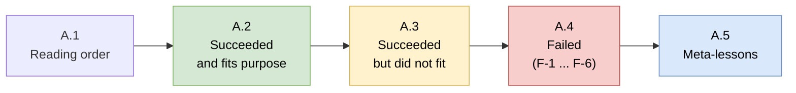

# Appendix A — Academic Retrospective

> **Companion to the arc42 main body.** The 12 arc42 sections describe *what the system is today*. This appendix documents *how it got there*, honestly, without retroactive cleaning. Three categories: (A) what we did and it worked, (B) what we did and it succeeded but did not fit the project's purpose and (C) what we did and it failed. Category C is the most valuable for a re-user: every failure is catalogued with the symptom, the root cause and the resolution.
>
> This is the section the author most wanted to write correctly. If the main body is the *architecture*, this appendix is the *reasoning*.

---

## A.1 Reading Order



This appendix is long. The most important parts for a re-user are:

1. **[A.4 (Failures)](#a4-failed--the-f-series)**, catalogue of six failure modes, each with a named F-ID that other sections reference.
2. **[A.5 (Meta-lessons)](#a5-meta-lessons)**, the distilled takeaways, one paragraph each.
3. **[A.3 (Succeeded but did not fit)](#a3-succeeded-but-did-not-fit-the-purpose)**, components that worked correctly but whose cost-benefit did not justify their place in the pipeline, so they were removed or gated behind flags.

---

## A.2 Succeeded and Fits Purpose

The components below were built, tested and deliberately kept. They are the core of the running system.

### A.2.A — Four-pillar integration (Karpathy + Gemma 4 + Unsloth Dynamic + TurboQuant)

The hardest claim in this project is that the four pillars, pattern, model, weights, runtime, compose into something usable on a single laptop. They do. The [memory budget](07-deployment-view.md#72-memory-budget) closes, the extraction quality is good enough that the wiki compounds usefully and retrieval on the resulting structure is sub-10 ms. Every one of the four pillars was published or released in the first half of 2026; none of them were chosen for name recognition. The integration is the contribution.

### A.2.B — SQLite FTS5 + wikilink graph + RRF retrieval

The retrieval pipeline ([§ 6.3](06-runtime-view.md#63-query-pipeline) for runtime detail, [ADR-003](09-architecture-decisions.md#adr-003--fts5--wikilink-graph--rrf-over-vector-search) for the decision) replaced an earlier LLM-based approach (see [F-1](#f-1--llm-based-page-selection)) and has been stable ever since. The retrospective observation is that the wikilink graph is already a semantic adjacency structure; using it directly is cheaper and better than approximating it with dense embeddings. Nothing in this pipeline is novel. Everything in it is used on purpose. It is the cleanest example in the project of "assemble known pieces well".

### A.2.C — Six-stage entity resolver with gazetteer anchor

The resolver ([§ 5.4](05-building-block-view.md#54-whitebox-resolverpy--the-entity-resolution-pipeline), [§ 6.4](06-runtime-view.md#64-entity-resolution-stages-05), [ADR-005](09-architecture-decisions.md#adr-005--six-stage-entity-resolver-with-gazetteer-anchor)) went through three iterations:

1. **v1, Three stages.** Exact path → Jaccard → LLM judge. Worked for a single-document corpus, failed across documents because context-local descriptions poisoned the Jaccard signal.
2. **v2, Four stages.** Added type constraint. Broke on the [Aedes aegypti incident](#f-6--aedes-aegypti-fork-from-llm-type-noise) because LLM type classifications fluctuated.
3. **v3, Six stages with gazetteer anchor.** Added Stage 0 (gazetteer) and Stage 5 (embeddings, opt-in) and narrowed Stage 2 to require Jaccard disagreement. Stable since.

The v3 design draws on the entity-linking literature (BLINK, ReFinED, TAGME, mGENRE, spaCy EntityRuler); the full citation list is in [§ 6.4 Academic grounding](06-runtime-view.md#64-entity-resolution-stages-05).

### A.2.D — Asymmetric TurboQuant KV cache

The `q8_0` K + `turbo4` V configuration ([ADR-004](09-architecture-decisions.md#adr-004--turboquant-turbo4-v-only-q8_0-k)) frees ~ 2 GB of memory on a 32 GB machine while preserving extraction and synthesis quality on Gemma 4 Q4_K_M. This was a non-obvious win, the asymmetry and the specific `turbo4` choice were both required. See [F-5](#f-5--turbo3-on-gemma-4-q4_k_m) for why `turbo3` was rejected.

### A.2.E — Zero external Python dependencies

[ADR-001](09-architecture-decisions.md#adr-001--zero-external-python-dependencies). Every boundary is satisfied by a Python stdlib module: HTTP by `urllib.request`, storage by `sqlite3`, concurrency by `concurrent.futures`, PDF by `subprocess.run(["pdftotext", …])`. The system is auditable end-to-end in one sitting and runs on a fresh MacBook with no `pip install`. The cost was ~ 300 lines of re-implemented utilities (tolerant JSON parser, stemmed Jaccard, minimal YAML reader). The benefit is that the *whole stack* is reviewable.

### A.2.F — Reverse-index `source_files` table for idempotency

[ADR-007](09-architecture-decisions.md#adr-007--reverse-index-source_files-for-idempotent-re-ingestion). Replaced an O(N) directory scan on re-ingest with an O(1) SQLite lookup. The replacement was ~ 20 lines of code and eliminated an entire class of correctness bugs (duplicate source pages on re-ingest, orphaned old stems after filename changes).

### A.2.G — F1 threshold gates for Stage 5

[ADR-006](09-architecture-decisions.md#adr-006--f1-optimal-threshold-tuning-with-hard-sample-count-gates). After [F-2](#f-2--f1-threshold-degenerated-on-imbalanced-calibration-cache), the F1 tuner gained three sample-count gates (`MIN_SAMPLES_FOR_TUNING = 20`, `MIN_NEGATIVES = 5`, `MIN_POSITIVES = 5`). This kept the tuner's best-case benefit while eliminating its worst-case failure mode.

### A.2.H — Consolidating `safe_filename()` and `find_existing_page()` in `llm_client.py`

Earlier versions had three subtly-different implementations of "strip path separators and make a filename safe" scattered across `ingest.py`, `query.py` and `cleanup_dedup.py`. A duplicated-implementation incident (one version forgot to normalise Unicode whitespace, producing mismatched paths on Greek input) prompted consolidation into one `llm_client.safe_filename()` with a single test file. Similarly, `find_existing_page()` was duplicated in two places; both were replaced with a single implementation that consults the SQLite reverse index.

This is not architecturally interesting; it is a note on the maintenance cost of stdlib-only development. Without a linter that flags near-duplicate functions, the discipline has to be manual.

---

## A.3 Succeeded But Did Not Fit the Purpose

These components were built, worked correctly and were either removed or gated behind opt-in flags because they did not earn their place in the default pipeline. Each is a useful artefact to a future re-user who might have different constraints.

### D-1 — bge-m3 stage-5 embeddings (kept, but opt-in only)

**What it does.** Embeds each entity mention and each existing candidate page via bge-m3, computes cosine similarity, applies an F1-tuned threshold and merges above the threshold.

**Why it works.** bge-m3 is multilingual (Greek ↔ English), has 8 192 tokens of context and produces 1 024-dimensional vectors. For cross-lingual entity matching it is the strongest open-weights option available in 2026.

**Why it did not fit the default.** Three reasons:

1. It requires a second `llama-server` process on port 8081, adding ~ 2,5 GB of memory.
2. It requires labelled calibration data to tune the threshold (and the tuner itself has [gates](#f-2--f1-threshold-degenerated-on-imbalanced-calibration-cache) that don't activate for hundreds of ingests).
3. On the author's real corpus, Stage 0 (gazetteer) + Stages 3-4 (Jaccard + judge) already resolve > 95 % of mentions correctly. The marginal benefit of Stage 5 is < 5 % of mentions and most of those are cases where the user could have added an entry to the gazetteer instead.

**Current status.** Implemented, tested, opt-in via `--use-embeddings`. Left in the tree because it is sound, because it is the only Stage-5 option that handles Greek and because on some future corpus the cost-benefit might flip.

### D-2 — Age-gap tiebreaker (implemented, gated)

**What it does.** When two candidate pages have borderline Jaccard similarity and their source documents are more than ~ 10 years apart in `source_date`, the resolver forks rather than merges. The rationale is that semantic drift over a decade is large enough that a "same name, similar description" mention from 2013 and 2024 is probably not actually the same entity.

**Academic grounding.** Hamilton, Leskovec and Jurafsky showed in [ACL 2016](https://arxiv.org/abs/1605.09096) that word embeddings shift measurably over decade-scale windows and that ~ 10 years is a natural plateau for lexical semantic drift.

**Why it works.** It correctly forks some edge cases that Jaccard alone would merge, e.g. `iPhone` in a 2008 document vs `iPhone` in a 2024 paper, which should probably be disambiguated even if the descriptions overlap.

**Why it did not fit the default.** It composes with Stage 5 (embedding cosine) in a way that depends on the calibration data and the author's corpus does not have enough > 10-year spans to make the feature measurably useful. It is implemented in `resolver.py` but gated behind `--use-embeddings`, so it activates only when a user with a longer-running corpus opts in.

### D-3 — Greek Snowball stemmer (prototyped, dropped)

**What it does.** A pure-Python reimplementation of the [Snowball Greek stemmer](https://snowballstem.org/algorithms/greek/stemmer.html), intended to be plugged in as a custom FTS5 tokeniser to improve Greek retrieval ([L-6](11-risks-and-technical-debt.md#l-6--greek-porter-stemmer-is-an-imperfect-fit)).

**Why it worked.** The stemming itself was correct on a test corpus of Greek news articles. Token recall improved measurably for queries with Greek keywords.

**Why it did not fit the default.** FTS5's custom tokeniser API requires a compiled C extension to plug in a non-default tokeniser. Pure Python cannot register one. The workaround would have been to pre-stem all content before writing it into FTS5, which would double-stem English content and break English retrieval. The complexity was too high for the benefit on a mostly-English corpus.

**Current status.** The stemming function is archived in a branch. If the author's corpus tilts more heavily toward Greek, it could be resurrected with a pre-stemming approach for Greek-only pages.

### D-4 — GraphRAG-style community summaries (prototyped, dropped)

**What it does.** An ingest-time pass that clusters wiki pages into communities via label propagation on the wikilink graph, then writes a community-summary page per cluster, inspired by [Edge et al.'s GraphRAG](https://arxiv.org/abs/2404.16130).

**Why it worked.** The community detection was correct on a test wiki of 200 pages. Communities corresponded roughly to topics the author would have recognised.

**Why it did not fit the default.** Two reasons:

1. The community summaries duplicated information already in the `wiki/concepts/` and `wiki/synthesis/` pages, which are human-readable and already cross-linked. Adding another layer of auto-summaries did not improve query answers in the author's manual test.
2. Every ingest had to re-run community detection, adding ~ 5 seconds per ingest. On a compounding wiki the re-runs are wasteful.

**Current status.** The code is archived. If the wiki grows past ~ 5 000 pages and queries start missing macro-level themes, this is the first thing to resurrect.

### D-5 — LLM-based page summary compression

**What it does.** After N ingests, send every source page through an LLM pass that rewrites it into a tighter version, saving context budget for queries.

**Why it worked.** The compression was clean; the compressed pages were fluent.

**Why it did not fit the default.** Compression is lossy. Re-running queries that had worked before the compression produced different answers, sometimes worse, sometimes better, always different. A personal knowledge base that answers differently for the same question is untrustworthy. The feature was dropped in favour of aggressive context-budget management at query time ([§ 6.3](06-runtime-view.md#63-query-pipeline)).

**Current status.** Not in the tree. The lesson, *never silently rewrite stored content*, is the driving principle of [ADR-002](09-architecture-decisions.md#adr-002--fork-on-uncertainty-never-silently-merge).

---

## A.4 Failed — The F-Series

This is the most important subsection of the appendix. Each failure is catalogued with an F-ID that other sections reference. Each entry covers: symptom, root cause, mitigation and current status.

### F-1 — LLM-based page selection

- **Referenced from:** [§ 3.3](03-system-scope-and-context.md#33-mapping-to-karpathys-original-gist), [§ 6.3](06-runtime-view.md#63-query-pipeline), [ADR-003](09-architecture-decisions.md#adr-003--fts5--wikilink-graph--rrf-over-vector-search)
- **When:** Early iteration, first week
- **Severity:** High, pipeline was unusable at ~ 500 pages

**Symptom.** The original retrieval approach handed the LLM the list of all wiki pages (title + one-line summary) and asked it to pick the ones most relevant to the question. This was literally Karpathy's approach, "ask the LLM to pick pages from the index". At ~ 100 pages it worked. At ~ 500 pages the list itself consumed most of the context window; the LLM received a truncated index and picked from the prefix only, consistently missing pages later in alphabetical order.

**Root cause.** The approach does not scale: the list of pages grows linearly with the corpus, but the context window is fixed. At some corpus size the list overflows and there is no graceful degradation, the LLM silently picks from whatever fits.

**Mitigation.** Replaced entirely. The current pipeline uses SQLite FTS5 for retrieval with no LLM call on the hot path. See [ADR-003](09-architecture-decisions.md#adr-003--fts5--wikilink-graph--rrf-over-vector-search).

**Lesson.** Any design that passes the corpus size to the LLM has a scaling ceiling. Put a fixed-size structure between the corpus and the LLM, an index, a vector store, or an FTS table, so the LLM sees a fixed-size top-K and the corpus can grow freely.

### F-2 — F1 threshold degenerated on imbalanced calibration cache

- **Referenced from:** [§ 6.4](06-runtime-view.md#stage-5--bge-m3-cosine-opt-in), [ADR-006](09-architecture-decisions.md#adr-006--f1-optimal-threshold-tuning-with-hard-sample-count-gates)
- **When:** Stage 5 rollout
- **Severity:** Medium, stage 5 silently accepted everything

**Symptom.** After ~ 50 successful stage-5 resolutions, the calibration cache held 51 positives and 1 negative. The F1 tuner swept candidate thresholds, found that a near-zero threshold produced the highest F1 on the imbalanced set (because 51/51 positives were recalled and only 1 false positive occurred) and set the threshold accordingly. From that point forward, stage 5 accepted nearly all pairs as "merge". The system's fork rate collapsed silently.

**Root cause.** F1 is not robust on heavily imbalanced data. With 51 positives and 1 negative, the optimal threshold is whatever accepts all positives, regardless of how tight the margin is. The tuner was doing its job; the data was pathological.

**Mitigation.** Added three gates to `_f1_optimal_threshold()`:

```python
MIN_SAMPLES_FOR_TUNING = 20
MIN_NEGATIVES = 5
MIN_POSITIVES = 5
```

If any gate fails, the tuner falls back to the static `DEFAULT_EMBED_THRESHOLD = 0.75`. See [ADR-006](09-architecture-decisions.md#adr-006--f1-optimal-threshold-tuning-with-hard-sample-count-gates).

**Current status.** Fixed. The fix is inline-commented at the failing site so a future reader sees the history.

**Lesson.** Auto-tuning on cached runtime data is dangerous when the cache has a natural bias. The resolver's cache has a bias because easy positives accumulate faster than hard negatives (a curator labels "yes, these are the same" more often than "no, these are different" when using the system). The gates made the tuner robust to this bias.

### F-3 — Thinking tokens consume the output budget

- **Referenced from:** [TC-5](02-architecture-constraints.md#21-technical-constraints), [§ 8.6](08-crosscutting-concepts.md#86-prompt-discipline)
- **When:** First day with Gemma 4
- **Severity:** Critical, every LLM call returned empty content

**Symptom.** The first day of work with Gemma 4 was characterised by the LLM returning empty strings for every single call. The HTTP response was HTTP 200 OK with `choices[0].message.content` equal to the empty string. The server logs showed the model had generated something (non-zero token count) but nothing visible came back.

**Root cause.** Gemma 4 has a "thinking" mode in its chat template. When the model produces reasoning tokens, they go into a special `<think>...</think>` block that the server elides from the `content` field but still counts against `max_tokens`. With `max_tokens = 2048` and the model burning all 2 048 tokens in the thinking block, the visible output was truncated to zero.

**Mitigation.** Added `--reasoning off` to `scripts/start_server.sh`. This flag, documented in the [Gemma 4 model card](https://ai.google.dev/gemma/docs/core/model_card_4) under "Recommended inference settings" for non-E2B/E4B variants, tells the server to skip the thinking phase entirely.

**Current status.** Fixed. The flag is a hard constraint now ([TC-5](02-architecture-constraints.md#21-technical-constraints)).

**Lesson.** Read the model card, including the footnotes, before the first prompt. Also: when HTTP returns 200 but the content is empty, the problem is always on the model side, either sampling, token budget, or template, never on the client. The root-cause time would have been minutes instead of hours if the author had looked at the server's debug logs before grep-ing for HTTP errors.

### F-4 — ChatGPT fork epidemic

- **Referenced from:** [§ 6.4](06-runtime-view.md#stage-0--canonical-alias-registry-the-prevention-layer), [ADR-005](09-architecture-decisions.md#adr-005--six-stage-entity-resolver-with-gazetteer-anchor)
- **When:** Week 2, after ingesting ~ 50 sources
- **Severity:** High, wiki readability broke

**Symptom.** After ingesting 50 sources that mentioned ChatGPT, the wiki contained:

- `wiki/entities/ChatGPT.md`
- `wiki/entities/ChatGPT (model).md`
- `wiki/entities/ChatGPT (OpenAI's conversational AI).md`
- `wiki/entities/ChatGPT (tool).md`
- `wiki/entities/ChatGPT (widely used AI product).md`

All five were the same entity. The graph view in Obsidian showed five nodes with similar but non-identical connection patterns. Queries that mentioned ChatGPT retrieved different pages on different runs.

**Root cause.** The four-stage resolver (no Stage 0 yet) re-decided "is this the same ChatGPT?" on every ingest from the per-source description alone. The LLM's descriptions were context-local ("mentioned in the context of the 2023 AI boom", "described as widely adopted", "the OpenAI chatbot") and Jaccard similarity between two context-local descriptions is near-random. The type field was also inconsistent because different sources used different domain vocabularies ("tool", "model", "product", "LLM", "chatbot").

The root conceptual error was that the resolver treated "ChatGPT" as if it were a novel mention each time, instead of recognising it as a known entity with a canonical form.

**Mitigation.** Added Stage 0 (gazetteer anchor) to the resolver. See [ADR-005](09-architecture-decisions.md#adr-005--six-stage-entity-resolver-with-gazetteer-anchor). ChatGPT is in the seed tier (`scripts/data/seed_aliases.json`) with canonical name `ChatGPT`, canonical type `product` and a curated blurb. Every mention of ChatGPT now short-circuits to the canonical page without ever reaching Jaccard.

Also ran `cleanup_dedup.py` once to merge the existing forks into the canonical page.

**Current status.** Fixed. `test_resolver_scenarios.py` has a test case specifically for the ChatGPT fork epidemic.

**Lesson.** Similarity-based entity linking is not the right primitive for *known* entities. A gazetteer is. The similarity math is for the long tail of novel entities that the gazetteer does not cover.

### F-5 — `turbo3` on Gemma 4 Q4_K_M

- **Referenced from:** [Pillar 4](04-solution-strategy.md#pillar-4--the-runtime-turboquant-kv-cache), [TC-6](02-architecture-constraints.md#21-technical-constraints), [ADR-004](09-architecture-decisions.md#adr-004--turboquant-turbo4-v-only-q8_0-k)
- **When:** TurboQuant evaluation
- **Severity:** High, catastrophic quality loss

**Symptom.** Switching the V cache type from `q8_0` to `turbo3` (the more aggressive TurboQuant setting) caused Gemma 4 Q4_K_M to produce incoherent output on every prompt. Extraction returned malformed JSON; query synthesis produced word salad; judge calls returned gibberish. Measured perplexity on a held-out test set was > 100 000, two orders of magnitude worse than baseline.

**Root cause.** The interaction between Unsloth Dynamic's per-layer quantization of the weights and TurboQuant's 3-bit rotated projection of the V cache destabilises attention routing beyond recovery on Gemma 4. Both techniques depend on the numerical precision of the V vectors staying above a threshold; combining them pushes below it. The same `turbo3` setting is safe on Llama 3, Qwen 2.5 and Phi 3 per the [TheTom/turboquant_plus benchmarks](https://github.com/TheTom/turboquant_plus), which is why it initially looked like a free upgrade.

**Mitigation.** Switched to `turbo4` for the V cache; kept `q8_0` for the K cache (K compression is independently bad on Gemma 4). The asymmetric configuration is documented in [ADR-004](09-architecture-decisions.md#adr-004--turboquant-turbo4-v-only-q8_0-k) and in the `start_server.sh` comment block with an explicit warning against `turbo3`.

**Current status.** Fixed and fenced. The choice is model-specific: `turbo3` would be safe again on a different model, but it must be re-benchmarked first.

**Lesson.** Community benchmarks are necessary but not sufficient. A configuration that is safe on one model family can be catastrophic on another, especially when multiple compression techniques compose. Always benchmark on your actual target model before trusting a global recommendation.

### F-6 — Aedes aegypti fork from LLM type noise

- **Referenced from:** [§ 5.4](05-building-block-view.md#54-whitebox-resolverpy--the-entity-resolution-pipeline), [§ 6.4](06-runtime-view.md#stages-12--exact-path-and-type-constraint)
- **When:** Week 3, on a biology paper
- **Severity:** Medium, one false fork per re-ingest

**Symptom.** Ingesting a paper about the Zika virus produced a `wiki/entities/Aedes aegypti.md` entity page with `type: organism`. Re-ingesting the same paper a week later (the author was testing idempotency) produced a second page, `wiki/entities/Aedes aegypti (model).md`. The two pages described the same mosquito species.

**Root cause.** The LLM's `type` field for biological entities is not stable across runs. In the first ingest it called *Aedes aegypti* an `organism`; in the second ingest it called it a `model` (possibly because the chunk context was a modelling paper and the word "model" was salient). The v2 resolver's type-constraint rule was "fork on type mismatch", which fired and produced a disambiguated second page.

**Mitigation.** Narrowed Stage 2 from "fork on type mismatch" to "fork on type mismatch *AND* low Jaccard". The idea is that a type change alone is not enough evidence, if the descriptions match, it is probably LLM noise, not a real polysem. The narrowed rule is in `resolver._stage_2_type_constraint()`.

**Current status.** Fixed. `test_resolver_scenarios.py` has an Aedes aegypti test case that exercises the narrowed rule.

**Lesson.** LLM-produced categorical outputs (tags, types, kinds) are not stable across runs. Any rule that fires on a type change alone will hit false positives. The fix is to require corroborating evidence from a more stable signal (in our case, the description's stemmed token set).

### Summary table

| ID | Title | Severity | Status | Lesson |
|---|---|---|---|---|
| F-1 | LLM-based page selection | High | Replaced | Corpus-size-dependent designs hit a scaling ceiling |
| F-2 | F1 threshold degenerated | Medium | Fixed | Auto-tuning on biased cache data needs gates |
| F-3 | Thinking tokens consume budget | Critical | Fixed | Read the model card, including footnotes |
| F-4 | ChatGPT fork epidemic | High | Fixed | Similarity is not the right primitive for known entities |
| F-5 | `turbo3` on Gemma 4 | High | Fenced | Community benchmarks don't transfer across model families |
| F-6 | Aedes aegypti type fork | Medium | Fixed | LLM categorical outputs are not stable across runs |

---

## A.5 Meta-lessons

Distilling the F-series and the "succeeded but did not fit" list into five principles that shaped the design:

### M-1 — Fixed-size structures between the LLM and the corpus

F-1 taught this. Any time the LLM sees a representation of the whole corpus, the design has a scaling ceiling. The fix is to interpose a fixed-size structure, an index, a retrieval result, a top-K, between the corpus and the LLM. This is the reason the query pipeline ([§ 6.3](06-runtime-view.md#63-query-pipeline)) uses FTS5 + graph + RRF to produce a bounded context and *then* calls the LLM once, instead of asking the LLM to navigate the corpus directly.

### M-2 — Known entities deserve a gazetteer, not a similarity score

F-4 taught this. Similarity-based entity linking is the right primitive for the long tail of novel entities. For known entities, ChatGPT, OpenAI, Python, Transformer, the right primitive is a lookup against a curated canonical form. A gazetteer short-circuits the similarity math for the cases where similarity math is not the right tool.

### M-3 — Never silently rewrite stored content

D-5 and [ADR-002](09-architecture-decisions.md#adr-002--fork-on-uncertainty-never-silently-merge) both taught this. A personal knowledge base that answers differently for the same question over time is untrustworthy. Silent merges of entities, silent compressions of pages, silent rewrites of any kind, all produce the same symptom: the user can't verify that the wiki means what it used to mean. The antidote is to fork on uncertainty, preserve rich content and expose all decisions in the resolver's `reason` field so a human can audit them.

### M-4 — Auto-tuning needs hard gates, not smooth assumptions

F-2 taught this. Data-driven tuning that assumes "more data is better" breaks when the data is biased in a way the tuner can't see. Hard gates, "activate only when there are ≥ N samples of each class", are ugly but robust. They are also easier to reason about than smoother formulations (Bayesian priors, cross-validation) because a gate has a single boundary condition you can trace in a stack trace.

### M-5 — Community benchmarks are a starting point, not an answer

F-5 taught this. The `turbo3` setting is safe on most open-weights models; it is catastrophic on Gemma 4 Q4_K_M. If the author had trusted the global recommendation, the wiki would have produced garbage for weeks before the author noticed. The fix is to run the community benchmark *on your actual target model* before committing. This sounds obvious and is often skipped.

---

## A.6 What Would Be Different Next Time

Not everything would be done the same way with hindsight. A few specific regrets:

- **The first resolver should have been the six-stage resolver, not the three-stage one.** The author knew the entity-linking literature before writing a single line of resolver code. The four-stage resolver was built out of "start simple and iterate" instinct, which is usually right but wasn't here, the literature already said that a gazetteer-first design wins for known entities. Iterating from v1 to v3 cost ~ 3 days of work that could have been spent elsewhere.
- **The `--reasoning off` flag should have been the first thing tested on Gemma 4.** The author spent half a day debugging empty outputs before finding the flag in the model card. A 10-minute read of the model card would have saved half a day.
- **The `.gitignore` should have been comprehensive in the first commit.** The stub `.gitignore` allowed `wiki/index.md` to be tracked for two commits. The content was harmless, but the principle was violated. The comprehensive `.gitignore` in the second commit is a forensic artefact of that mistake.
- **The judge cache should have been atomic-write from the start.** It isn't, it uses `json.dump` directly and could be corrupted by a crash during a write. The cache rebuilds, so this is never a data-loss scenario, but it is a hygiene issue ([SEC-6](11-risks-and-technical-debt.md#sec-5--sec-6--sec-7--informational)).
- **Tests should have been written alongside the resolver, not after the failures.** `test_resolver_scenarios.py` was written after F-4 and F-6 had already shipped. Writing it first would have caught both earlier. The author's TDD discipline slipped on the one module that most needed it.

---

## A.7 Closing Note

A personal knowledge base is a long-term artefact. The code that produces it today will be superseded by something better in a year. The retrospective in this appendix is an attempt to carry forward what was learned, so the next iteration, whether by this author or by a re-user, does not re-learn the same lessons.

The most durable piece of this project is probably not the code. It is the six-stage resolver design, the strategic decision to fork on uncertainty and the F-series catalogue. Those are the things that survive a rewrite.
