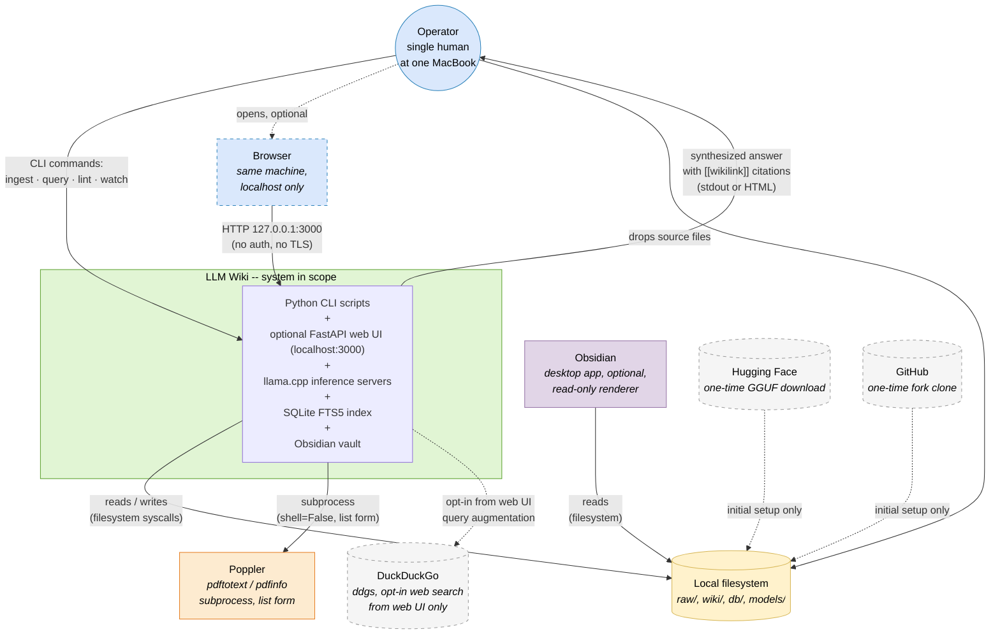

# C4 Level 1, System Context

> **C4 Model, Level 1.** A System Context diagram is the highest-level picture of a software system. It answers a single question: *what are we building and who or what does it talk to?* At this level the system is one box. We do not care yet how it is decomposed internally, [Level 2](L2-container.md) zooms in one step and [Level 3](L3-component.md) zooms in one step further.
>
> This document is the standalone C4 presentation. The same diagram appears inline in [arc42 § 3 (System Scope and Context)](../arc42/03-system-scope-and-context.md) for readers who prefer the arc42 presentation. The two must agree, if you change one, change both.

---

## System in scope

**Name:** LLM Wiki, a fully local, Obsidian-compatible knowledge base compiled by an on-device LLM from a folder of personal source documents.

**Purpose:** Let one human ingest and then query their own documents, emails, SMS exports, PDFs, Markdown notes, research papers, without trusting any third party with the content.

**Pattern origin:** [Andrej Karpathy's LLM Wiki gist](https://gist.github.com/karpathy/442a6bf555914893e9891c11519de94f), April 2026.

**Boundary rule:** Everything that crosses the boundary in either direction is pictured below. Nothing else is expected to cross it. If a new edge would appear, that is an architectural decision and must be documented in an ADR before code lands.

---

## System Context diagram

---

## Element catalogue

### Person, User

| Attribute | Value |
|---|---|
| **Type** | Person (C4 notation) |
| **Cardinality** | 1 |
| **Description** | A single human operator on their own MacBook. The user drops source files into `raw/`, issues CLI commands and reads answers on stdout. |
| **Trust level** | Full trust, same UID as the scripts. The security model is *local privilege*, not *multi-user*. |
| **Authentication** | None. This is a single-user system and making it multi-user is an explicit non-goal (see [arc42 § 10, non-goals](../arc42/10-quality-requirements.md#105-non-goals)). |

### Software system, LLM Wiki (the system in scope)

| Attribute | Value |
|---|---|
| **Type** | Software system |
| **Technology summary** | Python 3.12+ stdlib-only core; optional FastAPI + Lit web UI; llama.cpp with Metal; Gemma 4 26B-A4B MoE; SQLite FTS5; Obsidian vault on filesystem |
| **Responsibility** | Ingest source documents → compile them into a cross-linked Markdown wiki → let the operator query the wiki in natural language → file answers back into the wiki as synthesis pages. The same operations are exposed through two interfaces: the CLI and the optional web UI. |
| **Decomposition** | Opened at [Level 2 (Container view)](L2-container.md) |
| **Runtime location** | Exactly one process tree on one Apple Silicon MacBook. Loopback-only HTTP on `127.0.0.1:8080`, `127.0.0.1:8081` and (when the web UI is running) `127.0.0.1:3000`. |

### Secondary actor, Browser (dashed, optional)

| Attribute | Value |
|---|---|
| **Type** | Secondary actor, same-machine browser process |
| **Interaction** | Loads the Vite-built Lit frontend served by `web/api/app.py` and calls its JSON endpoints under `/api/*`. CSP forbids inline scripts and external origins; rendered markdown passes through DOMPurify before being inserted into the DOM. |
| **Why dashed** | The CLI is sufficient to run the system; the web UI is additive. Deleting `web/` removes this actor entirely without changing any CLI behaviour. |

### External software system, Local filesystem

| Attribute | Value |
|---|---|
| **Type** | External software system (OS filesystem) |
| **Interaction** | The only durable persistence mechanism. There is no database server, no message queue, no cloud bucket. |
| **Layout** | `obsidian_vault/raw/` (immutable source files), `obsidian_vault/wiki/` (LLM-generated Markdown), `db/` (SQLite + JSON caches), `models/` (GGUF weights) |
| **Notes** | Reads and writes go through `safe_filename()` and `find_existing_page()` helpers in [`scripts/llm_client.py`](../../scripts/llm_client.py), which enforce path-containment, every write resolves to an absolute path inside `WIKI_DIR` before it is opened. |

### External software system, Poppler

| Attribute | Value |
|---|---|
| **Type** | External executable dependency |
| **Binary** | [Poppler](https://poppler.freedesktop.org/), `pdftotext` and `pdfinfo` |
| **Interaction** | Called by `scripts/ingest.py` via `subprocess.run([...], shell=False)` on a resolved `Path` object |
| **Why not a library** | Python-native PDF libraries (PyMuPDF, pdfplumber, pypdf) would add a runtime dependency, which violates [ADR-001 (zero dependencies)](../arc42/09-architecture-decisions.md#adr-001--zero-external-python-dependencies). Poppler is installed system-wide via Homebrew and invoked as a subprocess. |
| **Data flow** | Inbound only (PDF text extraction). No data ever flows back to Poppler. |

### External software system, Obsidian

| Attribute | Value |
|---|---|
| **Type** | External desktop application, optional |
| **Interaction** | Obsidian watches `obsidian_vault/` and renders the Markdown files with graph view, backlinks, Dataview queries. It is **read-only from Obsidian's side**: Obsidian does not run the pipeline, does not write back to the vault and is not required for any script in this repository to work. |
| **Why optional** | The pipeline produces plain Markdown + YAML frontmatter. You could read it in any text editor. Obsidian is the ergonomic default because the pattern the system implements, [Karpathy's LLM Wiki gist](https://gist.github.com/karpathy/442a6bf555914893e9891c11519de94f), uses it explicitly. |

### External software system, Hugging Face (dashed)

| Attribute | Value |
|---|---|
| **Type** | External software system, **one-time setup only** |
| **Interaction** | The user runs `huggingface-cli download unsloth/gemma-3-27b-it-GGUF` **once** at setup to place the GGUF weights in `models/`. After that the system never talks to Hugging Face again. |
| **Why dashed** | The dashed edge signals that this is not part of the normal runtime path. It is present in the picture because the reproducibility procedure in [arc42 § 7.5](../arc42/07-deployment-view.md) requires it; it is dashed because it is a [one-time setup step, not an operational dependency](../arc42/07-deployment-view.md). |
| **Air-gap compatibility** | A prepared laptop can be taken fully offline; the edge never needs to activate again. |

### External software system, GitHub (dashed)

| Attribute | Value |
|---|---|
| **Type** | External software system, **one-time setup only** |
| **Interaction** | The user runs `git clone https://github.com/TheTom/llama-cpp-turboquant.git llama.cpp` **once** at setup to fetch the inference runtime fork. After that the `.git` directory is unused and can be deleted. |
| **Why dashed** | Same rationale as Hugging Face, setup-time edge, not a runtime dependency. The fork is pinned for the [specific TurboQuant KV-cache semantics documented in ADR-004](../arc42/09-architecture-decisions.md#adr-004--turboquant-turbo4-v-only-q8_0-k). |

### External software system, DuckDuckGo (dashed, opt-in)

| Attribute | Value |
|---|---|
| **Type** | External software system, **opt-in runtime edge** |
| **Interaction** | Reached from the web UI's `/api/query/*` endpoints via the `ddgs` Python package when the operator ticks the "augment with web search" option. Sends only the query text, parses the returned result snippets into additional context for answer synthesis. |
| **Why dashed** | This is the *only* runtime outbound edge in the system and it is off by default. A pure-CLI installation never loads `ddgs` at all; a web UI installation loads it but never calls it unless the operator enables the toggle on a per-query basis. Disabling it entirely is a single `pip uninstall ddgs` away. |
| **Air-gap compatibility** | The toggle is the operator's commitment. If the machine is genuinely offline, uninstall `ddgs` and the path is gone from the Python import graph. |

---

## Relationship catalogue

| # | From | To | Direction | Protocol | Data | Rate |
|---|---|---|---|---|---|---|
| 1 | Operator | LLM Wiki (app) | → | POSIX CLI (`argv`, stdin, stdout, stderr) | Commands: `ingest`, `query`, `lint`, `watch`, `cleanup_dedup` | Human-paced, a few per session |
| 2 | LLM Wiki (app) | Operator | → | Stdout text | Synthesized answers with `[[wikilink]]` citations; progress output; error messages | One response per CLI invocation |
| 3 | Operator | Local filesystem | → | Filesystem (Finder, `cp`, `mv`) | Source documents dropped into `obsidian_vault/raw/` | Occasional |
| 4 | LLM Wiki (app) | Local filesystem | ↔ | Filesystem syscalls (`open`, `read`, `write`, `rename`, `stat`) | Markdown, YAML, SQLite, JSON | Many per second during ingest; read-heavy during query |
| 5 | LLM Wiki (app) | Poppler | → | `subprocess.run(list, shell=False)` | Absolute file path of a PDF in `raw/` | Once per PDF ingest |
| 6 | Poppler | LLM Wiki (app) | → | Stdout capture | Extracted UTF-8 text and metadata | Once per PDF ingest |
| 7 | Obsidian | Local filesystem | → | Filesystem (FS events, file reads) | Reads `wiki/*.md`; renders graph view and backlinks | Continuous when the app is open |
| 8 | Browser (optional) | LLM Wiki web UI | ↔ | HTTP/1.1 on `127.0.0.1:3000` | JSON request / response under `/api/*`; HTML, JS, CSS under `/` | Request-response per operator action in the UI |
| 9 | Hugging Face | Local filesystem | ⇢ (dashed) | HTTPS (`huggingface-cli`) | GGUF weights | **One-off, setup only** |
| 10 | GitHub | Local filesystem | ⇢ (dashed) | HTTPS (`git clone`) | `llama-cpp-turboquant` source code | **One-off, setup only** |
| 11 | LLM Wiki (web UI only) | DuckDuckGo | ⇢ (dashed) | HTTPS via `ddgs` | Query text only; no vault content, no operator identity | **Opt-in per query, off by default** |

Relationships 1-7 are the mandatory steady state. Relationship 8 is active only while the web UI process is running. Relationships 9-10 exist only during initial setup. Relationship 11 is opt-in and never fires unless the operator ticks the "augment with web search" toggle.

---

## What is deliberately **not** on this diagram

This section is load-bearing. The absence of these edges is a direct expression of [Quality Goal Q1 (privacy)](../arc42/01-introduction-and-goals.md#12-quality-goals):

| Missing edge | Why it is missing |
|---|---|
| LLM Wiki → OpenAI / Anthropic / any LLM API | All inference is on-device. `grep -R "https://" scripts/` returns only documentation comments, never a live request target. |
| LLM Wiki → telemetry service | No telemetry collector exists. There is no crash reporter, no usage metric, no update check. |
| LLM Wiki → vector database (Pinecone, Weaviate, Qdrant, …) | SQLite FTS5 + wikilink graph is the retrieval stack. Rationale in [ADR-003](../arc42/09-architecture-decisions.md#adr-003--fts5--wikilink-graph--rrf-over-vector-search). |
| LLM Wiki → message queue (Redis, RabbitMQ, SQS, …) | There is no long-running broker. Concurrency is one `ThreadPoolExecutor` inside one Python process. |
| LLM Wiki → auth provider (OAuth, Auth0, …) | Single-operator by design. Multi-user is an explicit non-goal ([arc42 § 10.8](../arc42/10-quality-requirements.md#105-non-goals)). |
| LLM Wiki → automatic web scrape / search | There is **no** automatic outbound call. The only outbound path that exists at all is the opt-in `ddgs` edge from the web UI (relationship 11 above), and that only fires when the operator ticks a per-query toggle. Sources in `raw/` are always dropped manually. |
| LLM Wiki → backup service | Backups are the operator's responsibility. The repo is *intended* to live under an operator-managed backup (Time Machine, rsync, etc.); it does not bring its own. |

Every one of these absences would be a new edge in this diagram if reintroduced. By policy, adding any such edge is a breaking change to Q1 and requires an ADR.

---

## Boundary invariants

Four invariants follow mechanically from the diagram above. They are enforceable with `grep` and should be checked before any release:

1. **No outbound HTTPS from the CLI core.** `grep -R "https?://" scripts/` may match only comments and docstrings, never a live `urllib.request.urlopen`, `http.client`, `socket.create_connection`, `requests.get`, or equivalent. The one sanctioned runtime outbound edge (`ddgs` from the web UI) lives under `web/`, not `scripts/`, precisely to keep this invariant mechanically checkable. Violation = Q1 broken.
2. **Loopback-only server binding.** Both llama.cpp servers bind to `127.0.0.1`. When running, the FastAPI web UI binds to `127.0.0.1` by default. Checked in [`scripts/start_server.sh`](../../scripts/start_server.sh), [`scripts/start_embed_server.sh`](../../scripts/start_embed_server.sh) and [`web/api/app.py`](../../web/api/app.py). Violation = server exposed on LAN.
3. **One-way raw/.** `raw/` is read but never written by any script in this repository. Checked by inspecting `scripts/*.py` and `web/api/routers/*.py` for any `open(... "w")` under `RAW_DIR`. Violation = immutability of source material broken ([CLAUDE.md Rule 1](../../CLAUDE.md)).
4. **The web UI is strictly additive.** Deleting `web/` must leave a working system. Checked by running `python3 scripts/ingest.py …` and `python3 scripts/query.py …` with `web/` removed from the tree; both must succeed without `ImportError`. Violation = a CLI path reached into `web/` and the stdlib-only guarantee is gone.

These four checks together are the minimal mechanical proof that the Level 1 boundary is intact.

---

## Where to go next

- **[C4 Level 2, Container view](L2-container.md)**, opens the `LLM Wiki` box into its five containers: CLI scripts, inference servers, vault, derived state, seed gazetteer.
- **[C4 Level 3, Component view](L3-component.md)**, opens the most complex containers (`ingest.py`, `query.py` + `search.py`, `resolver.py`) into their internal components.
- **[arc42 § 3, System Scope and Context](../arc42/03-system-scope-and-context.md)**, the same diagram with additional narrative on the mapping to Karpathy's original gist.
- **[arc42 § 1, Introduction and Goals](../arc42/01-introduction-and-goals.md)**, why the boundary is drawn this way (the quality goals).
- **[arc42 § 9, Architecture Decisions](../arc42/09-architecture-decisions.md)**, the ADRs that justify every missing edge above.
