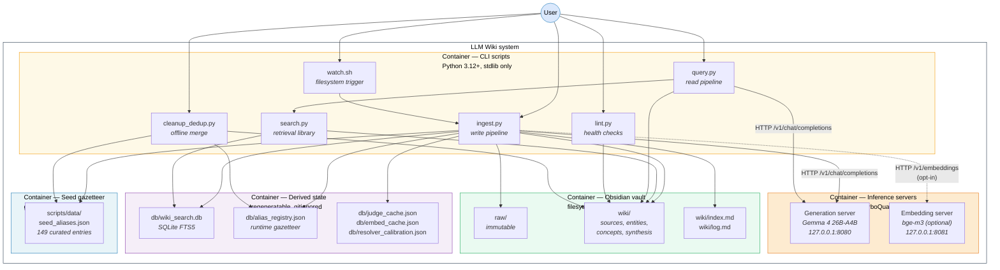

# C4 Level 2 — Container View

> **C4 Model, Level 2.** A Container diagram opens the single box from [Level 1](L1-system-context.md) into its independently deployable or runnable units. In the C4 vocabulary a *container* is "anything that hosts code or stores data", a web app, a standalone service, a database, a shell script, a filesystem directory. It is *not* a Docker container, although a Docker container would be one example.
>
> This document is the standalone C4 presentation. The same diagram appears inline in [arc42 § 5.1 (Whitebox Overall System)](../arc42/05-building-block-view.md#51-whitebox-overall-system--c4-level-2-container-view). The two must agree.

---

## Container diagram

---

## Container catalogue

### Container 1 — CLI scripts (Python, stdlib only)

| Attribute | Value |
|---|---|
| **Technology** | Python 3.12+ |
| **Dependencies** | Standard library only. No `pip install`. Justified in [ADR-001](../arc42/09-architecture-decisions.md#adr-001--zero-external-python-dependencies). |
| **Location** | [`scripts/`](../../scripts/) |
| **Lifecycle** | Short-lived. Each command is one invocation of the Python interpreter. |
| **Process count** | 0 at rest; 1 per active CLI invocation. `watch.sh` is a long-running `fswatch` loop that *spawns* `ingest.py` subprocesses on file events. |
| **Entry points** | `ingest.py`, `query.py`, `lint.py`, `cleanup_dedup.py`, `watch.sh` |
| **Shared library** | [`llm_client.py`](../../scripts/llm_client.py) holds paths, HTTP helpers, `safe_filename()` and typed exceptions. |
| **Responsibility** | User-facing commands. Everything the user types on the terminal lands here. No background daemons; no cron jobs; no scheduler. |
| **Zoomed into at Level 3** | [`ingest.py`](L3-component.md#l3a--ingestpy-components), [`query.py` + `search.py`](L3-component.md#l3b--querypy--searchpy-components), [`resolver.py`](L3-component.md#l3c--resolverpy-components) |

The CLI container is the only container the user directly invokes. All other containers are reached transitively: CLI scripts call the inference servers, the CLI scripts read and write the vault, the CLI scripts manage the derived state.

### Container 2 — Inference servers (llama.cpp + Metal)

| Attribute | Value |
|---|---|
| **Technology** | [llama.cpp](https://github.com/TheTom/llama-cpp-turboquant), TurboQuant fork by TheTom, built with `GGML_METAL=ON` on Apple Silicon |
| **Models** | Gemma 4 26B-A4B Unsloth Dynamic UD Q4_K_M (generation); bge-m3 Q4_K_M (embedding, optional) |
| **Processes** | Two independent `llama-server` processes, started on demand via shell scripts |
| **Network binding** | `127.0.0.1:8080` (generation), `127.0.0.1:8081` (embedding). Loopback only. Not reachable from other hosts on the LAN. |
| **Launch** | [`scripts/start_server.sh`](../../scripts/start_server.sh), [`scripts/start_embed_server.sh`](../../scripts/start_embed_server.sh) |
| **Lifecycle** | Long-running daemons. Started manually once; the user keeps them running across ingest and query sessions. Stopped with `Ctrl+C` or `pkill llama-server`. |
| **Memory footprint** | Generation: ~16 GB model weights + ~3 GB KV cache (q8_0 K + turbo4 V, asymmetric). Embedding: ~600 MB (when running). Budget detail in [arc42 § 7.4 (Memory Budget)](../arc42/07-deployment-view.md). |
| **API shape** | OpenAI-compatible, `POST /v1/chat/completions` for generation, `POST /v1/embeddings` for embedding. Only those two endpoints are used. |
| **Critical flags** | `--reasoning off` (disables Gemma 4 thinking-mode at the server level; see [Appendix A F-3](../arc42/appendix-a-academic-retrospective.md)), `--ctx-size 65536`, `--parallel 2`, `--flash-attn`, `--cache-type-k q8_0`, `--cache-type-v turbo4` |

**Why two processes and not one:** The two llama.cpp servers are architecturally separate because Gemma 4 is a chat model and bge-m3 is an embedding model; they are loaded into their own processes and their own Metal contexts. Only the generation server is mandatory for the pipeline. The embedding server is *opt-in* behind the `--use-embeddings` flag of `ingest.py` and is only used by resolver stage 5. This separation is intentional: a user running in low-memory mode turns off the embedding server and loses resolver stage 5 silently, but everything else still works. See [ADR-001](../arc42/09-architecture-decisions.md#adr-001--zero-external-python-dependencies) and [arc42 § 6.4](../arc42/06-runtime-view.md).

### Container 3 — Obsidian vault (filesystem)

| Attribute | Value |
|---|---|
| **Technology** | Plain filesystem. Markdown with YAML frontmatter. No database, no proprietary format. |
| **Location** | [`obsidian_vault/`](../../obsidian_vault/) |
| **Persistence model** | Durable, source-of-truth. This is the **only** container whose data should survive forever. Everything else is rebuildable. |
| **Subdivisions** | `raw/` (immutable source files dropped by the user), `wiki/sources/` (LLM-generated source summaries), `wiki/entities/` (people, organisations, tools, datasets, models), `wiki/concepts/` (methods, theories, frameworks), `wiki/synthesis/` (query answers filed back), `wiki/index.md` (master catalogue), `wiki/log.md` (append-only operation log) |
| **Write discipline** | Only `ingest.py`, `query.py --save`, `cleanup_dedup.py --apply` and (rarely) human edits write to `wiki/`. `raw/` is **never** written by any script (enforced by convention and by [CLAUDE.md Rule 1](../../CLAUDE.md)). |
| **Read discipline** | Obsidian reads the vault with its desktop client; `search.py` reads the vault to hydrate contexts; `lint.py` reads the vault to run health checks. |
| **File naming** | `safe_filename()` in [`llm_client.py`](../../scripts/llm_client.py) normalises titles: collapses whitespace to single spaces, replaces path separators with spaces, strips control characters, enforces a 150-character limit. Filenames use spaces so they match `[[wikilinks]]` directly. |
| **Size expectation** | Small (kilobytes to a few megabytes). Even a thousand pages is well under 10 MB of Markdown. |

The vault is the system's output, the system's input for query and the human's working surface inside Obsidian. It is the *only* container that must never be deleted.

### Container 4 — Derived state (regeneratable side stores)

| Attribute | Value |
|---|---|
| **Technology** | SQLite 3 (via `sqlite3` stdlib module) + plain JSON files |
| **Location** | [`db/`](../../db/), gitignored |
| **Files** | `wiki_search.db` (SQLite FTS5 index + `source_files` reverse index), `alias_registry.json` (runtime-promoted gazetteer entries), `judge_cache.json` (resolver stage-4 LLM verdicts), `embed_cache.json` (bge-m3 vectors keyed by content hash), `resolver_calibration.json` (F1-optimal thresholds from `resolver.py`) |
| **Rebuildability** | 100 %. Every file in this container can be reconstructed from the vault + seed gazetteer via `search.py --rebuild`. This is the **invariant** that makes the container safe to delete. |
| **Lifecycle** | Populated incrementally by `ingest.py`. Deleted wholesale by `rm -rf db/` for a clean restart. |
| **Concurrency** | Single-writer, single-reader. The Python GIL + short-lived script invocations make this trivial. SQLite is opened in its default journaling mode. |

This container exists because building the FTS5 index, collecting judge verdicts and tuning thresholds are expensive and should not be redone on every query. It does **not** exist because the data is irreplaceable, it is the opposite. The rule is: *if it would take more than a few seconds to regenerate, cache it here; but the invariant is that you can always regenerate it.*

### Container 5 — Seed gazetteer (git-tracked, read-only at runtime)

| Attribute | Value |
|---|---|
| **Technology** | One JSON file |
| **Location** | [`scripts/data/seed_aliases.json`](../../scripts/data/seed_aliases.json) |
| **Contents** | 149 curated canonical alias entries covering major AI labs (OpenAI, Anthropic, DeepMind, …), major models (GPT-4, Claude, Gemini, Llama, …), major frameworks (PyTorch, JAX, HuggingFace, …), major tech companies and core ML concepts (Transformer architecture, Attention, MoE, …) |
| **Schema** | Each entry has `canonical` (the normalised name), `type` (person/org/tool/model/concept), `aliases` (surface forms), `description` (the authoritative blurb), `subdir` (which wiki folder it belongs in) |
| **Runtime role** | Read by `aliases.py` into an in-memory lookup. First stage (stage 0) of the resolver consults this before any similarity math runs. A hit short-circuits everything downstream. |
| **Editorial role** | Hand-curated + code-reviewed. Updated by pull request when a new canonical AI/tech entity appears in the source corpus. |
| **Why separate from derived state** | The seed tier is git-tracked and survives `rm -rf db/`. The runtime tier (`alias_registry.json` in the derived-state container) is rebuildable. The seed tier is **not** rebuildable, it is authored intellectual work. This split is the central design decision of the resolver; full rationale in [ADR-005](../arc42/09-architecture-decisions.md#adr-005--six-stage-entity-resolver-with-gazetteer-anchor). |

---

## Container-to-container interfaces

Every edge in the Level 2 diagram corresponds to exactly one interface. Listed here in the order they appear at runtime during a typical ingest:

| # | From | To | Interface | Payload | Error mode |
|---|---|---|---|---|---|
| 1 | User | `watch.sh` | Process startup via `bash scripts/watch.sh` | None | - |
| 2 | `watch.sh` | `ingest.py` | Subprocess invocation on filesystem event from [`fswatch`](https://github.com/emcrisostomo/fswatch) | `argv = [filename]` | Non-zero exit surfaced to the terminal |
| 3 | `ingest.py` | Poppler (external) | `subprocess.run([...], shell=False)` | Absolute `Path` to a PDF file | `CalledProcessError` → skip that source with a logged message |
| 4 | `ingest.py` | Generation server | HTTP `POST /v1/chat/completions` via `urllib.request` | JSON body: `{model, messages, temperature, max_tokens, …}` | `ContextOverflowError` → recursive chunk auto-split (depth 2); any other `HTTPError` → fail loudly |
| 5 | `ingest.py` | Embedding server (optional) | HTTP `POST /v1/embeddings` via `urllib.request` | JSON body: `{model, input}` | `EmbeddingUnavailableError` → resolver skips stage 5; ingest succeeds without it |
| 6 | `ingest.py` | Seed gazetteer | In-memory dict lookup after first-call load | Surface form → canonical form | None, always returns hit/miss |
| 7 | `ingest.py` | Runtime gazetteer | JSON read-modify-write under a file lock | Append-only promotion entries | Single-writer only (single-process script) |
| 8 | `ingest.py` | Vault | Filesystem writes via `safe_filename()` + atomic rename | Source pages, entity pages, concept pages | Path-containment check refuses writes outside `WIKI_DIR` |
| 9 | `ingest.py` | Derived state | SQLite writes + JSON rewrites | FTS5 rows, reverse-index rows, judge cache entries, threshold recalibrations | `sqlite3.OperationalError` → fail loudly |
| 10 | `query.py` | `search.py` (in-process) | Python function call to `WikiSearch.search()` | Query string, top-k | - |
| 11 | `search.py` | Derived state | SQLite read via parameterised `?`-bound queries | BM25-ranked rows | Read-only path |
| 12 | `search.py` | Vault | Filesystem reads (Markdown bodies) | Page content for context hydration | File-not-found is a lint finding |
| 13 | `query.py` | Generation server | HTTP `POST /v1/chat/completions` | Assembled context + user question | Same as (4) |
| 14 | `query.py` | Vault (optional) | Filesystem write of synthesis page on `--save` | One new Markdown file under `wiki/synthesis/` | Atomic write |
| 15 | `lint.py` | Vault | Filesystem reads + wikilink graph walk | Entire vault | Read-only |
| 16 | `cleanup_dedup.py` | Vault + seed + runtime gazetteer | Read all, plan merges, optionally apply | Bulk file operations guarded by `--apply` | Dry run is the default |

All HTTP interfaces go through [`llm_client.py`](../../scripts/llm_client.py)'s `llm()` and `embed()` helpers, which apply a single retry/timeout/error-handling policy. There is no second HTTP client in the tree.

---

## What each container is allowed to depend on

This matrix is the **load-bearing** constraint of the decomposition. Keeping it true is how the system stays decoupled enough to reason about.

| Container | Allowed to depend on | Forbidden from depending on |
|---|---|---|
| **CLI scripts** | Inference servers (HTTP), vault (FS), derived state (FS/SQLite), seed gazetteer (FS) | External network, third-party Python packages, multi-process coordination |
| **Inference servers** | Filesystem (model weights), nothing else | The vault, the CLI scripts, each other |
| **Obsidian vault** | Nothing, it is a pure storage container | Everything |
| **Derived state** | Nothing, it is a pure storage container | Everything |
| **Seed gazetteer** | Nothing, it is a pure storage container | Everything |

The three storage containers are leaves in the dependency graph. The inference servers are also leaves (from the app's perspective, they depend on GGUF files on disk but not on anything in the app tree). Only the CLI container has outgoing edges. This shape is what makes the system easy to reason about: any change upstream propagates down; nothing propagates up.

---

## Lifecycle and cardinality

| Container | At rest | During `ingest` | During `query` | On user logout |
|---|---|---|---|---|
| **CLI scripts** | 0 processes | 1 short-lived Python process | 1 short-lived Python process | 0 processes |
| **Generation server** | 1 daemon (if started) | 1 daemon servicing HTTP requests | 1 daemon servicing HTTP requests | Survives logout only if started outside a login session |
| **Embedding server** | 0 or 1 (optional) | 0 or 1 | 0 | same |
| **Vault** | files on disk | files being written | files being read | files on disk |
| **Derived state** | files on disk | files being written | files being read | files on disk |
| **Seed gazetteer** | files on disk | file being read once | file being read once | files on disk |

The steady state is: one generation server daemon, zero CLI processes, zero embedding server processes. When the user wants to do something, they type a command and a single Python process wakes up, talks to the daemon and exits.

---

## Where to go next

- **[C4 Level 1, System Context](L1-system-context.md)**, zoom out one level to see what the whole system talks to.
- **[C4 Level 3, Component view](L3-component.md)**, zoom in one level to see the components inside the CLI container's most complex scripts (`ingest.py`, `query.py` + `search.py`, `resolver.py`).
- **[arc42 § 5, Building Block View](../arc42/05-building-block-view.md)**, the same decomposition with additional discussion of *why* this particular decomposition.
- **[arc42 § 7, Deployment View](../arc42/07-deployment-view.md)**, how the containers map to processes, memory and the single MacBook node.
- **[arc42 § 6, Runtime View](../arc42/06-runtime-view.md)**, the dynamic sequences that traverse these containers during ingest, query and resolve.
