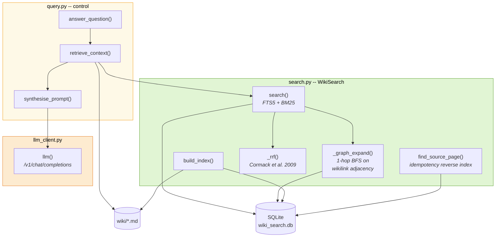
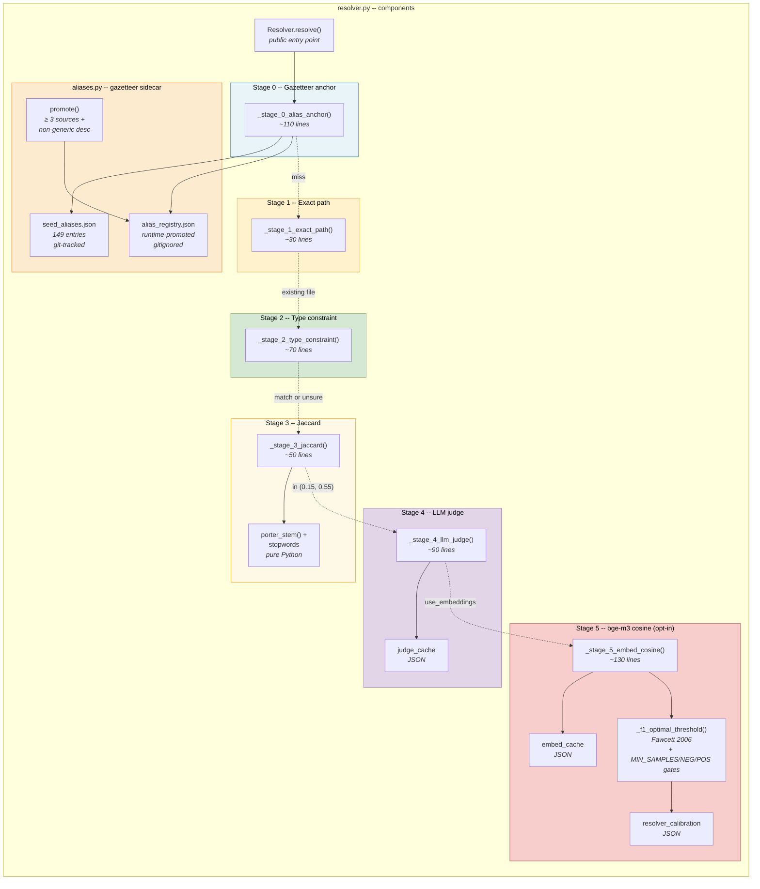
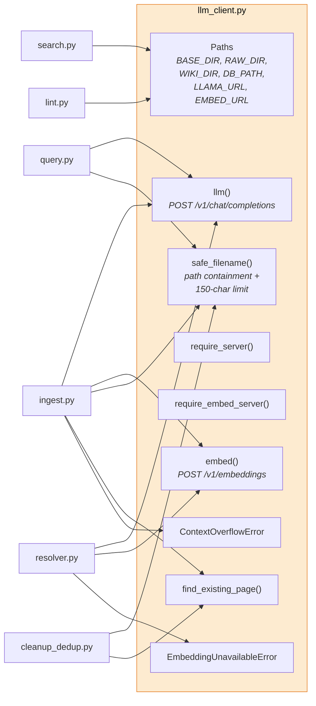

# C4 Level 3, Component View

> **C4 Model, Level 3.** A Component diagram opens a single container from [Level 2](L2-container.md) into its internal parts. In the C4 vocabulary a *component* is "a grouping of related functionality encapsulated behind a well-defined interface", typically a class, a module, or a set of cohesive functions. We zoom into the three largest, most complex scripts inside the **CLI scripts** container: `ingest.py`, `query.py` + `search.py` and `resolver.py`.
>
> This document is the standalone C4 presentation. The same three diagrams appear inline in [arc42 § 5.2-5.4 (Building Block View)](../arc42/05-building-block-view.md). The two must agree.

---

## Which containers are decomposed here

We do not zoom into every container. Four are interesting at component level:

| Container | Decomposed here? | Why / why not |
|---|---|---|
| **CLI scripts, `ingest.py`** | ✓ [L3.A](#l3a--ingestpy-components) | Largest module (~1 850 lines); six distinct responsibility layers |
| **CLI scripts, `query.py` + `search.py`** | ✓ [L3.B](#l3b--querypy--searchpy-components) | The read pipeline; shows the FTS5 + graph + RRF retrieval stack |
| **CLI scripts, `resolver.py`** | ✓ [L3.C](#l3c--resolverpy-components) | The six-stage entity resolver, the most complex single-purpose module in the tree |
| **CLI scripts, `llm_client.py`** | No | It is a thin shared foundation, see [L3.D](#l3d--llm_clientpy-the-shared-foundation) |
| **Web UI (`web/api` + `web/frontend`)** | ✓ [L3.E](#l3e--webapi--webfrontend-components) | Eight FastAPI routers + ten Lit components; shows the in-process delegation into `scripts/` |
| **CLI scripts, `lint.py`, `cleanup_dedup.py`, `watch.sh`** | No | Each is cohesive enough at container level |
| **Inference servers** | No | External processes, documented at [Level 2](L2-container.md#container-2--inference-servers-llamacpp--metal) |
| **Vault / Derived state / Seed gazetteer** | No | Pure storage containers with no internal components |

---

## L3.A, `ingest.py` components

[`scripts/ingest.py`](../../scripts/ingest.py) is roughly 1 850 lines organised into six cohesive layers. Each layer has one responsibility; the handoffs are the only seams.

```mermaid
graph TB
 subgraph INGEST ["ingest.py -- components"]
 direction LR

 subgraph READ ["Read layer"]
 parse["detect_and_parse()<br/><i>per-type parsers</i>"]
 pdf["_parse_pdf()<br/><i>pdftotext subprocess</i>"]
 xml["_parse_sms_xml()<br/><i>ElementTree, XXE-safe</i>"]
 date["_extract_source_date()<br/><i>pdfinfo + regex</i>"]
 end

 subgraph CHUNK ["Chunking layer"]
 split["chunk_text()<br/><i>paragraph-boundary split<br/>max 50K chars</i>"]
 end

 subgraph EXTRACT ["Extraction layer"]
 parallel["extract_chunks_parallel()<br/><i>ThreadPoolExecutor<br/>PARALLEL_SLOTS=2</i>"]
 one["extract_chunk()<br/><i>LLM JSON extraction<br/>auto-split on overflow</i>"]
 parse_json["_parse_json()<br/><i>tolerant JSON parser</i>"]
 end

 subgraph MERGE ["Merge + canonicalize layer"]
 merge_fn["merge_extractions()<br/><i>dedup, richest desc wins</i>"]
 canon["_canonicalize_descriptions()<br/><i>rewrite 'the model' /<br/>'our framework' via LLM</i>"]
 norm["_normalize_via_aliases()<br/><i>gazetteer short-circuit</i>"]
 end

 subgraph RESOLVE ["Resolve layer"]
 resolve["resolver.resolve()<br/><i>stages 0-5</i>"]
 end

 subgraph WRITE ["Write layer"]
 write_source["_write_source_page()"]
 write_items["_write_item_pages()<br/><i>entities + concepts</i>"]
 update_idx["_update_index_and_log()"]
 rebuild["WikiSearch.build_index()<br/><i>FTS5 rebuild</i>"]
 end

 parse --> split
 pdf --> parse
 xml --> parse
 date --> parse
 split --> parallel
 parallel --> one
 one --> parse_json
 parse_json --> merge_fn
 merge_fn --> canon
 canon --> norm
 norm --> resolve
 resolve --> write_source
 resolve --> write_items
 write_source --> update_idx
 write_items --> update_idx
 update_idx --> rebuild
 end

 style READ fill:#fff2cc,stroke:#d6b656,color:#000
 style CHUNK fill:#d5e8d4,stroke:#82b366,color:#000
 style EXTRACT fill:#dae8fc,stroke:#6c8ebf,color:#000
 style MERGE fill:#e1d5e7,stroke:#9673a6,color:#000
 style RESOLVE fill:#f8cecc,stroke:#b85450,color:#000
 style WRITE fill:#fdebd0,stroke:#e67e22,color:#000
```

### Component catalogue, `ingest.py`

| Layer | Component | Responsibility | External calls |
|---|---|---|---|
| Read | `detect_and_parse()` | Dispatches on file extension to the right parser | none |
| Read | `_parse_pdf()` | Extracts UTF-8 text from a PDF via `pdftotext` | `subprocess.run(["pdftotext", path, "-"], shell=False)` |
| Read | `_parse_sms_xml()` | Parses SMS backup XML into structured records | `xml.etree.ElementTree.parse()`, XXE-safe because Python's `ET` does not expand external entities by default on 3.12 |
| Read | `_extract_source_date()` | Pulls the `CreationDate` metadata line from `pdfinfo` output; falls back to regex over the PDF text for hand-scanned documents | `subprocess.run(["pdfinfo", path], shell=False)` |
| Chunk | `chunk_text()` | Paragraph-boundary splits at ≤ 50 000 chars per chunk. Single-article docs normally fit in one chunk; long PDFs split into 2-8. | none |
| Extract | `extract_chunks_parallel()` | Parallel LLM extraction across the two llama.cpp slots via `ThreadPoolExecutor(max_workers=2)` | none directly |
| Extract | `extract_chunk()` | One LLM call per chunk asking for `{title, summary, key_claims, entities, concepts}`. Recursively auto-splits and retries on `ContextOverflowError` (depth 2). | `llm_client.llm()` → generation server |
| Extract | `_parse_json()` | Tolerant JSON parser that recovers from the LLM's occasional half-valid output (missing closing braces, trailing commas, code fences) | none |
| Merge | `merge_extractions()` | Deduplicates entities and concepts across chunks. Richest (longest non-generic) description wins. | none |
| Merge | `_canonicalize_descriptions()` | A second LLM pass rewrites context-local descriptions ("the model", "our framework", "this paper") into stand-alone ones, which is essential for the resolver's Jaccard stage to work. Batched and targeted, only items flagged as context-local are rewritten. | `llm_client.llm()` → generation server |
| Merge | `_normalize_via_aliases()` | Applies the seed + runtime gazetteer to rewrite surface forms to canonical names **before** the resolver runs | `aliases.canonicalise()` |
| Resolve | `resolver.resolve()` | See [L3.C](#l3c--resolverpy-components) | resolver stages 0-5 |
| Write | `_write_source_page()` | Writes the source summary page with YAML frontmatter, summary, key claims, entities/concepts section | `safe_filename()`, atomic write |
| Write | `_write_item_pages()` | Creates or **updates** entity and concept pages, adds new source info, notes contradictions | `safe_filename()`, atomic write |
| Write | `_update_index_and_log()` | Adds new entries to `wiki/index.md`, appends to `wiki/log.md` | atomic writes |
| Write | `WikiSearch.build_index()` | Rebuilds the SQLite FTS5 index so query is always fresh | `sqlite3` |

### Why these seams

The handoffs are chosen so that each layer has one kind of failure and one kind of recovery:

- **Read layer** fails on "I cannot parse this file". Recovery: skip the source with a logged message.
- **Chunking layer** cannot fail (it only splits strings).
- **Extraction layer** fails on "the LLM returned junk" or "context overflow". Recovery: tolerant JSON parser (for junk), recursive auto-split (for overflow).
- **Merge layer** cannot fail on normal input. `_canonicalize_descriptions` can fail if the LLM is unreachable, this is a hard failure that aborts the ingest.
- **Resolve layer** fails on "the embedding server is down" (stage 5). Recovery: stages 0-4 still produce a verdict, which is the *designed* fallback.
- **Write layer** fails on "filesystem is full" or "path containment violation". Both are hard failures.

This layering is the direct implementation of [ADR-001 (zero dependencies)](../arc42/09-architecture-decisions.md#adr-001--zero-external-python-dependencies) and [ADR-002 (fork on uncertainty)](../arc42/09-architecture-decisions.md#adr-002--fork-on-uncertainty-never-silently-merge).

---

## L3.B, `query.py` + `search.py` components

The read pipeline is intentionally much thinner than the write pipeline. `query.py` is a thin controller; `search.py` is a reusable retrieval library.

### Component catalogue, `query.py` + `search.py`

| Container | Component | Responsibility | Cost |
|---|---|---|---|
| `query.py` | `answer_question()` | Orchestrates the read pipeline end-to-end | - |
| `query.py` | `retrieve_context()` | Hydrates Markdown bodies from the top-ranked rows within a 40 000-char budget | ~5 ms for retrieval, ~50 ms for disk reads |
| `query.py` | `synthesise_prompt()` | Builds the one synthesis prompt for the final LLM call. Enforces `[[wikilink]]` citation discipline. | - |
| `search.py` | `WikiSearch.build_index()` | Rebuilds the FTS5 index from all pages under `wiki/`. Populates the `source_files` reverse-index table used for idempotency. | O(N) one-time per ingest |
| `search.py` | `WikiSearch.search()` | Entry point. Runs FTS5 query, applies BM25 column weights `(10.0, 3.0, 5.0, 1.0)` for `(name, type, tags, content)`, returns top-k ranked rows. | ~1 ms |
| `search.py` | `WikiSearch._graph_expand()` | 1-hop breadth-first search from each top-ranked seed across the wikilink adjacency stored as an auxiliary table. Adds indirectly-related pages that BM25 alone would miss. | ~2 ms |
| `search.py` | `WikiSearch._rrf()` | Reciprocal Rank Fusion ([Cormack, Clarke, Büttcher, SIGIR 2009](https://doi.org/10.1145/1571941.1572114)), `k = 60`. Fuses the BM25 ranking with the graph-expansion ranking into a single score. | ~1 ms |
| `search.py` | `WikiSearch.find_source_page()` | Looks up the previous page-stem for a re-ingested source via the `source_files` reverse index. Replaces an earlier O(N) directory scan; see [arc42 Appendix A, A.2.F](../arc42/appendix-a-academic-retrospective.md). | ~1 ms |
| `llm_client.py` | `llm()` | The single HTTP client for chat completions | ~3-10 s synthesis |

### The retrieval pipeline in one sentence

*FTS5 ranks pages by BM25 with column weights; then a 1-hop wikilink BFS pulls in indirectly-related pages; then RRF fuses the two rankings; then the top-k results are hydrated from disk into a 40 000-char context window and handed to one LLM call for synthesis.*

Retrieval is ~5 ms total. Synthesis dominates the wall clock (~3-10 s). The point of the retrieval stack is that it is small enough to always take the same few milliseconds regardless of corpus size, because we replaced an earlier LLM-driven page selector that hit a scaling ceiling at ≈ 500 pages. The failure story is [Appendix A F-1](../arc42/appendix-a-academic-retrospective.md); the decision is [ADR-003](../arc42/09-architecture-decisions.md#adr-003--fts5--wikilink-graph--rrf-over-vector-search).

---

## L3.C, `resolver.py` components

[`scripts/resolver.py`](../../scripts/resolver.py) is the most complex single-purpose module in the tree (~600 lines of class + supporting helpers). It implements a six-stage entity-resolution pipeline. Each stage can terminate the pipeline with a verdict (`create`, `merge`, or `fork`); if no stage terminates, the default is `fork` (conservative, per [ADR-002](../arc42/09-architecture-decisions.md#adr-002--fork-on-uncertainty-never-silently-merge)).

### Stage-by-stage component detail

| Stage | Component | Verdict types | Cost | Failure mode |
|---|---|---|---|---|
| **0** | `_stage_0_alias_anchor()` | `merge` (on gazetteer hit), otherwise pass-through | ~50 µs | None, always returns hit/miss |
| **1** | `_stage_1_exact_path()` | `create` (if no file exists), otherwise pass-through | filesystem stat, <1 ms | None |
| **2** | `_stage_2_type_constraint()` | `fork` (on type mismatch **and** description disagreement), otherwise pass-through | <1 ms | None |
| **3** | `_stage_3_jaccard()` | `merge` (Jaccard ≥ 0,55), `fork` (Jaccard ≤ 0,15), otherwise pass-through | <1 ms | None |
| **4** | `_stage_4_llm_judge()` | `merge` or `fork` based on one LLM call; cached per `(incoming, existing)` pair | ~2-3 s uncached, ~50 µs cached | LLM unreachable → falls through to stage 5 or forks by default |
| **5** | `_stage_5_embed_cosine()` | `merge` (cosine > threshold) or `fork`, **opt-in only** | ~200 ms (embed) + <1 ms (cosine) | Embedding server unreachable → raises `EmbeddingUnavailableError` → resolver skips stage 5 |

### The gazetteer sidecar (`aliases.py`)

The gazetteer is a separate module (`scripts/aliases.py`, ~544 lines) because it has its own concerns: loading two files, normalising surface forms, enforcing the subdirectory + type-compatibility guards and managing runtime promotion. It is used by stage 0 but also pre-normalises mentions before `resolver.resolve()` is ever called, so the resolver sees already-canonicalised names for known entities.

| Component | Responsibility |
|---|---|
| `seed_aliases.json` | 149 curated canonical entries, git-tracked, authored by hand + code review |
| `alias_registry.json` | Runtime-promoted entries, gitignored, append-only |
| `load()` | Merges the two tiers into one in-memory lookup at first use |
| `canonicalise()` | Maps a surface form to a canonical form, preserving the original as a comment if forking |
| `promote()` | Automatically adds an entry when a wiki page accumulates ≥ 3 distinct sources and a non-generic description |
| Subdir guard | Refuses matches across wiki subdirectories (e.g. `entities/Python.md` for the language, not `entities/Python_snake.md`) |
| Type-compat guard | Refuses matches across incompatible types (e.g. Transformer *model* vs. Transformer *architecture*) |

The gazetteer is the **prevention layer** for the cross-document proper-noun fork epidemic. Without it, the resolver re-decides "is this the same ChatGPT?" on every ingest from per-source evidence alone and thin context-local descriptions reliably produce forks. With it, known entities short-circuit to the canonical page before any similarity math runs.

The full failure-and-fix story for this layer is [arc42 Appendix A F-4 (the ChatGPT fork epidemic)](../arc42/appendix-a-academic-retrospective.md).

### F1 threshold tuner

`_f1_optimal_threshold()` implements a Fawcett (2006) precision-recall sweep over the labelled calibration data in `resolver_calibration.json`. It recomputes the stage-5 threshold whenever:

- `len(samples) >= MIN_SAMPLES_FOR_TUNING` (= 20)
- `num_negatives >= MIN_NEGATIVES` (= 5)
- `num_positives >= MIN_POSITIVES` (= 5)

All three gates must pass. These hard gates exist because an earlier version of the tuner degenerated when the cache hit 51 positives / 1 negative, the F1 sweep picked a near-zero threshold and accepted everything. That failure and its fix are documented in [arc42 Appendix A F-2](../arc42/appendix-a-academic-retrospective.md) and in [ADR-006](../arc42/09-architecture-decisions.md#adr-006--f1-optimal-threshold-tuning-with-hard-sample-count-gates).

---

## L3.D, `llm_client.py`: the shared foundation

The smallest and most load-bearing module in the tree. Every other CLI script imports from it. It is intentionally *not* a subgraph in the component diagrams because it is referenced by all three of them.

| Component | Responsibility |
|---|---|
| **Paths** (`BASE_DIR`, `RAW_DIR`, `WIKI_DIR`, `DB_PATH`, `LLAMA_URL`, `EMBED_URL`) | Single source of truth for filesystem locations and HTTP URLs. Nothing else in the tree hardcodes a location. |
| `llm()` | HTTP POST to `/v1/chat/completions` via `urllib.request`. Handles timeout, retry and error classification. Raises `ContextOverflowError` on HTTP 400 with "context" in the body. |
| `embed()` | HTTP POST to `/v1/embeddings`. Raises `EmbeddingUnavailableError` on connection refused. |
| `require_server()` / `require_embed_server()` | Pre-flight checks that fail fast with a helpful message if the server is not running |
| `safe_filename()` | Normalises a title to a filesystem-safe name: collapses whitespace, replaces path separators, strips control chars, caps at 150 chars. Enforces path-containment. |
| `find_existing_page()` | Case-insensitive lookup for an existing page by canonical name across all wiki subdirectories |
| `ContextOverflowError` | Typed exception used by `ingest.py` to trigger recursive auto-split |
| `EmbeddingUnavailableError` | Typed exception used by `resolver.py` to skip stage 5 gracefully |

The consolidation of `safe_filename()` and `find_existing_page()` here is the direct result of a duplicated-implementation incident, two copies drifted out of sync. See [arc42 Appendix A A.2.H](../arc42/appendix-a-academic-retrospective.md) for the full story.

---

## L3.E, `web/api` + `web/frontend` components

The optional web UI container (see [L2 Container 5](L2-container.md#container-5--web-ui-fastapi--lit-optional)) is structurally a thin HTTP wrapper: it adds no new pipelines. Every router imports the same `scripts/*` modules the CLI uses and delegates to them in-process. The value it adds is presentation, request routing, HTTP-level hardening and a browser-friendly form of the operator loop.

The same decomposition appears inline in [arc42 § 5.6](../arc42/05-building-block-view.md#56-whitebox-web--the-optional-ui-container); this is the standalone C4 restatement.

```mermaid
graph TB
 subgraph API ["web/api -- FastAPI core"]
 app["app.py<br/><i>ASGI entrypoint<br/>CSP + security headers<br/>SPA fallback with<br/>path-containment</i>"]
 models["models.py<br/><i>Pydantic request /<br/>response schemas</i>"]
 svc["services.py<br/><i>bridges scripts/ to routers<br/>WikiSearch, paths,<br/>server health helpers</i>"]
 end

 subgraph ROUT ["web/api/routers"]
 r_server["server.py (228 L)<br/><i>start/stop llama-server,<br/>/health, /slots, reasoning<br/>toggle</i>"]
 r_search["search.py (75 L)<br/><i>FTS5 passthrough</i>"]
 r_wiki["wiki.py (134 L)<br/><i>list, read, rename, delete<br/>wiki pages + graph data</i>"]
 r_query["query.py (929 L)<br/><i>multi-turn chat, intent<br/>routing, optional ddgs<br/>augmentation</i>"]
 r_ingest["ingest.py (688 L)<br/><i>upload + background<br/>ingest with progress<br/>streaming</i>"]
 r_lint["lint.py (332 L)<br/><i>wiki health checks +<br/>orphan cleanup</i>"]
 r_dedup["dedup.py (268 L)<br/><i>cleanup_dedup driver<br/>(dry-run + apply)</i>"]
 r_admin["admin.py (310 L)<br/><i>reset, reindex, logs,<br/>config inspection</i>"]
 end

 subgraph FRONT ["web/frontend (Vite build -> dist/)"]
 main_js["src/main.js<br/><i>Lit entry, wires app-shell</i>"]
 shell["components/app-shell.js<br/><i>layout + routing</i>"]
 panels["components/*-panel.js<br/><i>server, search, query,<br/>ingest, lint, dedup</i>"]
 views["components/wiki-browser.js<br/>components/page-viewer.js<br/>components/graph-view.js"]
 lib_api["lib/api.js<br/><i>fetch wrapper over /api/*</i>"]
 lib_md["lib/markdown.js<br/><i>Marked + DOMPurify</i>"]
 lib_rt["lib/router.js<br/><i>hash SPA router</i>"]
 lib_ic["lib/icons.js"]
 end

 SCRIPTS[("scripts/*<br/>ingest, search, query,<br/>lint, cleanup_dedup,<br/>llm_client, aliases")]
 DDGS(["ddgs<br/><i>opt-in web search</i>"])

 app --> models
 app --> svc
 app --> r_server
 app --> r_search
 app --> r_wiki
 app --> r_query
 app --> r_ingest
 app --> r_lint
 app --> r_dedup
 app --> r_admin
 app -. "static mount" .-> main_js

 main_js --> shell
 shell --> panels
 shell --> views
 panels --> lib_api
 views --> lib_api
 views --> lib_md
 shell --> lib_rt
 shell --> lib_ic

 r_server -. "subprocess: start_server.sh" .-> SCRIPTS
 r_search -. "WikiSearch (via services)" .-> SCRIPTS
 r_wiki -. "llm_client helpers" .-> SCRIPTS
 r_query -. "WikiSearch + llm_client" .-> SCRIPTS
 r_query -. "optional" .-> DDGS
 r_ingest -. "ingest pipeline" .-> SCRIPTS
 r_lint -. "lint" .-> SCRIPTS
 r_dedup -. "cleanup_dedup" .-> SCRIPTS
 r_admin -. "llm_client + aliases" .-> SCRIPTS

 style API fill:#fde2e4,stroke:#c0392b,color:#000
 style ROUT fill:#fdebd0,stroke:#e67e22,color:#000
 style FRONT fill:#eafaf1,stroke:#27ae60,color:#000
```

### Component catalogue, `web/api`

| Component | Responsibility | Delegates to |
|---|---|---|
| `app.py` | ASGI entrypoint. Mounts the 8 routers under `/api/*`, serves the built frontend under `/`, applies CORS for `localhost:3000`/`:5173`, attaches the `SecurityHeadersMiddleware` (CSP, X-Content-Type-Options, X-Frame-Options, Referrer-Policy, Permissions-Policy). SPA fallback resolves the URL path against `web/frontend/dist/` and rejects anything that escapes that tree. | Pydantic models, uvicorn |
| `models.py` | All Pydantic request/response schemas in one file. Validates input at the HTTP boundary so routers can assume well-typed data. | Pydantic |
| `services.py` | Shared service layer. Adds `scripts/` to `sys.path` once at import time, re-exports `BASE_DIR`, `WIKI_DIR`, `DB_PATH`, `LLAMA_URL`, `EMBED_URL`, `safe_filename`, `WikiSearch`. Provides `check_server_health()`, `check_server_slots()`, `parse_server_config()` so routers never poll the inference servers directly. | `scripts/llm_client.py`, `scripts/search.py` |
| `routers/server.py` | Starts and stops `start_server.sh` and `start_embed_server.sh` via `subprocess`. Polls `/health` and `/slots` on the generation and embedding endpoints. Exposes the `REASONING="on"/"off"` toggle documented in [arc42 TC-5](../arc42/02-architecture-constraints.md#21-technical-constraints). | `services.check_server_health()`, `subprocess.Popen` |
| `routers/search.py` | Thin passthrough to `WikiSearch.search()`. Returns ranked rows only; hydration is the frontend's job. | `services.WikiSearch` |
| `routers/wiki.py` | Lists pages, reads a single page with parsed frontmatter and inbound/outbound wikilinks, returns graph adjacency data for the `graph-view.js` component. Every path parameter is validated against `SUBDIRS` and resolved under `WIKI_DIR`. | `services.get_page()`, `services.build_wiki_graph()` |
| `routers/query.py` | Multi-turn chat endpoint. Implements the 4-category SKR-style intent router (RETRIEVE / DIRECT / HYBRID / reserved) with one classification prompt before the generation prompt. Optionally augments with web-search results from `ddgs` when `web_search=true` (opt-in per request). Always returns a source-attribution tag ("from your documents", "from the model", "from both"). | `services.WikiSearch`, `llm_client.llm()`, `ddgs` (optional) |
| `routers/ingest.py` | Accepts file uploads into `raw/`, launches the ingestion pipeline as a background task, streams progress events. Enforces reasoning-mode "off" for the ingest subprocess regardless of the UI toggle. | `scripts/ingest.py` as subprocess, `services.WikiSearch` |
| `routers/lint.py` | Runs `scripts/lint.py` and surfaces categorised findings. Offers auto-fix for safe categories (broken wikilinks to obviously-canonical targets, orphan pages). | `scripts/lint.py` |
| `routers/dedup.py` | Driver for `scripts/cleanup_dedup.py`. Dry-run is default; `--apply` is a separate endpoint so the destructive action needs an explicit operator click. | `scripts/cleanup_dedup.py` |
| `routers/admin.py` | Log tail, config inspection, FTS5 reindex, manual alias promotion. The "admin" endpoints are the ones most likely to rewrite state, so path-containment and input validation are strictest here. | `services` + `aliases.py` |

### Component catalogue, `web/frontend`

The frontend is a Vite-built Lit single-page app. Ten components, four library modules, one entry point.

| Component | Responsibility |
|---|---|
| `src/main.js` | Lit entry point. Imports `app-shell` and mounts it against `<app-shell>` in `index.html`. Everything else is lazy-loaded on demand via the router. |
| `components/app-shell.js` | Top-level layout: sidebar, route outlet, global status indicator. Consumes `lib/router.js` to map URL hash → active panel/view. |
| `components/server-panel.js` | Start/stop the generation and embedding servers, flip the reasoning toggle, watch live `/health` + `/slots` data. |
| `components/search-panel.js` | FTS5 search input, ranked results list, hit-preview side panel. |
| `components/wiki-browser.js` | Directory-tree view of `wiki/` with frontmatter badges (type, tag cloud, source count). |
| `components/page-viewer.js` | Renders a single page: Markdown via `lib/markdown.js`, inbound/outbound wikilink panels, edit / rename / delete actions. |
| `components/query-panel.js` | Multi-turn chat UI. Shows source attribution and the retrieved wiki pages used by each answer. Exposes the web-search and reasoning toggles for the current turn. |
| `components/ingest-panel.js` | Drag-and-drop upload, streaming progress log, per-stage status indicators. |
| `components/lint-panel.js` | Categorised lint findings with one-click auto-fix where safe. |
| `components/dedup-panel.js` | Dry-run preview of cleanup_dedup merges; separate apply button. |
| `components/graph-view.js` | Force-directed wikilink graph backed by `routers/wiki.py`'s adjacency endpoint. |
| `lib/api.js` | Thin `fetch()` wrapper over `/api/*` with JSON error handling. The only place the frontend hits the backend. |
| `lib/markdown.js` | Marked → DOMPurify pipeline. Explicit allowlist for `http:`/`https:`/`mailto:`/`tel:`. Output is handed to Lit's `unsafeHTML` only after sanitising. |
| `lib/router.js` | Hash-based SPA router. Decouples panel selection from the server, so page refresh keeps state. |
| `lib/icons.js` | Inline SVG icon set. No icon-font dependency. |

### Load-bearing design choices

Three design decisions bind this container together:

1. **No new persistence layer.** The routers hold no mutable state. They re-enter `scripts/*` for every request; all state lives in the existing Obsidian vault and the `db/` side-state container. Re-reading the disk per request is cheap compared to the LLM call a request almost always ends in, and it eliminates the cache-coherence class of bugs between the CLI and the web UI.
2. **Strict CSP, no inline scripts, sanitised Markdown.** `app.py` sets `script-src 'self'`, no `'unsafe-inline'`. The Vite build emits hashed bundle entrypoints; every `<script>` tag in the built `index.html` loads from `self`. Markdown is rendered via Marked then sanitised by DOMPurify with an explicit scheme allowlist before Lit's `unsafeHTML` inserts it into the DOM. This is defence-in-depth on top of the localhost-only bind.
3. **Path-containment on every endpoint that takes a page name.** `routers/wiki.py` and `routers/admin.py` always call `Path.resolve()` on user-supplied paths and verify `relative_to(WIKI_DIR)` before touching the filesystem, matching the same discipline `llm_client.safe_filename()` enforces in the CLI. The SPA fallback in `app.py` applies the same `relative_to(_FRONTEND_ROOT)` check against the static dist directory.

The container is optional by design: deleting `web/` does not change any behaviour under `scripts/`. This is what keeps the privacy posture of [Q1](../arc42/01-introduction-and-goals.md#12-quality-goals) intact, neither `fastapi` nor `ddgs` is on the code path that runs during a pure-CLI ingest.

---

## Cross-component invariants

These are the invariants that bind the components above together. Violating any of them is a bug.

1. **All HTTP calls go through `llm_client.llm()` or `llm_client.embed()`.** No other module issues its own `urllib.request.urlopen` against the inference servers. This gives one place to add retry, timeout and error classification. Verified by `grep -r "urlopen" scripts/`, the only hits should be inside `llm_client.py`.
2. **All filesystem writes under `wiki/` go through `safe_filename()` first.** Verified by `grep -rn "open(.*WIKI_DIR" scripts/`, every match should be preceded by a `safe_filename()` call on the same line or the immediately preceding statement.
3. **Stage 0 is reached before any similarity math.** If stage 0 is bypassed, the gazetteer's short-circuit is lost and the resolver degrades to its pre-gazetteer behaviour. Verified by `scripts/test_resolver.py::test_stage_0_short_circuits_known_entity`.
4. **The FTS5 index is rebuilt at the end of every `ingest.py` run.** A stale index is treated as a bug, not as "eventual consistency". Verified by the last line of the write layer being `WikiSearch(...).build_index()`.
5. **On uncertainty, every stage forks rather than merges.** The default branch of every stage function returns `fork`, never `merge`. Verified by code review and by `test_resolver_scenarios.py` covering borderline cases.
6. **The `source_files` reverse-index table is always consulted for idempotency.** On re-ingest, `find_source_page()` must be called before `_write_source_page()`; otherwise the source gets a new filename on every run and stale duplicates accumulate.
7. **`scripts/` never imports from `web/`.** The CLI must run with `web/` absent. Verified by `grep -rn "from web" scripts/` returning no matches. Imports only flow the other way: `web/api/services.py` adds `scripts/` to `sys.path` and re-exports from it.
8. **All wiki-writing endpoints resolve paths and call `relative_to(WIKI_DIR)` before any filesystem operation.** Path parameters are untrusted input. Verified by `grep -n "relative_to" web/api/routers/*.py` covering every `open(...)`, `unlink()`, `rename()` or `write_text()` call site on a user-supplied path. The SPA fallback in `web/api/app.py` applies the same check against `_FRONTEND_ROOT`.
9. **The web UI binds to `127.0.0.1` by default and sets a strict CSP on every response.** `script-src 'self'` with no `'unsafe-inline'`; Markdown goes through DOMPurify before Lit's `unsafeHTML` inserts it. Verified by reading `_CSP` in `web/api/app.py` and by the `allow_origins` list excluding any non-loopback host.
10. **The `ddgs` outbound edge is opt-in per request.** `routers/query.py` only reaches `ddgs` when `ChatRequest.web_search=true`. The default is `false`, keeping the privacy-posture invariant from [Q1](../arc42/01-introduction-and-goals.md#12-quality-goals) mechanically checkable.

Invariants 1-10 are the mechanical expression of the architectural decisions in [ADR-001 through ADR-007](../arc42/09-architecture-decisions.md).

---

## Where to go next

- **[C4 Level 1, System Context](L1-system-context.md)**, zoom out two levels.
- **[C4 Level 2, Container view](L2-container.md)**, zoom out one level to see how these components fit inside the CLI scripts and Web UI containers.
- **[arc42 § 5, Building Block View](../arc42/05-building-block-view.md)**, the same decomposition with discussion of the design axes (write/read split, pure functions vs. stateful classes, stdlib-first).
- **[arc42 § 6, Runtime View](../arc42/06-runtime-view.md)**, dynamic sequences that cross these components: ingestion, query, resolver stages 0-5, context-overflow recovery.
- **[arc42 § 9, Architecture Decisions](../arc42/09-architecture-decisions.md)**, the ADRs that justify the component boundaries drawn here.
- **[arc42 Appendix A, Academic Retrospective](../arc42/appendix-a-academic-retrospective.md)**, the failures and fixes that shaped these components into their current form.
